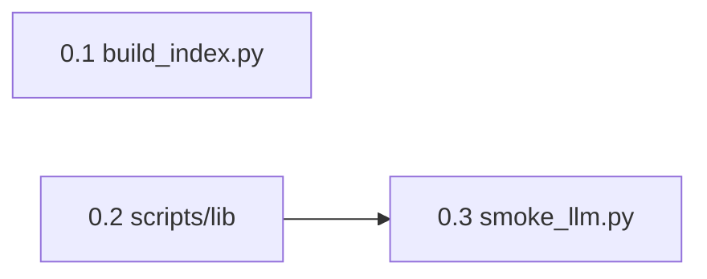

# Phase 0 · Index & LLM Foundation

## Todo 依赖关系

| Todo | 依赖 | 可与之下并行 |
|------|------|----------------|
| **0.1** | 无 | 0.2 |
| **0.2** | 无 | 0.1 |
| **0.3** | **0.2**（`get_llm_client`） | — |



- **0.1 与 0.2 无相互依赖**，可交给两个 agent 并行；合并前确认 `paths.py` 中的 `INDEX_DIR` / `embeddings_npy()` 与 0.1 产出路径一致。
- **0.3 必须在 0.2 完成后**再开工。
- **Phase 0 完成** = 0.1 + 0.2 + 0.3 全部验收通过（顺序不限，仅 0.3 晚于 0.2）。

## Scope

### In scope

- 从 `data/output/cleaned.csv` 生成 `data/index/meta.parquet`（9 列检索/渲染字段）
- 将 `data/output/text_embeddings.npy` 接到 `data/index/embeddings.npy`（拷贝或硬链，二选一；禁止静默改行序）
- 断言行数对齐：**59,341**
- 共享 Python 模块：`paths` / `load_env` / `get_llm_client(provider=mimo)`
- MiMo **smoke test** CLI
- 更新 `.env.example` 中与路径相关的变量（与 ADR-0001、`data/output` 布局一致）

### Out of scope（本 Phase 不做）

- `agents.py` / `retrieve.py` / `fetch_news.py` / `main.py` / `copywriter.py`
- 从 CSV **重新 encode** 向量（Post-MVP；本 Phase 默认 `--reuse`）
- C1/C2、RSS、简报 Markdown 模板
- 修改 `prompts/` 内容

## SSOT（实现前必读）

| 文档 | 用途 |
|------|------|
| `docs/adr/0001-reuse-cosmos-text-embeddings.md` | 索引复用、查询模板约束（retrieve 阶段用） |
| `docs/SSOT/电影宇宙「每日星轨观测」系统 PRD.md` | §3.1 字段、§10 step 0 |
| `CONTEXT.md` | 片单、伪剧情模板术语 |

## 当前仓库状态（已知事实）

- `data/output/cleaned.csv` — **59,341** 行，28 列（与 cosmos 对齐）
- `data/output/text_embeddings.npy` — shape `(59341, 384)`，float32，行 L2 范数 ≈ 1.0
- `scripts/build_index.py` — 空壳 + TODO 注释
- `.env` — **不在仓库内**；agent 不得提交密钥；验收时假设用户本地已配置 `MIMO_*`

## 路径约定（本 Phase 定稿）

```
data/output/cleaned.csv          # 片单 SSOT（只读）
data/output/text_embeddings.npy  # cosmos 向量源（只读）
data/index/embeddings.npy        # 检索读取入口（由 build_index 生成/同步）
data/index/meta.parquet          # 检索元数据（由 build_index 生成）
```

`INDEX_DIR` 环境变量默认 `data/index`。

---

## Todo 0.1 · `build_index.py`（ADR-0001 复用模式）

**依赖：** 无（可与 **0.2** 并行）

**负责 agent 只做本 todo 时**：实现 `scripts/build_index.py`，默认走复用，不重算 embedding。

### 行为

1. **CLI**

   ```text
   python scripts/build_index.py
   python scripts/build_index.py --reuse          # 默认
   python scripts/build_index.py --csv PATH       # 仅影响 meta 来源；--reuse 时 CSV 应为 cleaned.csv
   python scripts/build_index.py --rebuild-embed  # Post-MVP 预留：从 CSV 重算（本 Phase 可 stub + 打印 "not implemented"）
   ```

2. **`--reuse`（默认）流程**

   - 读 `data/output/cleaned.csv`（或 `--csv` 覆盖，但应警告若非 59341 行）
   - 写出 `data/index/meta.parquet`，列**仅**保留：
     `id, title, original_title, overview, tagline, genres, original_language, release_date, poster_path`
   - 将 `data/output/text_embeddings.npy` → `data/index/embeddings.npy`（`shutil.copy2`；Windows 无 symlink 权限时 copy 即可）
   - **断言**：`len(meta) == embeddings.shape[0] == 59341`，失败则 `sys.exit(1)` 并打印清晰错误
   - 打印摘要：行数、embedding shape、index 目录绝对路径

3. **不要**在 `--reuse` 路径加载 `sentence-transformers`（避免无意义的重型依赖拉取）

4. **`meta.parquet` 行序**：与 `cleaned.csv` 行序一致，**不得 sort/reindex**（第 i 行 meta 对应第 i 行向量）

### 验收命令

```powershell
python scripts/build_index.py
python -c "import numpy as np, pandas as pd; e=np.load('data/index/embeddings.npy'); m=pd.read_parquet('data/index/meta.parquet'); assert len(m)==59341 and e.shape==(59341,384); print('OK', m.columns.tolist())"
```

### 完成定义

- [x] `data/index/meta.parquet` 存在且 9 列齐全
- [x] `data/index/embeddings.npy` 存在且 shape 正确
- [x] 断言脚本通过
- [x] `build_index.py` 有 `if __name__ == '__main__'` 与 `--help`

---

## Todo 0.2 · 共享模块 `scripts/lib/`

**依赖：** 无（可与 **0.1** 并行；**0.3** 依赖本 todo）

**负责 agent 只做本 todo 时**：新增可复用基础设施，供 Phase 1+ 导入。

### 建议结构

```text
scripts/
  lib/
    __init__.py
    paths.py      # 解析 REPO_ROOT、CLEANED_CSV、INDEX_DIR、EMBEDDINGS_NPY、META_PARQUET
    env.py          # load_dotenv；读 DEFAULT_LLM_PROVIDER
    llm.py          # get_llm_client() -> openai.OpenAI 实例（base_url + api_key 来自 env）
```

### `paths.py` 要求

- 用 `pathlib.Path`，相对路径以 **仓库根** 为基准（可通过 `paths.py` 所在位置向上推断）
- 导出常量或函数，例如：
  - `cleaned_csv()` → `data/output/cleaned.csv`
  - `index_dir()` → `Path(os.getenv("INDEX_DIR", "data/index"))`
  - `embeddings_npy()` / `meta_parquet()`

### `llm.py` 要求

- 支持 `DEFAULT_LLM_PROVIDER=mimo`（主）与 `deepseek`（备）
- MiMo：`MIMO_API_KEY`, `MIMO_BASE_URL`, `MIMO_MODEL`
- DeepSeek：`DEEPSEEK_*`（与 `.env.example` 一致）
- 缺 key 时抛出可读错误（不要静默失败）

### 更新 `.env.example`

```dotenv
# 数据路径（ADR-0001）
CLEANED_CSV=data/output/cleaned.csv
EMBEDDINGS_SOURCE=data/output/text_embeddings.npy
INDEX_DIR=data/index
# TMDB_CSV=...  # 仅 subsample plumbing；The Bet 用 CLEANED_CSV
```

保留旧 `TMDB_CSV` 可加注释说明 subsample 用途，但文档以 `CLEANED_CSV` 为准。

### 验收

```powershell
python -c "from scripts.lib.paths import cleaned_csv, embeddings_npy; from scripts.lib.llm import get_llm_client; print(cleaned_csv(), embeddings_npy())"
```

### 完成定义

- [x] `scripts/lib/` 可被 `python -c` 导入（必要时在 `scripts/` 加 `__init__.py` 或文档说明从 repo root 运行）
- [x] `.env.example` 已更新
- [x] 不引入业务逻辑（agents/retrieve）

---

## Todo 0.3 · `scripts/smoke_llm.py`

**依赖：** **0.2**（`scripts/lib/llm.py` 的 `get_llm_client`）

**负责 agent 只做本 todo 时**：最小 LLM 连通性验证；依赖 Todo 0.2 的 `get_llm_client`。

### 行为

```text
python scripts/smoke_llm.py
python scripts/smoke_llm.py --provider mimo
python scripts/smoke_llm.py --provider deepseek
```

- 发送单轮 user message，例如：`Reply with exactly: pong`
- 打印：provider、model 名、首 200 字符回复
- 非零退出码表示失败（auth / 404 model / 网络）

### 验收

```powershell
# 用户本地 .env 已配置 MIMO_API_KEY + MIMO_BASE_URL
python scripts/smoke_llm.py --provider mimo
```

### 完成定义

- [ ] MiMo smoke 在用户已配置 `.env` 时通过
- [ ] `--help` 存在
- [ ] 不修改 prompts、不写 agents 业务

---

## Phase 0 整体验收（全部 todo 完成后）

```powershell
python scripts/build_index.py
python scripts/smoke_llm.py --provider mimo
python -c "import numpy as np, pandas as pd; e=np.load('data/index/embeddings.npy'); m=pd.read_parquet('data/index/meta.parquet'); assert len(m)==59341; print('phase0 OK')"
```

## 交给下一 Phase 的接口

| 产出 | 消费者 |
|------|--------|
| `data/index/embeddings.npy` + `meta.parquet` | Phase 2 `retrieve.py` |
| `scripts/lib/llm.py` | Phase 1 `agents.py` |
| `scripts/lib/paths.py` | 全项目 |
| smoke 通过 | Phase 1 开工前置条件 |

## 风险与约束

- **勿提交** `.env` 或 API key
- **勿**对 `cleaned.csv` / `text_embeddings.npy` 做会改变行序的 transform
- `gitignore` 已忽略 `data/index/` 产物时，在 README 或 plan 中注明「克隆后需运行 `build_index.py`」
- Windows 路径：一律用 `pathlib`，避免硬编码反斜杠拼接
