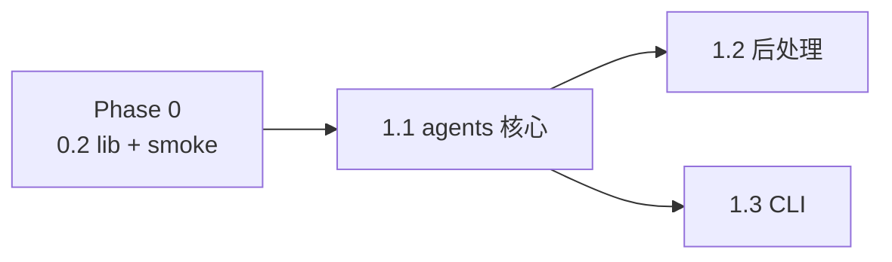

# Phase 1 · Agents（Pseudo-overview）

## Todo 依赖关系



- **1.1** 依赖 Phase 0（至少 **0.2** `scripts/lib`）
- **1.2**、**1.3** 依赖 **1.1**，彼此可并行

## Scope

### In scope

- 实现 `scripts/agents.py`（替换现有 TODO 空壳）
- MVP Persona：**A1**（baseline）、**A2**、**A4**、**A7**（创作视角）
- 读取 `prompts/A1_*.md` … `prompts/A7_*.md`；**不**加载 `prompts/_shared/`、`prompts/C1_*`、`prompts/C2_*`
- 新闻 payload 注入 `{{title}}` / `{{description}}` / `{{pub_time}}` / `{{source_name}}`
- 默认 provider：`DEFAULT_LLM_PROVIDER=mimo`（经 `scripts/lib`）
- 异步并发 4 路 LLM；单路失败 → `errors`，不阻断其余
- 输出：结构化 JSON（stdout 或 `--out`），供 Phase 2 / `main.py` 消费

### Out of scope（本 Phase 不做）

- `retrieve.py` / 向量编码 / 索引读取
- `copywriter.py`（C1/C2）
- `fetch_news.py` / RSS
- A3/A5/A6 Persona
- JSON Schema 强约束、自动重试、模型路由
- 简报 Markdown 渲染（Phase 3 / Phase 6）

## SSOT（实现前必读）

| 文档 | 章节 |
|------|------|
| `docs/SSOT/电影宇宙「每日星轨观测」系统 PRD.md` | §4.1–4.4、§6.3 新闻字段、§10 step 3 |
| `prompts/_shared/deentification_rules.md` | 硬规则 1–6 |
| `prompts/_shared/output_contract.md` | 60–120 words、英文、单段 |
| `CONTEXT.md` | 伪剧情、基线、去实体化 |
| `prompts/A1_reality_recorder.md` 等 | 模板变量与 few-shot |

## Persona 与角色标记

| ID | 文件 | `role` 字段 | 说明 |
|----|------|-------------|------|
| A1 | `A1_reality_recorder.md` | `baseline` | 对照组，不做隐喻 |
| A2 | `A2_sociologist.md` | `creative` | |
| A4 | `A4_mythologist.md` | `creative` | |
| A7 | `A7_chaos_theorist.md` | `creative` | |

运行顺序建议：**A2 → A4 → A7 → A1**（仅影响 JSON 数组顺序；并发时无妨）。

---

## Todo 1.1 · `agents.py` 核心

**依赖：** Phase 0 **0.2**（`scripts/lib`）

**负责 agent 只做本 todo 时**：搭好数据结构与 LLM 调用，后处理可先做最小版（strip 空行），详细校验留给 1.2。

### 数据模型（建议）

```python
@dataclass
class NewsItem:
    title: str
    description: str
    pub_time: str = ""
    source_name: str = ""
    url: str = ""  # 可选，Phase 5/6 用

@dataclass
class AgentOutput:
    agent_id: str          # "A2"
    persona_name: str      # 来自 md 标题或文件名
    role: str              # "creative" | "baseline"
    text: str
    warnings: list[str]    # 1.2 填充
    error: str | None      # 本路失败原因
```

### Persona 加载

- `prompts_dir` 默认 `prompts/`
- 仅加载：`A1_reality_recorder.md`, `A2_sociologist.md`, `A4_mythologist.md`, `A7_chaos_theorist.md`（显式列表或 `A[1247]_*.md` glob，**排除** `C*`、`_shared`）
- 解析 `agent_id`：文件名前缀 `A1` / `A2` / …

### Prompt 渲染

- 读入完整 `.md` 文本
- 替换占位符（空字段用 `—` 或 `unknown`，避免残留 `{{...}}`）：
  - `{{title}}`, `{{description}}`, `{{pub_time}}`, `{{source_name}}`
- **不要**在代码里拼接 `_shared/deentification_rules.md`（已在各 Persona 的「Must Obey」中引用；整文件送入模型即可）

### 异步 LLM

- `asyncio.gather` 并发 4 路
- 使用 `scripts.lib.llm.get_llm_client()` + `chat.completions.create`（OpenAI SDK）
- 每路 **timeout** 建议 120s（可 env 配置）；超时 → 该路 `error`，其余继续
- system 消息：可选简短一句 "Follow the instructions in the user message exactly."
- user 消息：渲染后的整份 prompt

### 最小输出清洗（本 todo 即可做）

- 去掉首尾空白；多行合并为单段（`\n\n` → 空格）
- 去掉常见前言（`Sure,` / `Here is` 等简单启发式，完整规则在 1.2）

### 验收（1.1 单独）

```powershell
# 需本地 .env + Phase 0 lib；可暂用手写最小 main 或 pytest
python -c "
import asyncio, json
from scripts.agents import run_all, NewsItem
# ... 或等 1.3 的 CLI
"
```

**1.1 完成定义（合并前）**：能对一条硬编码 `NewsItem` 并发返回 4 个 `AgentOutput`，至少 3 路有非空 `text`（允许 1 路失败记入 error）。

---

## Todo 1.2 · 后处理、去实体化告警与 errors

**依赖：** **1.1**

**负责 agent 只做本 todo 时**：在 1.1 输出管道上增加 PRD §4.4 约定的校验与告警。

### 长度

- 目标 **60–120 words**（按空格分词近似即可）
- 过长：在**最近句号**处截断，并 `warnings.append("truncated_over_length")`
- 过短（如 <40 words）：`warnings.append("short_output")`，**不**丢弃（MVP）

### 去实体化告警（MVP 决策：打标，不丢弃）

启发式即可，力求简单、可测：

- 检测**疑似真实专名**：连续大写词组（如 `Elon Musk`）、常见新闻品牌词表（可选小列表：`Tesla`, `Twitter`, `X`…）
- 检测**新闻八股**（`reportedly`, `according to`, `据报道` 等）
- 命中 → `warnings.append("deentify_warning: ...")`，**仍保留 text** 进入下游（与 grill 结论一致）

### errors（整路失败）

记入顶层 `errors: list[dict]`，例如：

```json
{"agent_id": "A4", "type": "timeout", "message": "..."}
```

触发条件：超时、API 异常、空响应、纯拒绝话术、渲染后仍为空。

### 验收

```powershell
python scripts/agents.py --news-file tests/sample_news.json --out out/agents_test.json
# 检查 JSON：4 路结构完整；errors 数组存在；warnings 字段存在
```

### 完成定义

- [ ] 失败单路不导致进程非零退出（除非**全部**失败）
- [ ] `warnings` / `errors` 语义与 `output_contract.md` 一致
- [ ] 无 JSON Schema 强校验（纯 dict / dataclass `asdict`）

---

## Todo 1.3 · CLI、fixtures 与文档

**依赖：** **1.1**（可与 **1.2** 并行，但合并前需 1.2 已合入或本 todo 含 1.2）

**负责 agent 只做本 todo 时**：可交付的命令行与样本数据。

### CLI

```text
python scripts/agents.py --news-file tests/sample_news.json
python scripts/agents.py --news-file tests/sample_news.json --out output/agents_last.json
python scripts/agents.py --news-file tests/sample_news.json --provider deepseek
python scripts/agents.py --agents A2,A4   # 可选：只跑子集，便于调试
```

### 新闻 JSON schema（`tests/sample_news.json`）

```json
{
  "title": "...",
  "description": "...",
  "pub_time": "2026-05-29T12:00:00Z",
  "source_name": "Example Wire",
  "url": "https://example.com/article/1"
}
```

- `title`、`description` **必填**
- 其余可选

### stdout JSON 顶层结构（契约，供 Phase 2）

```json
{
  "news": { "title": "...", "description": "...", "pub_time": "...", "source_name": "...", "url": "..." },
  "agents": [
    {
      "agent_id": "A2",
      "persona_name": "The Sociologist",
      "role": "creative",
      "text": "...",
      "warnings": []
    },
    {
      "agent_id": "A1",
      "role": "baseline",
      "text": "...",
      "warnings": []
    }
  ],
  "errors": []
}
```

- 无 `--out` 时打印到 stdout（UTF-8）
- 有 `--out` 时写入文件并打印路径摘要

### README

更新 `README.md` §「MVP 执行顺序」第 2 步：命令、预期肉眼检查项（4 段英文、A1 更平、A2/A4/A7 风格可分）。

### 验收

```powershell
python scripts/smoke_llm.py --provider mimo   # Phase 0 已通过
python scripts/agents.py --news-file tests/sample_news.json
```

**人工检查清单（总编 / 开发者）：**

- [ ] 4 段均为英文单段
- [ ] A1 无明显隐喻；A2/A4/A7 口吻可区分
- [ ] 无明显未替换真实人名/公司名（或已有 `deentify_warning`）

### 完成定义

- [ ] `tests/sample_news.json` 已提交
- [ ] `--help` 完整
- [ ] 从仓库根目录运行无需 `PYTHONPATH` 手调（`python scripts/agents.py` 或 `python -m` 二选一，文档写清）

---

## Phase 1 整体验收

```powershell
python scripts/agents.py --news-file tests/sample_news.json --out output/phase1_agents.json
python -c "import json; d=json.load(open('output/phase1_agents.json')); assert len(d['agents'])==4; print('phase1 OK', [a['agent_id'] for a in d['agents']])"
```

## 交给下一 Phase 的接口

| 产出 | 消费者 |
|------|--------|
| `agents.py` + JSON 契约 | Phase 2 `retrieve.py`（读 `agents[].text`） |
| `role=baseline` 标记 | Phase 3 闸门、简报 `[baseline]` |
| `errors` / `warnings` | Phase 6 `main.py` 简报 `errors` 节 |

## 风险与约束

- **勿修改** `prompts/A*.md` 人格正文（除非验收发现明显 bug；改 prompt 属于产品迭代，单开 PR）
- **勿提交** `.env`
- 并发注意 provider **rate limit**；MVP 仅 4 路，一般足够
- 中文源新闻 → 输出仍须**英文**（契约在 prompt 与 `output_contract.md`，非代码翻译）
