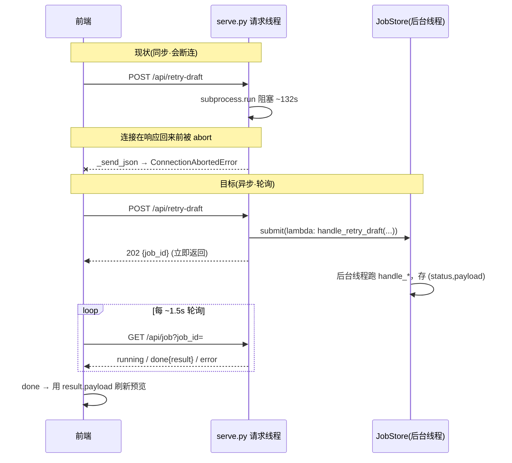

# Phase_12.6_·_面板长任务异步_job_框架（从同步_http_收回长_llm_任务）

> 入库文件标题对齐既有约定：frontmatter `name: Phase12.6-panel-async-job-framework`（slug，对照 `Phase11-deterministic-movie-header-projection` / `Phase12-c2-body-quality-gate`）；正文 H1 用中文描述式 `# Phase 12.6 · 面板长任务异步 job 框架（从同步 HTTP 收回长 LLM 任务）`（对照 `# Phase 11 · 确定性电影抬头行投影...`）。二者在 12.6.1 落地动作 A 写正。

## 前置条件


| Phase / 前置                     | 状态                     | 判定依据                                                                                                                                  |
| -------------------------------- | ------------------------ | ----------------------------------------------------------------------------------------------------------------------------------------- |
| 12.1–12.5（C2 正文质量闸门主体） | complete 且已并入 `main` | PR #143/#144/#145/#146/#147 已合并（`1d80edb`/`91984d5`/`0f780c9`/`d03c7d7`/`07014cf`）；开工前 `git log --oneline` 佐证                  |
| 12.end（原 12.6 搁置 gate）      | 与本框架正交、**不阻塞** | gate 搁置中（`status: todo`、无 Go/No-Go）；反过来本框架是 gate 验收 retry 闭环的**新前置**                                               |
| 当前分支                         | 从最新 `main` 检出       | 规则2：前置已并入 main → 从 main 检出，无 stacked 继承；`git status -sb` 应为 `## main...origin/main`（Phase11 未提交裸改不计入、不触碰） |


## 编号与落地重构（本次调整）

原「独立 Phase 13」改挂进 Phase 12 尾部。**异步框架在逻辑上先于 gate 执行**（gate 的验收内容含「面板 warnings 展示 + 单份 retry 闭环可用」，而 retry 正因同步 HTTP 断连而不可用），故：

- **落地动作 A（新建独立 plan）**：入库为 `.cursor/plans/Phase12.6-panel-async-job-framework.plan.md`，frontmatter `name: Phase12.6-panel-async-job-framework`、正文 H1 `# Phase 12.6 · 面板长任务异步 job 框架（从同步 HTTP 收回长 LLM 任务）`、编号 12.6.1~12.6.5、`status: todo`、`isProject: true`、`overview: |` 块标量——标题与格式全对齐 `Phase11`/`Phase12`。主题是「面板传输层架构」，与 Phase12 主体「C2 正文质量闸门」不同，独立文件更干净。
- **落地动作 B（改现有 Phase12 plan）**：`[.cursor/plans/Phase12-c2-body-quality-gate.plan.md](.cursor/plans/Phase12-c2-body-quality-gate.plan.md)` 把 gate 从 `p12.6-eyeball-gate-manual-approve` 重命名为「最后一项」`p12.end-eyeball-gate-manual-approve`（frontmatter `id` + 正文 `## Todo 12.end` 标题同步改），依赖从「12.1–12.5」更新为「12.1–12.5 + 12.6.x（异步框架）」，附一句「retry 闭环验收依赖 12.6.x 落地」。**只改 id/标题/依赖三处文字，不动 gate 搁置状态**（仍 `status: todo`、不给 Go/No-Go）。

```
Phase 12 执行顺序（= 数字顺序）:
    12.1 → 12.2 → 12.3 → 12.4 → 12.5 → 12.6.1 → 12.6.2 → 12.6.3 → 12.6.4 → 12.6.5 → 12.end(gate)
    ────────────已并入 main────────────   ──────────本 plan（异步框架）──────────   ──搁置人工验收──
```

## 背景 · 根因（已实测锁定）

点重试后卡在「重掷中」不刷新，**不是前端 bug**。实测证据链：

- 前端 `onRetryDraft` 逻辑正确：`apiPost` 返回 `{status, ok, body}`，判 `res.ok && res.body.ok` 后 `state.drafts = res.body.drafts` + `onPreviewDraft(id)` 重渲染。
- 照 server 方式前台复现 `drafts_adapter.py --retry The-Innocent --judge`：exit 0、`Wrote ...drafts_xiaohongshu.json`（池子**确实回写了**），但耗时 **~132s**（真实 MIMO：正文 + judge + 一次修复 ≈ 4 次串行 LLM 调用）。
- server 日志实锤 traceback：`_send_json` → `self.wfile.write(data)` → `ConnectionAbortedError`。**连接在这 132s 里早被中止**，subprocess 后台跑完想回写响应时 socket 已死。

根子：`[review_panel/serve.py](review_panel/serve.py)` 用 `ThreadingHTTPServer`，6 个长任务端点（`publish`/`rewrite`/`regenerate`/`generate-drafts`/`combine-drafts`/`retry-draft`）**全是同一同步模式**——请求线程里 `subprocess.run(capture_output=True)` 阻塞到跑完才 `_send_json`。retry+judge 最长最先触雷，其余端点同样脆弱。

## 数据流演变




## 关键架构锚点（复用，不新造）

- **纯函数路由边界**：`[review_panel/serve.py](review_panel/serve.py)` 的 `route()` 无共享可变状态、用闭包注入的 `run_subprocess`，测试直接调 `route()` 传 stub、不起真实端口。**这条可测性边界必须被异步框架保住**——故 executor 可注入 inline（见 D2）。
- **handle_ 已产出 `(status, payload)`**：6 个 `handle_*` 逻辑/参数解析/subprocess/读回池已成型，异步化只挪「在哪跑」，**零改动**（D3）。
- **注入同构**：`job_store` 沿用既有 `run_subprocess` 的注入方式，穿 `route/make_handler_class/_dispatch/serve`（D6）。
- **前端可复用件**：已有 `apiGet`(≈1222)/`apiPost`(≈1227)/`showCopyLoading`(≈1439)/`showDraftPoolResult`(≈1935)/`draftOpInFlight`；**无 `/api/job`、无 `pollJob`**（本 plan 新建）。

## 设计决策（写入 ADR-0020）

### D1 · JobStore = 内存 dict + 锁

单用户本地工具，无需持久化；进程重启即清（记为技术债）。新模块 `review_panel/job_store.py`，FP 风格。`JobRecord`（`job_id/status(running|done|error)/http_status/payload/error/kind/created_at`）；`JobStore.submit(work, kind) -> job_id` / `get(job_id)`。

### D2 · executor 可注入（可测性命门）

`submit` 的执行器默认 `_thread_executor`（`threading.Thread(daemon=True)`）；测试注入 `_inline_executor`（同步立即跑）→ route() 测试不起真实线程、job 在 submit 内即完成、GET 立即拿回结果。守住「route() 纯函数、单测注入」既有边界。

### D3 · handle_ 零改动

`route()` 对这 6 个端点改为 `job_store.submit(lambda: handle_xxx(...), kind=...)` 立即返回 `202, {ok:True, job_id, kind}`。业务逻辑/参数解析/subprocess/读回池全部原样复用。

### D4 · `/api/job` 轮询契约

`GET /api/job?job_id=`：未知 id→404；running→200 `{ok:True,status:"running"}`；done→200 `{ok:True,status:"done",result:{http_status,payload}}`；error→200 `{ok:True,status:"error",stderr}`。

### D5 · `_send_json` 兜断连

包 try/except 吞 `(ConnectionAbortedError, BrokenPipeError, ConnectionResetError)`——即便快请求客户端也可能断开，防 server 线程崩打 traceback。

### D6 · job_store 注入贯通

作参数穿 `route/make_handler_class/_dispatch/serve`，默认模块级单例 `_DEFAULT_JOB_STORE`；与既有 `run_subprocess` 注入同构。

---

## Todo 12.6.1 · [asset+adr] job_store.py + ADR-0020 + 落地动作 B（gate 改 12.end）

**依赖：** 无（可先做）

**改动：**

- 新增 `review_panel/job_store.py`：
  - `JobRecord`（`job_id/status/http_status/payload/error/kind/created_at`，FP 风格 NamedTuple/dataclass）。
  - `JobStore`：内存 `dict` + `threading.Lock`；`submit(work, kind, *, executor=_thread_executor) -> job_id`；`get(job_id) -> JobRecord | None`。
  - executor 可注入：默认 `_thread_executor`（`threading.Thread(daemon=True)`）；`_inline_executor`（同步立即跑，供测试）。
- 新增 `docs/adr/0020-panel-async-job-framework.md`：记录 D1–D6，引用 ADR-0016/0017/0019。
- **落地动作 A（本 plan 入库定名）**：将本 plan 写入 `.cursor/plans/Phase12.6-panel-async-job-framework.plan.md`，frontmatter `name: Phase12.6-panel-async-job-framework`、H1 中文描述式、`isProject: true`、`overview: |` 块标量、各 todo `status: todo`——标题与格式对齐 `Phase11`/`Phase12`。
- **落地动作 B**：改 `[.cursor/plans/Phase12-c2-body-quality-gate.plan.md](.cursor/plans/Phase12-c2-body-quality-gate.plan.md)`——gate `id` `p12.6-...`→`p12.end-...`、正文 `## Todo 12.6`→`## Todo 12.end`、依赖 `12.1–12.5`→`12.1–12.5 + 12.6.x`；不动搁置状态。

### 验收

- [ ] `JobStore.submit/get` 有单测（inline executor 下 job 立即 `done`、异常路径落 `error`）
- [ ] ADR-0020 落地，D1–D6 齐全并被本 plan 引用
- [ ] 落地动作 A：入库 plan 文件名/frontmatter `name`/H1 与 `Phase11`/`Phase12` 标题格式一致
- [ ] 落地动作 B 完成：Phase12 plan gate 的 id/标题/依赖三处已改，`status` 仍 `todo`（搁置不动）

---

## Todo 12.6.2 · [serve] route() 异步化 6 端点 + /api/job + job_store 注入 + _send_json 兜断连

**依赖：** 12.6.1

**改动：**

- `[review_panel/serve.py](review_panel/serve.py)`：
  - `route()` 6 长任务端点（`publish`/`rewrite`/`regenerate`/`generate-drafts`/`combine-drafts`/`retry-draft`）改为 `job_store.submit(lambda: handle_xxx(...), kind=...)`，立即返回 `(202, {ok:True, job_id, kind})`。`**handle_*` 本身不改**。
  - 新增 `GET /api/job?job_id=`：按 D4 四态（404/running/done{result}/error）。
  - `job_store` 注入穿 `route/make_handler_class/_dispatch/serve`，默认单例 `_DEFAULT_JOB_STORE`（与 `run_subprocess` 注入同构）。
  - `_send_json`（≈1208）包 try/except 吞 `ConnectionAbortedError/BrokenPipeError/ConnectionResetError`。

### 验收

- [ ] 6 端点 POST 返回 `202`+`job_id`，请求线程不再阻塞
- [ ] `GET /api/job` 四态正确（未知 id→404 / running / done{result} / error）
- [ ] `select-draft`/`edit-body` 等无 LLM 快端点保持同步不变
- [ ] `_send_json` 断连不再打 traceback

---

## Todo 12.6.3 · [frontend] submitJob + pollJob + 6 回调切换

**依赖：** 12.6.2

**改动：**

- `[review_panel/index.html](review_panel/index.html)`：
  - 新增 `submitJob(url, payload, kind)`：`apiPost` 拿 `202+job_id` → `pollJob(job_id)` → 把内层 `result.http_status/payload` **还原成 `{status, ok, body}`**（与 `apiPost` 形状完全一致）。
  - 新增 `pollJob(job_id)`：`setTimeout` 循环 `apiGet('/api/job?job_id=')`（复用现有 `apiGet` ≈1222），done→resolve / error→reject / running→续轮询；**设最大轮询上限兜死循环**。
  - 6 个 `on*` 回调把长任务 `apiPost` 换 `submitJob`（形状一致，`.then(res=>res.ok&&res.body.ok)`/`.catch`/复位逻辑几乎零改）：`onGenerateDrafts`(≈2157)/`onCombineDrafts`(≈2204)/`onRetryDraft`(≈2019) + publish/rewrite/regenerate 三处。
  - loading 文案复用 `showCopyLoading`(≈1439)/`showDraftPoolResult`(≈1935)。

### 验收

- [ ] `submitJob` 返回形状与 `apiPost` 完全一致，6 回调 `.then/.catch` 逻辑几乎零改
- [ ] `pollJob` 有最大轮询上限，超限清 loading 并报错
- [ ] 6 回调切换后功能一致；retry 跑完自动刷新预览、warnings 徽标随之更新

---

## Todo 12.6.4 · [测试] job_store 单测 + serve route 改注入 inline

**依赖：** 12.6.2 + 12.6.3

**改动：**

- 新增 `tests/test_job_store.py`：`submit`/`get`/异常落 error/inline executor 各分支。
- 改造 `tests/test_review_panel_serve.py`：6 端点 route 测试注入 inline `job_store`——POST 断言 `202`+`job_id`，再 `GET /api/job` 断言拿回原 `(status, payload)`；新增 job 路由未知 id/running/done/error 测试。

### 验收

- [ ] `pytest tests/test_job_store.py tests/test_review_panel_serve.py` 全绿
- [ ] route() 测试用 inline executor，不起真实线程、无端口
- [ ] 全量 `pytest` 无 regression（基线 337 passed / 1 xfailed）

---

## Todo 12.6.5 · [GATE] 真实重跑面板异步闭环 [需人工验收]

**依赖：** 12.6.1–12.6.4 全部

**执行顺序：**

1. 面板点 retry+judge（~132s）与 generate-drafts（不写 report、不合并）。
2. 人工验收：POST 立即返回、轮询期间 loading、跑完自动刷新预览、warnings 徽标更新、server 日志无 `ConnectionAbortedError`。
3. 等待人工 Go/No-Go；No-Go 回 12.6.2 / 12.6.3 修正。

**人工验收阻断说明：** 本 TODO 为人工验收阻断点。达标（Go）前**不标 complete、不写报告、不合并**；触发挂起须按规则输出 `⚠️ [PAUSED]` 并等待 `approve`。

**验收项：**

- [ ] retry+judge POST 立即返回 `202`，不再卡「重掷中」
- [ ] 轮询期间 loading 正常，跑完自动刷新预览与 warnings 徽标
- [ ] generate-drafts 异步链路同样可用
- [ ] server 日志无 `ConnectionAbortedError`
- [ ] `[需人工验收 · Go/No-Go]`

---

## 风险与约束

- **可测性**：executor 必须可注入 inline，否则 route() 测试起真实线程/超时——守住 D2 边界。
- **loopback 不变**：仍只绑 127.0.0.1、无鉴权，不动。
- **并发**：`ThreadingHTTPServer` 每请求一线程 + job 再起 daemon 线程；`JobStore` 用 `Lock` 保护 dict。前端 `draftOpInFlight` 防同类重复提交。
- **内存增长**：job record 不回收（MVP 可接受，重启清空）→ 技术债，ADR-0020 记录。
- **向后兼容**：这 6 端点 HTTP 契约由「同步 200/500」变「202+轮询」——纯前后端内部契约，无外部消费者；`select-draft`/`edit-body` 等快端点保持同步不动。
- **gate 编号迁移纪律**：落地动作 B 只改现有 Phase12 plan 里 gate 的 `id`/标题/依赖三处文字，**不动 gate 的搁置状态**（仍 `status: todo`、仍不给 Go/No-Go）。
- **计划文件标题/格式**：本 plan 入库为 `.cursor/plans/Phase12.6-panel-async-job-framework.plan.md`，frontmatter `name: Phase12.6-panel-async-job-framework`（slug）、H1 `# Phase 12.6 · 面板长任务异步 job 框架（从同步 HTTP 收回长 LLM 任务）`、`isProject: true`、`overview: |` 块标量、`status: todo/complete`——全对齐 `Phase11`/`Phase12`。Cursor 计划态草稿的临时自动文件名（`phase_12.6_·_..._<hash>.plan.md`）为一次性草稿名、非入库文件，在落地动作 A 归一。

