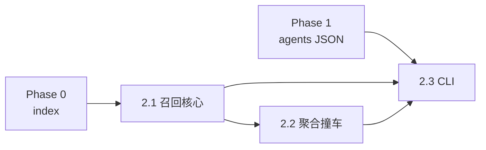

# Phase 2 · Retrieve（候选召回）

## Todo 依赖关系



- **2.1** 依赖 Phase 0（`data/index/embeddings.npy` + `meta.parquet`）
- **2.2** 依赖 **2.1**
- **2.3** 依赖 **2.1**、**2.2**、Phase 1（`agents.py` 输出 JSON）

## Scope

### In scope

- 实现 `scripts/retrieve.py`（替换 TODO 空壳）
- 查询编码：**`Overview: {pseudo}`**（ADR-0001，与索引同分布）
- 模型：`sentence-transformers/paraphrase-multilingual-MiniLM-L12-v2`（仅用于 **查询**；电影向量复用 `embeddings.npy`）
- 每 Agent **Top-K=2**；4 Agent → 最多 **8** 条 per-agent 命中
- 聚合视图：按 `tmdb_id` 去重；标注 `triggered_by`（创作视角列表）；**A1 不计入撞车展示**
- **不设**相似度阈值 / 评分过滤 / 历史去重
- 深链：`MOVIE_LINK_PREFIX` + `id`（默认 `https://themoviecosmos.com/movie/{id}`）
- 输出 JSON（stdout / `--out`）

### Out of scope

- `agents.py` 改动（除联调）
- C1/C2、`fetch_news`、`main.py` 全链路
- FAISS、索引重算、候选过滤策略

## SSOT

| 文档 | 用途 |
|------|------|
| `docs/adr/0001-reuse-cosmos-text-embeddings.md` | 查询模板、片单 59,341 |
| `docs/SSOT/...PRD.md` | §5.1–5.2 |
| `CONTEXT.md` | 表层匹配器、撞车、基线 |
| Phase 1 plan | `agents` JSON 输入字段 |

---

## Todo 2.1 · 召回核心

**依赖：** Phase 0

### 实现要点

1. 启动时加载（经 `scripts/lib/paths`）：
   - `embeddings.npy` → `(59341, 384)` float32
   - `meta.parquet` → DataFrame，行序与 embeddings **第 i 行对齐**
2. 加载 `SentenceTransformer('paraphrase-multilingual-MiniLM-L12-v2')`
3. 对每条 pseudo 文本：
   - `query_text = f"Overview: {pseudo.strip()}"`
   - `encode(..., normalize_embeddings=True)` → `(384,)`
4. `scores = query @ embeddings.T`（已 L2 归一 → 余弦）
5. `np.argpartition` 取 Top-**2** per agent；附带 `similarity` float
6. 映射 meta 字段：`tmdb_id`←`id`，`release_year`←`release_date` 年份，`language`←`original_language`

### 单条 pseudo 调试（本 todo 验收）

```powershell
python scripts/retrieve.py --pseudo "A prophet of technology proclaims..." --agent-id A2
```

### 完成定义

- [ ] Top-2 返回 2 部不同电影（除非库极小）
- [ ] `similarity` 在 [-1, 1] 且单调合理
- [ ] 未改 `embeddings.npy` 行序

---

## Todo 2.2 · 聚合与撞车展示

**依赖：** **2.1**

### 实现要点

1. **per_agent**：保留每 Agent 的 Top-2 列表（含 `agent_id`、`role`）
2. **candidates**（去重）：key = `tmdb_id`
   - `title`, `overview`, `genres`, `release_year`, `language`, `poster_path`, `movie_url`, `similarity`（可取各 agent 中 **max**）
   - `triggered_by`: `["A2","A4"]` — 仅 **role=creative** 的 agent；**不含 A1**
   - `triggered_by_baseline`: 可选，若 A1 也命中则单独字段或布尔 `also_baseline`（便于简报标 `[baseline]`）
3. **撞车**：仅展示 `len(triggered_by) >= 2`，**不**用于排序加权
4. **发散度探针**（可选，写入 JSON 顶层 `divergence`）：
   - 各 agent 查询向量两两余弦
   - 各 agent Top-K 的 `tmdb_id` 集合 Jaccard
   - 不参与召回逻辑

### 完成定义

- [ ] 同一电影被 A2+A4 命中时，`triggered_by` 含二者且候选只出现一次
- [ ] A1 单独命中时不在 `triggered_by` 创作列表中

---

## Todo 2.3 · CLI 与 JSON 契约

**依赖：** **2.1**、**2.2**、Phase 1

### CLI

```text
python scripts/retrieve.py --agents-json output/phase1_agents.json
python scripts/retrieve.py --agents-json ... --out output/phase2_retrieve.json
python scripts/retrieve.py --agents-json ... --top-k 2
```

- 跳过 `agents[].error` 非空或 `text` 为空的项
- `--help` 完整

### 输出 JSON（契约）

```json
{
  "per_agent": [
    {
      "agent_id": "A2",
      "role": "creative",
      "pseudo": "...",
      "hits": [
        { "tmdb_id": 157336, "title": "...", "similarity": 0.42, "movie_url": "https://themoviecosmos.com/movie/157336" }
      ]
    }
  ],
  "candidates": [
    {
      "tmdb_id": 157336,
      "title": "...",
      "overview": "...",
      "genres": "...",
      "release_year": 2014,
      "language": "en",
      "poster_path": "/...",
      "movie_url": "...",
      "similarity": 0.42,
      "triggered_by": ["A2", "A4"],
      "also_baseline": false
    }
  ],
  "divergence": { "query_cosines": {}, "topk_jaccard": {} }
}
```

### README

在「MVP 执行顺序」增加第 3 步：`agents.json` → `retrieve.json`，并说明在全量 59,341 索引上肉眼验收。

### 验收

```powershell
python scripts/agents.py --news-file tests/sample_news.json --out output/phase1_agents.json
python scripts/retrieve.py --agents-json output/phase1_agents.json --out output/phase2_retrieve.json
python -c "import json; d=json.load(open('output/phase2_retrieve.json')); print(len(d['candidates']), 'candidates')"
```

---

## Phase 2 整体验收

- [ ] 上述命令通过
- [ ] `candidates` 非空（正常新闻下）
- [ ] 人工：候选与 pseudo 至少有表层相关，便于进入 Phase 3 闸门评分

## 交给下一 Phase

| 产出 | 消费者 |
|------|--------|
| `retrieve.json` / `candidates[]` | Phase 3 `run_eval`、Phase 4 C1 |
| `triggered_by` | 简报「由 A2, A4 共同召回」展示 |
| `divergence` | 评测期观察，非门禁 |

## 风险与约束

- 首次运行会下载 sentence-transformers 模型（缓存后离线可复用）
- 内存：59341×384×4 bytes ≈ 90MB，可全量载入
- **勿**对 embeddings 做 re-normalize 或 reorder
- 片单外电影不可召回（索引即站点子集）
