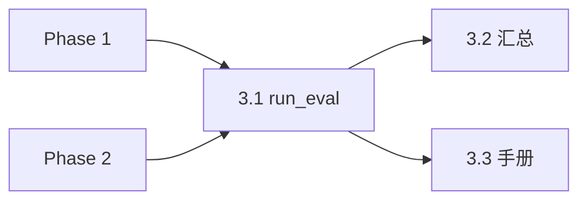

# Phase 3 · 验证闸门（The Bet）

## Todo 依赖关系



- **3.1** 依赖 Phase 1、Phase 2（可 `import` 或 subprocess 调用二者 CLI）
- **3.2**、**3.3** 依赖 **3.1** 的 Markdown 格式，彼此可并行

## Scope

### In scope

- `scripts/run_eval.py`：单条新闻 → `agents` → `retrieve` → **`output/Eval/{run_id}/` 目录**
- 目录含：`reality.json`、`reality.md`、`agents/A*.md`、`candidates.md`（共振分占位）、`retrieve.json`、`errors.md`、`run.md`
- `scripts/summarize_eval.py`（或同名）：扫描多份已评分 md → 闸门指标
- `docs/eval-the-bet.md` 或 README 章节：N=10、手挑新闻、通过线、评分 rubric
- 输出目录：`output/Eval/`（与正式 `Daily_Briefing` 区分）

### Out of scope

- C1/C2、`copywriter.py`
- `fetch_news.py`（Phase 5；评测期可继续用手写 `--news-file` JSON）
- `main.py` 生产日更全链路
- 自动打分（共振分**仅人类填写**）

## SSOT

| 文档 | 用途 |
|------|------|
| PRD §1.3、§7.2、§10 step 5 | 闸门与简报骨架 |
| `CONTEXT.md` | 结构性共振、基线、评分归属 |
| Phase 1/2 plan | JSON 输入输出契约 |

## 闸门定义（实现与文档须一致）

**评分（每个去重候选一条）：**

| 分 | 含义 |
|----|------|
| **0** | 毫无结构性共振 |
| **1** | 表层题材沾边但平淡 |
| **2** | 真正的结构性共振（权力/命运/反讽骨架同构） |

**归属：** 对 `(新闻, tmdb_id)` 打**一次**分；该分同时计入所有召回了它的 agent 桶（创作 / 基线分开统计）。

**通过线（N=10 条新闻）：**

1. ≥ **60%** 的批次（6/10）至少存在 **1 个** 候选为 **2 分**
2. **A1 基线**候选集的 **2 分率** < **A2+A4+A7 创作**合并候选集的 **2 分率**

**未通过 →** 回到 Phase 1（prompt）或 Phase 2（召回），**不开** Phase 4 Copy。

---

## Todo 3.1 · `run_eval.py`

**依赖：** Phase 1、Phase 2

### CLI

```text
python scripts/run_eval.py --news-file tests/sample_news.json
python scripts/run_eval.py --news-file path.json --run-id musk-layoff-01
python scripts/run_eval.py --news-file path.json --out output/Eval/musk-layoff-01
```

- `--run-id` 默认从新闻 title slug 或时间戳生成；默认输出目录 `output/Eval/{run_id}/`
- 内部调用：`agents.run_all` + `retrieve.from_agents`（优先库内调用，避免重复加载索引）

### 产出目录（当前实现）

```text
output/Eval/{run_id}/
├── run.md, reality.json, reality.md, retrieve.json, errors.md
├── candidates.md    # 聚合候选 + 共振分占位（唯一填分处）
└── agents/A2.md … A1.md
```

- 创作视角撞车：`[A2, A4]` 来自 `triggered_by`；**不含 A1**
- 若仅 A1 命中：`[baseline only]` / `also_baseline: true`
- `divergence` 仅在 `retrieve.json` 内，无单独文件

### 验收

```powershell
python scripts/run_eval.py --news-file tests/sample_news.json --run-id sample
```

- [ ] 目录生成且 `agents/` 四段 pseudo + `candidates.md` 非空（正常样本）
- [ ] 每条候选有 `共振分:` 占位行

---

## Todo 3.2 · 分数汇总与闸门判定

**依赖：** **3.1**

### `scripts/summarize_eval.py`

```text
python scripts/summarize_eval.py --dir output/Eval
python scripts/summarize_eval.py output/Eval/01-grid-outage/candidates.md
```

**解析规则（简单、可手写）：**

- 每个 `### ` 候选块内读取 `- **共振分**:` 后第一个 `0`/`1`/`2`
- 未填则报 `missing` 并计入报告，不参与通过率

**输出（stdout 或 `--out report.json`）：**

- 每 run：是否有 ≥1 个 2 分
- 全局：批次通过率（有 2 分的 run 数 / 总 run 数）
- **baseline_2_rate** vs **creative_2_rate**（按归属规则：候选的 2 分计入其 `triggered_by` 创作列表；仅 A1 的计入 baseline 桶）

**判定：** 打印 `GATE_PASS` / `GATE_FAIL` 及简要原因

### 验收

- [ ] 对 2～3 份**手工填好分**的 fixture md 跑通，结果与手算一致

---

## Todo 3.3 · 评测手册

**依赖：** **3.1**

### 交付

- `docs/eval-the-bet.md`（推荐）或 README「验证闸门」专节，包含：
  1. 前置：Phase 0–2 已验收
  2. 准备 **N=10** 条新闻 JSON（来源：Phase 5 抓取后手挑；评测早期可手写 JSON）
  3. 循环：`run_eval.py --news-file ...` → 在 Obsidian 打开 `output/Eval/*.md` 填 **共振分**
  4. `summarize_eval.py` 看闸门
  5. rubric 0/1/2 与 CONTEXT「结构性共振」一致
  6. 未通过时的回流路径（改 prompt / 查 retrieve）

- 可选：`tests/eval_news/README.md` 列出 10 条占位文件名（内容用户自行填充）

### 人类步骤（不写进 agent todo，但手册须写清）

> 从真实 RSS 池手挑 10 条 → 跑 10 次 `run_eval` → 填分 → `summarize_eval` → 记录 GATE 结论

---

## Phase 3 整体验收

- [ ] `run_eval` + `summarize_eval` 命令文档齐全
- [ ] 至少 **1 条**真实新闻端到端评测 md 产出
- [ ] 团队对「通过 / 不通过」有书面结论（可记在 `output/Eval/GATE_RESULT.md`，人工维护）

## 交给下一 Phase

| 条件 | 下一动作 |
|------|----------|
| **GATE_PASS** | 开 Phase 4 `copywriter.py`（C1） |
| **GATE_FAIL** | 回到 Phase 1/2，不建 Copy |

| 产出 | 消费者 |
|------|--------|
| 评测 md 格式 | Phase 6 `main.py` 可复用渲染逻辑 |
| `summarize_eval` 指标定义 | 产品记录 / 迭代 prompt |

## 风险与约束

- 全量索引 59,341：每次 `run_eval` 会加载 embedding + 模型，注意机器内存
- 10 次运行 ≈ 10× LLM 成本（4 agent/次），预算需心理预期
- 评分主观：N=10 为 grill 约定，可在手册注明「可增至 15」但闸门线需重算
