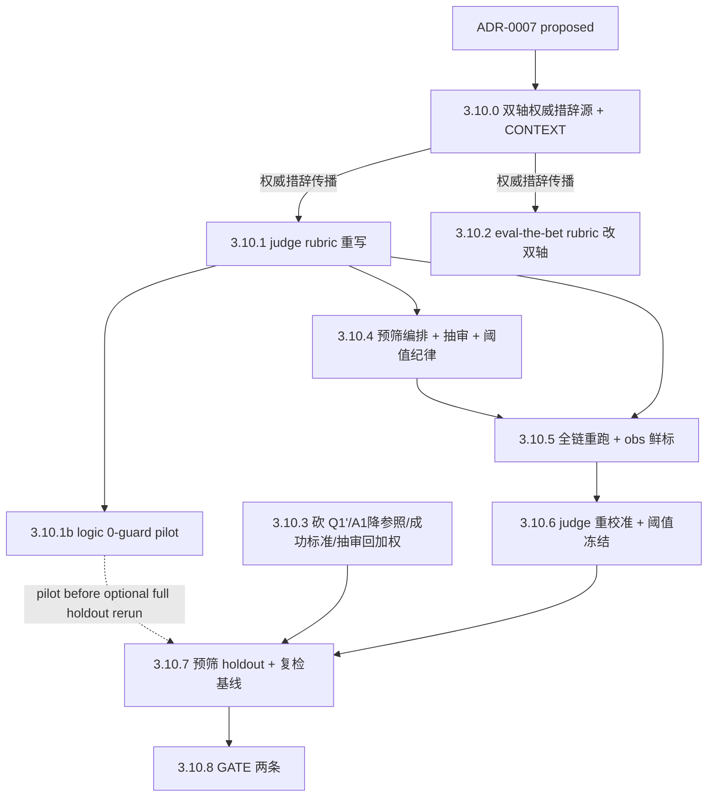

# Phase 3.10 · 共振升级双轴 + LLM-judge 转评测预筛（新定义复检基线）

## 触发与定位

承接 [ADR-0007](../../docs/adr/0007-logic-resonance-judge-prescreen-and-pov-focalization.md)（`Status: proposed`），它是 **Phase 3.9 `GATE no-go`（2026-06-09）复盘后的重设计第一步**。3.9 硬数据（`output/Eval/phase3.9/llm-judge-scores.json`，152 配对）：judge **从未**把人工强共振（human=2）判成 0（`within_one=1.0`）；`judge≥1` 放行模拟下 **human=2 留存 100%**、human=0 筛掉 83%、总量砍 57%；`human=2 & judge=1` 的 14 例**全部** judge 给 1（无一给 0）。

**复盘定性**：人工早已按「表层元素 + 底层逻辑」打分，但写下来的 rubric 与 judge 仍停在「骨架同构」——14 例分歧是**定义错位**而非噪声。本 Phase 落地 ADR-0007 **D1–D5**：① D1 共振重定义双轴；② D2 不动 3.9 历史、全新起算；③ D3 分两步的第一步（POV 留 3.11）；④ D4 judge 转评测预筛；⑤ D5 砍 Q1'、A1 降只读、成功标准两条。

**本 Phase 不开新赌注**，而是「用修正后的尺子 + 减负工具给组合拳一次诚实复检」，并产出 3.11（POV）的**干净对照臂**（POV-off 基线）。

**代码现状（实现前）：**

- **judge**：`scripts/llm_judge.py` 的 `_JUDGE_RUBRIC`/`_JUDGE_SYSTEM` 仍是旧「骨架同构」2×2；校准在 3.9 旧定义人工分上跑（采信但尺子是旧的）。
- **rubric 文档**：`docs/eval-the-bet.md` §4 仍「表层 + 结构性」。
- **闸门**：`scripts/summarize_eval.py` 仍含 Q1'/A1-oracle 删除判据（3.9 遗留）。
- **生成侧**：persona / salience / 检索保持 3.9 配方，本 Phase **不动**。

## Todo 依赖关系

`3.10.0` 是**双轴定义的唯一权威措辞源**；`3.10.1`（judge prompt）与 `3.10.2`（rubric 文档）必须**逐字传播同一措辞**，不得各自改写——否则 judge 与人类又按不同尺子打分（重蹈 14 例分歧）。`3.10.3`/`3.10.4` 可与 `3.10.1`/`3.10.2` 并行。

> **执行分工标记**：`[需聪明模型]` = **执行该条时须在 Cursor 把 agent 模型切到 Opus**（agent 亲手撰写权威措辞）。注意区分两类「智能」：① **Cursor agent 模型**——只有 `3.10.0` 这种撰写权威措辞的活才需切 Opus；② **运行时 LLM**（pseudo 生成 / judge 打分，由 `.env` 的 MiMo Pro / DeepSeek 决定）——与 Cursor agent 模型无关，跑脚本即可。`3.10.1`（粘贴进 judge prompt + 代码/测试）、`3.10.2`（粘贴进 rubric 文档）只要 `3.10.0` 成稿就是**机械传播**，Cursor 普通模型即可；`3.10.3/4` 机械、`3.10.5–8` 跑批/打分，均无须切 Opus。

## Scope

### In scope

- `prompts/_shared/*` + `CONTEXT.md`：双轴定义权威措辞源。
- `scripts/llm_judge.py`：rubric 双轴重写 + 强制因果反测句。
- `docs/eval-the-bet.md` §4：共振 rubric 双轴 + 反测 + 2×2 措辞。
- `scripts/summarize_eval.py` / `scripts/score_eval_candidates.py`：砍 Q1'、A1 只读、成功标准两条、抽审回加权。
- judge 预筛编排（全量打分 / 分档 / 拒绝集抽审 / 阈值纪律）。
- 全链重跑（同新闻集 01–10，**生成侧不动**）+ obs 新定义鲜标 + judge 重校准 + holdout 预筛。
- `tests/`：双轴 rubric 解析、反测句校验、分档/抽审逻辑、阈值安全断言、成功标准统计。
- pilot/批量 run + GATE_RESULT。

### Out of scope

- **POV / focalization**（ADR-0007 D6–D8）：3.11。
- **生成侧改动**（persona / salience / 检索）：保持 3.9 配方。
- **候选噪声根治 / 第二匹配轴**（OPEN b）：仅用预筛贴创可贴。
- **生产日报选片预筛**（OPEN c）、**呈现层 POV**（OPEN a）、**Phase 4 解封**。

## SSOT

| 文档 | 用途 |
| --- | --- |
| [docs/adr/0007-*.md](../../docs/adr/0007-logic-resonance-judge-prescreen-and-pov-focalization.md) | 本 Phase 全部决策（D1 双轴 / D2 不动历史 / D3 分两步 / D4 预筛 / D5 砍 Q1'）；`proposed`，3.10 GATE go 后 D1–D5 升 `accepted` |
| [docs/adr/0006-*.md](../../docs/adr/0006-a1-as-held-out-oracle-per-persona-neutral-and-three-bucket-eval.md) | salience≠valence 架构 / 中性通道 / 三桶（保留）；其 Q1' 删除闸被 ADR-0007 砍 |
| [docs/eval-the-bet.md](../../docs/eval-the-bet.md) §4 | 共振 rubric（本 Phase 改双轴；judge 与人工共用） |
| [output/Eval/phase3.9/llm-judge-scores.json](../../output/Eval/phase3.9/llm-judge-scores.json) | 14 例分歧 + 混淆矩阵（D1 证据、阈值参考） |
| [output/Eval/phase3.9/GATE_RESULT.md](../../output/Eval/phase3.9/GATE_RESULT.md) | 3.9 结案（legacy 基线） |

## 判据与闸门（本 Phase 定稿 · 与 ADR-0007 D1/D4/D5 一致）

| 代号 | 定稿 |
| --- | --- |
| **双轴定义（D1）** | 表层=具体可命名过0分守门；逻辑=POV/尺度不变因果引擎+反测句；抽象权力角色归逻辑轴；2×2 矩阵不变只换措辞 |
| **judge 预筛（D4）** | 全量打分不删；`0`降级/`≥1`人工/`2`高亮；阈值 `judge≥1` 在 obs 验证「零 human-2 被杀」才冻结 |
| **拒绝集抽审（D4）** | 每 run 盲评 `judge=0` 堆随机 k%；捞到 human=2 ⇒ 门槛不安全，放宽 |
| **成功 · 共振侧（D5）** | 新双轴定义下 combo 2 分率 **>** pure_fact，控相似度后仍成立，obs/holdout 不裂口 |
| **成功 · 工作流侧（D5）** | 减负 ~50%+ 且零 human-2 被杀（抽审证实）+ judge 校准采信 |
| **A1（D5）** | 仅只读质量参照，不进任何闸；Q1' 删除闸**已删** |

---

## Todo 3.10.0 · 双轴定义权威措辞源 + CONTEXT [需聪明模型] [需人工验收]

**依赖：** ADR-0007（proposed）

- 在 `prompts/_shared/`（或 ADR-0007 引用的权威块）写定**唯一一份**「双轴定义 + 因果反测句」措辞：表层元素（具体可命名 / 过 0 分守门 / 抽象权力角色归逻辑轴）+ 底层逻辑（POV/尺度不变因果-赌注引擎）+ 反测句模板。
- 明确「2×2 矩阵不变，仅换措辞」：`结构性共振→逻辑共振`、`深层共振（仅结构）→深层共振（仅逻辑）`、`强共振（表层+结构）→强共振（表层+逻辑）`。
- **同时产出两份成稿**，让下游变成纯粘贴（这是把 Opus 工作前置到本条的关键）：① **judge-ready** 段（直接替换 `llm_judge.py` 的 `_JUDGE_RUBRIC`/`_JUDGE_SYSTEM`，含 Step1/Step2 + 强制因果反测句 rationale + JSON schema）；② **rubric-ready** 段（直接替换 `eval-the-bet.md` §4 的 2×2 表 + 共振类型示例）。
- `CONTEXT.md`：补术语（表层元素 / 底层逻辑 / POV 不变因果引擎 / judge 预筛 / 拒绝集抽审）。
- **传播契约**：声明 3.10.1（judge prompt）/ 3.10.2（rubric 文档）只**逐字粘贴**上述成稿，禁止各自改写（执行时无须切 Opus）。

### 验收

- [x] 权威措辞源含双轴定义 + 反测句 + 2×2 映射，与 ADR-0007 D1 逐条一致
- [x] CONTEXT 术语补齐
- [x] `[需人工验收]`：用户 approve 措辞口径 → 可进 3.10.1/3.10.2

---

## Todo 3.10.1 · llm_judge.py rubric 重写为双轴 + 单测

**依赖：** 3.10.0 approve（传播权威措辞）

- 重写 `scripts/llm_judge.py` 的 `_JUDGE_RUBRIC`/`_JUDGE_SYSTEM`：Step 1 具体表层 + 0 分守门，Step 2 改「POV/尺度不变因果引擎」（替换骨架同构），2×2 映射同权威源。
- **强制 rationale 含因果反测句**：judge 输出须给出「X 在约束 Z 下驱动 Y」的两边映射句，写不出即 0/1。
- `tests/`：双轴 rubric 解析、反测句字段校验、score↔type 矩阵一致。

### 验收

- [ ] `python -m unittest`（judge 相关）通过
- [ ] judge prompt 措辞与 3.10.0 权威源逐字一致（无私自改写）
- [x] judge 输出含因果反测句 rationale

---

## Todo 3.10.1b · logic-axis 0-guard pilot + holdout rerun 05/06 [需人工验收]

**依赖：** 3.10.1（在双轴 rubric 上追加 logic 0-guard）；pilot 通过后再做 3.10.7 全量 holdout rerun（可选路径）

- `prompts/_shared/resonance_definition_v2.md` + `scripts/llm_judge.py`：Axis 2 追加 **logic 0-guard**（因果反测句若对无关新闻仍成立 → 底层逻辑=NO；不确定时 prefer 0）。
- `scripts/run_phase39_judge_batch.py`：`--run-ids` 子集打分 + `prompt_version=3.10.1b-logic-0-guard`；`scripts/judge_batch_parallel.py` 并行 worker。
- Pilot：在 `output/Eval/phase3.10-visible` 仅重跑 holdout **05-climate-disaster**、**06-tech-monopoly**；产出 `llm-judge-scores-rerun-05-06.json` + `judge-rerun-05-06-comparison.md`。

### 验收

- [x] `python -m unittest tests.test_llm_judge -v` 通过（含 logic 0-guard 断言）
- [x] Pilot 05/06 分布 before/after 与 transition 表产出
- [x] 4 例 prior judge=2 降至 0/1 已标注待 spot-check
- [x] `[需人工验收]`：用户 approve pilot → 可进 3.10.7 全量 holdout rerun（本 pilot merge 不含全量 rerun）

---

## Todo 3.10.2 · eval-the-bet.md §4 rubric 改双轴

**依赖：** 3.10.0 approve（传播权威措辞）

- `docs/eval-the-bet.md` §4：共振 rubric 改双轴（表层元素 + 底层逻辑）+ 反测句；2×2 表与共振类型措辞同步权威源；归属规则不变。

### 验收

- [x] §4 措辞与 3.10.0 权威源一致；2×2 映射更新
- [x] 共振类型标注示例同步（逻辑共振 / 强共振（表层+逻辑））

---

## Todo 3.10.3 · 砍 Q1'/A1 降参照/成功标准/抽审回加权 + 单测

**依赖：** ADR-0007 D5（可与 3.10.1/3.10.2 并行）

- `scripts/summarize_eval.py`：删除 Q1' 删除闸；A1 降只读质量参照（不进任何闸）；成功标准收敛为 D5 两条（共振侧 combo>pure_fact 控相似度 + 工作流侧减负&安全&校准）。
- 抽审样本按抽样率**回加权**计入桶分母，保证统计诚实。
- `tests/test_summarize_eval.py`：无 Q1'/A1 闸；成功标准两条口径；抽审回加权。

### 验收

- [ ] `python -m unittest tests.test_summarize_eval -v` 通过
- [ ] 报告不含 Q1'/A1 删除判据；A1 仅参照
- [ ] 成功标准两条 + 抽审回加权可产出

---

## Todo 3.10.4 · judge 预筛编排 + 抽审 + 阈值纪律 + 单测

**依赖：** 3.10.1

- judge 全量打分、**物理不删**；分档 `0`降级/`≥1`人工/`2`高亮。
- 拒绝集抽审：每 run 从 `judge=0` 堆随机抽 k% 进人工盲评池；脚手架记录抽样与命中。
- 阈值纪律脚手架：阈值参数化（默认 `judge≥1`），冻结前可调；产「零 human-2 被杀」核验报告位。
- `tests/`：分档逻辑、抽样可复现、阈值安全断言（人工=2 落在放行侧）。

### 验收

- [x] `python -m unittest`（预筛相关）通过
- [x] 分档/抽审产出齐；抽样可复现
- [x] 阈值安全核验位就绪

---

## Todo 3.10.5 · 全链重跑（生成侧不动）+ obs 鲜标 [需人工验收]

**依赖：** 3.10.1 + 3.10.4（+ 3.10.3 口径）

- 同新闻集 01–10 全链重跑（复用 3.9 decon+expansion+生成配方，**生成侧零改动**），写 `output/Eval/phase3.10/{run_id}/`。
- obs 01–04 **按新双轴定义鲜标**共振分 + 共振类型（不参考旧分）。

### 验收

- [x] 产出位于 `output/Eval/phase3.10/{run_id}/`；3.9 及更早未改写
- [x] obs 01–04 新定义鲜标完成（无 missing）
- [x] `[需人工验收]`：用户 approve obs 鲜标 → 进 3.10.6

---

## Todo 3.10.6 · judge 重校准 + 阈值冻结 [需人工验收]

**依赖：** 3.10.5

- 用 obs 新定义鲜标重跑 judge 校准（exact/pearson/within-one），报采信状态。
- 在 obs 验证 `judge≥1` 阈值「零 human-2 被杀」；通过则**冻结**阈值与 prompt，进入 holdout 一次性预筛。

### 验收

- [x] judge 在 obs 新定义上校准采信（达阈值）— **未达 exact/pearson 门 → 不采信 / screening_only**；用户 approve 仍冻结阈值
- [x] 阈值「零 human-2 被杀」在 obs 验证通过并冻结
- [x] `[需人工验收]`：用户 approve 冻结 → 进 3.10.7（若未达标 → 回 3.10.1 修 rubric / 放宽阈值）

---

## Todo 3.10.7 · 预筛 holdout + 复检基线 [需人工验收]

**依赖：** 3.10.6 冻结

- holdout 05–10：judge 预筛分档 + 人工只复核 `judge≥1` + 拒绝集抽审 k%。
- 算复检基线：新双轴定义下 combo vs pure_fact 2 分率（控相似度）+ 减负率 + 抽审「零 human-2 被杀」核验。

### 验收

- [ ] holdout 预筛 + 人工复核 + 抽审完成
- [ ] combo>pure_fact(新def) 与减负率/安全核验数据齐 → 可进 3.10.8
- [ ] `[需人工验收]`：用户 approve holdout 数据

---

## Todo 3.10.8 · GATE：成功标准两条 → GATE_RESULT [GATE · 需人工验收]

**依赖：** 3.10.7

- 写 `output/Eval/phase3.10/GATE_RESULT.md`：① 共振侧 combo>pure_fact(新def·控相似度·obs/holdout 一致性)；② 工作流侧 减负率 + 零 human-2 被杀 + judge 校准采信；③ A1 只读参照对照（诊断）。
- 产品裁决：两条双成立 ⇒ go（进 3.11，本 Phase 充当 POV-off 对照臂）。

### 验收

- [x] GATE_RESULT 给出两条成功标准 + obs/holdout 一致性 + 裁决
- [x] `[需人工验收]`：用户确认 GATE 结论（go · screening_only · holdout 减负产品确认达标）

---

## Phase 3.10 整体验收

- [x] 3.10.0 双轴权威措辞源 approve
- [x] 3.10.1–3.10.4 各单测通过：judge 双轴 rubric、rubric 文档、砍 Q1'/A1、预筛编排+抽审
- [x] 3.10.5 全链重跑 + obs 新定义鲜标
- [x] 3.10.6 judge 重校准采信 + 阈值「零 human-2 被杀」冻结
- [x] 3.10.7 holdout 预筛 + 复检基线
- [x] 3.10.8 书面 GATE（两条成功标准）→ 裁决（**go**）

## 风险与约束

- **校准过拟合**：obs 鲜标须先于 holdout 预筛冻结，否则 judge 校准与阈值过拟合。
- **抽审成本**：k% 是减负的「税」；太小漏杀监控失效，太大减负打折——pilot 校准 k。
- **新旧不可比**：3.8/3.9 数字降 legacy；结论靠 3.10 run 内对照自证。
- **生成侧不动的副作用**：候选池≈3.9，pure_fact 桶样本量仍小，「显著」效力须诚实标注。
- **措辞漂移**：3.10.0/1/2 三处必须同源；漂移即重蹈 14 例分歧——硬性逐字传播。
- 受「人工验收阻断」约束：**3.10.0 / 3.10.5 / 3.10.6 / 3.10.7 / 3.10.8** 标 `[需人工验收]`。

## 交给下一 Phase

| 条件 | 下一动作 |
| --- | --- |
| **GATE go** | 新定义复检基线成立 + 预筛安全可用 ⇒ 进 **Phase 3.11**（POV 派生式追加，以本 Phase 为 POV-off 对照臂）；ADR-0007 D1–D5 升 accepted |
| **GATE no-go · 共振侧** | combo 未超 pure_fact（新尺子下仍不成立）⇒ 回看生成侧或定义反测句是否过严 |
| **GATE no-go · 工作流侧** | 抽审捞到 human=2 / 校准不达标 ⇒ 放宽阈值或回 3.10.1 修 rubric，预筛暂不上线 |
