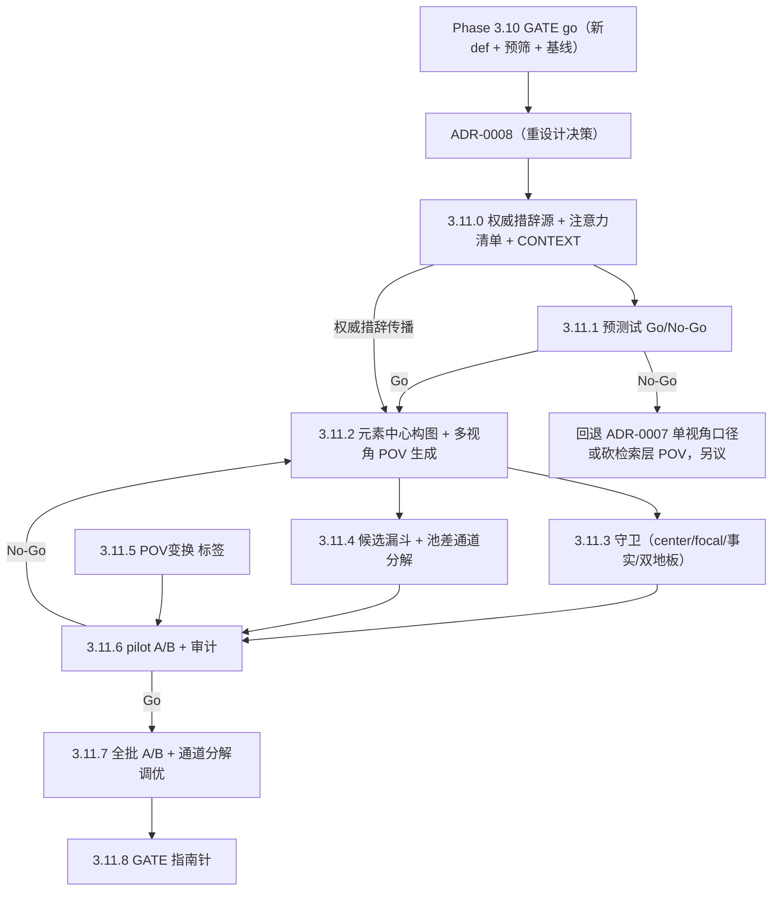

# Phase 3.11 · salience 元素中心构图 + 多视角 POV（ADR-0008 重设计）

## 触发与定位

承接 [ADR-0008](../../docs/adr/0008-salience-driven-element-composition-and-multi-vantage-pov.md)（supersede [ADR-0007](../../docs/adr/0007-logic-resonance-judge-prescreen-and-pov-focalization.md) D6，修订 D7 通道结构，继承 D8）。前置 **Phase 3.10**（新双轴定义 + judge 预筛）已 GATE go（2026-06-10）——它提供新定义的尺子，并作为本 Phase 的**对照臂（基线）**。

> **重设计备注**：本 plan 原为「单视角派生 POV 追加通道」（ADR-0007 D6–D8 口径），其 3.11.0 v1 权威措辞已完成并搁置于 `feat/phase3.11.0-pov-wording-source` @ `834e788`（12 行 canonical vantage 表按 ADR-0008 **作废**；CONTEXT 术语中 候选漏斗 / POV-recalled 两条可回收）。总编于 3.11.0 验收讨论中决定扩大改动面，形成 ADR-0008，本 plan 全文按新口径改写。

**核心**：生成层从「valence 覆盖组织变化」转向「**salience 元素中心组织变化**」，并把 POV（focalization）作为中心元素为 `who-`* 时的派生表达引入。人类感受到的共振常含视角变换（ADR-0007 D1 Gap A 的 8 例），当前 persona 只有 valence 取景 + 语气，做不到 focalization；同时 valence 光谱覆盖的期待把模糊元素硬安极性、且回答不了「authority(+) 在 ungoverned zone(−) 建立新秩序算正还是负」这类不存在的问题——轴对齐（axis-alignment）才是 persona-ness 的判据。

**性质**：POV 与元素中心构图是**底层必备的产品能力**（总编决策），**不设"通不过就砍"的判决闸**；3.11 度量是**调优指南针**——测「哪个 persona / 哪类中心 / 哪类视角有用、哪里伤匹配、往哪调」。

**代码现状（实现前）：**

- **生成层**：`prompts/_shared/persona_screenwriter_contract.md` 仅 P-Tone 语气改写 + "prefer value tendency" 引导；无中心声明、无 focalization；pseudo 第三人称、事件外。
- **alt-creator**：`prompts/_shared/persona_alt_creator_contract.md` 仍有逐元素 valence 光谱覆盖期待；salience 仅驱动中性通道选材。
- **检索**：`scripts/retrieve.py` 现有 top-k + 撞车票，无「漏斗」「池差按通道分解」。
- **打分**：共振类型无 `POV变换` 子标签。
- **守卫**：现有 lens/hypernym 守卫，无 center/focal 校验、无双地板校验。

## Todo 依赖关系

`3.11.0` 是**新构图与 POV 的唯一权威措辞源**（规则在 contract、视角清单在 card）；`3.11.1` 预测试、`3.11.2` 生成实现都**引用同一措辞**。`3.11.1` 为 Go/No-Go 省钱闸。

> **执行分工标记**：`[需聪明模型]` = **执行该条时须在 Cursor 把 agent 模型切到能撰写权威措辞的模型**。本 Phase 只有 `3.11.0` 属此类（contract 规则 + 12 张 card 注意力清单成稿）。其余条目的「智能」来自**运行时 LLM**（pseudo 生成、judge 打分，由 `.env` 决定），Cursor 普通模型即可。**唯一例外**：若 `3.11.7` 调优需回改 3.11.0 措辞，那次回改仍按撰写权威措辞处理。

## Scope

### In scope

- `prompts/_shared/persona_screenwriter_contract.md`：轴对齐 P-Select、元素中心构图规则、POV 派生规则（引 card 清单）、删 v1 单 vantage 表（v1 在搁置分支，main 上无此表——直接按新口径写）。
- `prompts/_shared/persona_alt_creator_contract.md`：valence 降级为可选标注、取消光谱覆盖期待（salience 输出机制不变）。
- `prompts/personas/*/persona_card.md`（12 张）：价值轴段重定位为**注意力清单** + 视角原型标注。
- `scripts/personas.py`（生成层）：中心声明解析、focalized 通道、provenance 标签、贪心记分排序。
- 运行时守卫：center ∈ decon ids、支撑元素上限（2–4）、focal ∈ decon who-*、事实守卫、双地板校验。
- `scripts/retrieve.py`：候选漏斗（去重 + 汇聚排序 + 预算 top-N）+ A/B 池差**按通道分解**输出。
- 打分 schema：`POV变换` 子标签（judge + 人工双侧）。
- 预测试脚手架；单点 pilot；全批 A/B；通道分解调优。
- `CONTEXT.md`：补术语（注意力清单 / 轴对齐 / 元素中心构图・中心元素 / POV 聚焦・多视角派生 / 双地板 / 候选漏斗 / POV-recalled）。
- `tests/`：中心声明解析与互异、贪心顺延、focalized 派生正确、双地板、事实守卫硬失败、漏斗去重/排序/预算、池差通道分解、POV变换 标签。
- GATE_RESULT。

### Out of scope

- **顶替式 POV / 砍第三人称通道**（双地板铁律，ADR-0008 D5）。
- **呈现层 / Phase 4 文案 POV**（OPEN a）。
- **中性通道 n1 的 wording/模板机制改动**（ADR-0008 D3 铁律：零改动；alt-creator/salience 的修订不在此列）。
- **共振定义与 judge rubric 改动**（3.10 定稿，本 Phase 复用）。
- **生产日报选片预筛 / 删 A1 / Phase 4 解封**。

## SSOT

| 文档                                                                                                       | 用途                                                                                                                                             |
| ---------------------------------------------------------------------------------------------------------- | ------------------------------------------------------------------------------------------------------------------------------------------------ |
| [docs/adr/0008-*.md](../../docs/adr/0008-salience-driven-element-composition-and-multi-vantage-pov.md)     | 本 Phase 决策（D1 注意力清单 / D2 轴对齐 / D3 元素中心构图 / D4 多视角 POV / D5 双地板 / D6 打包归因）；`proposed`，3.11 GATE go 后升 `accepted` |
| [docs/adr/0007-*.md](../../docs/adr/0007-logic-resonance-judge-prescreen-and-pov-focalization.md)          | D1–D5（定义/预筛）accepted 继续有效；D6–D8 由 0008 接管                                                                                          |
| [.cursor/plans/Phase3.10-*.plan.md](Phase3.10-logic-resonance-and-judge-prescreen.plan.md)                 | 前置 Phase；提供新定义尺子 + 对照臂基线                                                                                                          |
| [prompts/_shared/persona_screenwriter_contract.md](../../prompts/_shared/persona_screenwriter_contract.md) | 构图与 POV 规则落地处（本 Phase 改）                                                                                                             |
| [prompts/_shared/persona_alt_creator_contract.md](../../prompts/_shared/persona_alt_creator_contract.md)   | valence 降级落地处（本 Phase 改）                                                                                                                |
| [docs/SSOT/personas-12.md](../../docs/SSOT/personas-12.md) + `prompts/personas/*/persona_card.md`          | 注意力清单 / 视角原型 SSOT（本 Phase 改 card）                                                                                                   |
| [output/Eval/phase3.9/llm-judge-scores.json](../../output/Eval/phase3.9/llm-judge-scores.json)             | Gap A 8 例（POV-resonance 样本来源，预测试参考）                                                                                                 |

## 判据与口径（本 Phase 定稿 · 与 ADR-0008 一致）

| 代号                         | 定稿                                                                                                                                                                     |
| ---------------------------- | ------------------------------------------------------------------------------------------------------------------------------------------------------------------------ |
| **注意力清单（D1）**         | card Who/Where/When 极 = 叙事注意力清单；valence 降级元素层可选着色；模糊元素一等公民                                                                                    |
| **轴对齐（D2）**             | pseudo 无极性；判据 = 逐元素透过价值轴框定；两极同场张力欢迎                                                                                                             |
| **元素中心构图（D3）**       | 每条 toned/POV pseudo 声明 1 中心元素 + 2–4 支撑；中心按 salience 贪心自上而下、互异；LLM 声明、代码记分；中性 n1 wording 零改动                                         |
| **多视角 POV（D4）**         | 视角清单 = card Who 极原型（共情座位，负极排除）；中心是 who-* 且实例化原型 ⇒ focalized；focal∈decon who-*；不新增内心戏/事件/因果/结果；hypernym 锚保留；硬失败即重生成 |
| **双地板（D5）**             | 中性 n1 零改动 + 每 persona ≥1 条非聚焦第三人称 toned；focalized 纯增                                                                                                    |
| **打包归因（D6）**           | A/B 测整包新设计 vs 3.10 基线（同新闻同 def 同 judge）；provenance 标签按通道分解恢复粗归因；度量=指南针非判决闸                                                         |
| **候选漏斗（继承 0007 D8）** | 去重 → 汇聚排序（多通道命中排前）→ judge 预筛 → 预算 top-N；上限以下 judge≥1 进抽审；**绝不调高 judge 门槛控量**                                                         |
| **GATE（指南针口径）**       | 池差净新增 human-2>0 + 差集 2 分率不显著低于 baseline combo（精度不崩）+ 守卫零硬失败 + 双地板不塌（3.10 命中片不丢）                                                    |

---

## Todo 3.11.0 · 权威措辞源 + 注意力清单 + CONTEXT [需聪明模型] [需人工验收]

**依赖：** ADR-0008

- `prompts/_shared/persona_screenwriter_contract.md`（唯一规则权威源）：
  - P-Select 引导改**轴对齐**措辞（逐元素透过价值轴框定；两极同场张力欢迎；删 "prefer value tendency" 旧引导）。
  - **元素中心构图规则**：每条 pseudo 声明 1 个中心元素 id + 2–4 支撑元素；中心按注入的 salience 自上而下贪心取、各条互异；声明字段进 response schema。
  - **POV 派生规则**：中心是 `who-`* 且实例化本 persona card 视角原型 ⇒ 写成 focalized（共情座位原则、负极排除）；focal∈who-*、不新增内心戏/事件/因果/结果、hypernym 锚保留；通道类型声明（toned / focalized）。
  - **双地板声明**：≥1 条非聚焦第三人称 toned 必须存在。
- `prompts/_shared/persona_alt_creator_contract.md`：valence 降级为可选标注、取消逐元素光谱覆盖期待（salience 机制不动）。
- `prompts/personas/*/persona_card.md`（12 张）：价值轴段重定位为**注意力清单**，标注哪些 Who 原型是合法**视角座位**（共情座位）。
- `CONTEXT.md`：补术语（注意力清单 / 轴对齐 / 元素中心构图・中心元素 / POV 聚焦・多视角派生 / 双地板 / 候选漏斗 / POV-recalled；后两条可回收 v1 搁置分支的成稿）。
- **传播契约**：3.11.1 / 3.11.2 只引用本措辞源与 card 清单，不私自改写。

### 验收

- [x] contract 规则与 ADR-0008 D2–D5 一致；card 清单与 D1/D4 一致（12 张全）
- [x] alt-creator 契约 valence 降级、salience 机制未动
- [x] CONTEXT 术语补齐
- [x] `[需人工验收]`：用户 approve 措辞口径 → 进 3.11.1

---

## Todo 3.11.1 · 预测试：新构图重写跑检索差集 [需人工验收 · Go/No-Go]

**依赖：** 3.11.0 approve

- 选 N 条新闻（含 Gap A 那类），用 3.11.0 措辞**驱动运行时 LLM**按新构图（元素中心 + focalized）生成 pseudo，跑检索。
- 比对新构图与 3.10 基线候选池**差集**：是否冒出当前 pseudo 漏掉的**新共振片**（人工速判）；顺带观察 OPEN c（中心元素粒度）。

### 验收

- [x] 差集中**真有**新共振片 → Go，进 3.11.2
- [ ] 差集全是老片/噪声 → **No-Go**：回退 ADR-0007 单视角口径或砍检索层 POV，与总编另议
- [x] [需人工验收 · Go/No-Go]：用户裁决（Conditional Go）

---

## Todo 3.11.2 · 生成层：元素中心构图 + 多视角 POV + 单测

**依赖：** 3.11.1 Go（引 3.11.0 权威措辞）

- `scripts/personas.py`：中心/通道声明解析；focalized 通道接线；provenance 标签（中心元素 id / 通道类型 / focal 角色 id）；代码侧按「中心 salience 名次」记分排序与预算。
- 双地板装配：中性 n1 照旧 + 强制 ≥1 非聚焦第三人称 toned。
- `tests/`：中心声明解析与互异、贪心顺延、focalized 派生正确（中心 who-* × 清单实例化）、provenance 标签完整、第三人称通道保留、pseudo 计数。

### 验收

- [x] `python -m unittest`（生成相关）通过
- [x] 措辞引 3.11.0 权威源与 card 清单；中性 n1 wording 零改动
- [x] 中心确按 salience 贪心派生、focalized 确按清单实例化派生

---

## Todo 3.11.3 · 运行时守卫 + 单测

**依赖：** 3.11.2

- 校验：center ∈ decon element ids；支撑元素 2–4 上限；focal-char ∈ decon `who-`*；事实守卫拒绝新增内心戏/事件/因果/结果；hypernym 锚仍校验；双地板校验（缺非聚焦 toned = 硬失败）。
- 硬失败即重生成（携错误重问 1 次）。

### 验收

- [x] `python -m unittest`（守卫相关）通过
- [x] 非法 center / 非法 focal / 新增事实 / 双地板缺失即硬失败
- [x] hypernym 锚守卫不被 POV 绕过

---

## Todo 3.11.4 · 候选漏斗 + 池差通道分解 + 单测

**依赖：** 3.11.2

- `scripts/retrieve.py`：① 去重（tmdb_id 合并多通道同命中）；② 汇聚排序（多通道/多 persona 命中排前，扩展撞车票）；③ 预算 top-N 给人工；上限以下 `judge≥1` 进抽审池。
- 输出 **A/B 池差**（新设计-on ∖ 3.10 基线同新闻），**按 provenance 通道类型分解**（neutral / toned / focalized）供调优指南针。
- `tests/`：去重、汇聚排序权重、预算上限、池差通道分解正确性。

### 验收

- [ ] `python -m unittest`（漏斗相关）通过
- [ ] 去重/排序/预算/抽审兜底齐；不靠调高 judge 门槛控量
- [ ] 池差可按通道分解输出

---

## Todo 3.11.5 · `POV变换` 共振类型子标签 + 单测

**依赖：** 3.11.0（措辞）

- 打分 schema 加 `POV变换` 子标签：标记某个 2 是否「靠视角/尺度变换才看得出来」；judge 与人工双侧支持。
- `tests/`：标签解析、judge 输出含标签、与共振类型矩阵兼容。

### 验收

- [ ] `python -m unittest`（标签相关）通过
- [ ] judge/人工均可标 `POV变换`
- [ ] 标签与 2×2 共振类型兼容

---

## Todo 3.11.6 · 单点 pilot A/B + 防火墙审计 [需人工验收 · Go/No-Go]

**依赖：** 3.11.3 + 3.11.4 + 3.11.5

- 选 1 条新闻全链新设计-on，与 3.10 基线对照。
- 人工审计：① 事实漂移（无新增内心戏/事件）；② 中心声明真实性（声明 A 实写 A，无塞词）；③ focalized 确按清单原型派生；④ 双地板完好（n1 + 非聚焦 toned 在场，3.10 命中不丢）；⑤ 漏斗去重/排序合理；⑥ OPEN d（valence 可选化后弱 fit persona 产出质量）观察。

### 验收

- [ ] 守卫零硬失败；中心/视角派生正确；双地板完好
- [ ] `[需人工验收 · Go/No-Go]`：用户 approve → 进 3.11.7；反复漂移/塞词 → 回 3.11.2 收紧

---

## Todo 3.11.7 · 全批 A/B + 通道分解调优 + 抽审 [需人工验收]

**依赖：** 3.11.6 Go

- 全批新设计-on（同新闻集 01–10）vs 3.10 基线（**同新闻同 def 同 judge**，差异=整包新设计，按 ADR-0008 D6 打包归因）。
- 计池差新定义 2 分率（**按通道分解**：focalized 独家 / toned 中心化独家 / 撞车增益）+ `POV变换` 标签分布；按指南针口径**调优**（哪 persona / 哪类中心 / 哪类视角有用，漏斗权重，预算 N）。
- 拒绝集抽审延续，监控「零 human-2 被杀」。

### 验收

- [ ] 产出位于 `output/Eval/phase3.11/{run_id}/`；3.10 及更早未改写
- [ ] 池差通道分解 + POV变换 分布 + 调优记录在案
- [ ] `[需人工验收]`：用户 approve 数据 → 进 3.11.8

---

## Todo 3.11.8 · GATE（调优指南针口径）→ GATE_RESULT [GATE · 需人工验收]

**依赖：** 3.11.7

- 写 `output/Eval/phase3.11/GATE_RESULT.md`：① 池差净新增 human-2 > 0（扩大强共振边界）；② 差集 2 分率不显著低于 baseline combo（精度不崩）；③ 守卫零硬失败；④ 双地板不塌（3.10 命中片不丢）。
- 裁决（ADR-0008 性质）：元素中心构图与 POV 是必备能力，GATE 为**调优是否收敛**，非「要不要」。
- GATE go ⇒ ADR-0008 升 `accepted`。

### 验收

- [ ] GATE_RESULT 给出四条指南针口径 + 调优结论
- [ ] `[需人工验收]`：用户确认 GATE 结论

---

## 风险与约束

- **事实漂移（主要失败模式）**：POV 易编内心戏/新事实；靠硬守卫 + pilot 专审 + 运行时守卫三层兜底。
- **中心声明名不副实 / 塞词**：声明 A 实写 B、或为记分堆元素；靠 60–120 词限制 + 支撑元素上限 + pilot 专项审计。
- **匹配地板**：靠双地板锁死——中性 n1 零改动 + ≥1 非聚焦第三人称 toned；focalized 纯增。
- **候选膨胀**：靠四层漏斗（继承 0007 D8）；预算 N 由 pilot 定（OPEN b）。
- **归因变粗（显式接受的代价）**：A/B 差异=整包新设计；靠 provenance 标签按通道分解恢复粗归因；**不得**事后宣称单变量净效应。
- **alt-creator 语义变更的存量冲击**：按桶校验的存量单测/守卫需随 3.11.2/3.11.3 更新；schema 字段保留向后兼容。
- **预测试是省钱闸**：差集无新共振片 ⇒ 回退或砍掉，避免整轮浪费。
- **措辞漂移**：3.11.0 是唯一措辞源（规则在 contract、清单在 card）；3.11.1/3.11.2 须引用，不私自改写。
- 受「人工验收阻断」约束：**3.11.0 / 3.11.1 / 3.11.6 / 3.11.7 / 3.11.8** 标 `[需人工验收]`；3.11.1 / 3.11.6 为 Go/No-Go。

## 交给下一 Phase

| 条件                     | 下一动作                                                                                                                                                 |
| ------------------------ | -------------------------------------------------------------------------------------------------------------------------------------------------------- |
| **GATE go**              | 新构图 + POV 扩大强共振边界且精度不崩 ⇒ 成生成层标配；ADR-0008 升 accepted；考虑呈现层 POV（OPEN a）、删 A1 复议（生成已变）、中心元素粒度定稿（OPEN c） |
| **预测试 No-Go**         | 新构图无召回价值 ⇒ 回退 ADR-0007 单视角口径或砍检索层 POV，与总编另议                                                                                    |
| **GATE no-go（精度崩）** | 召回多但净是噪声 ⇒ 回 3.11.2 收紧派生/守卫/支撑上限，或调漏斗预算/排序权重                                                                               |

