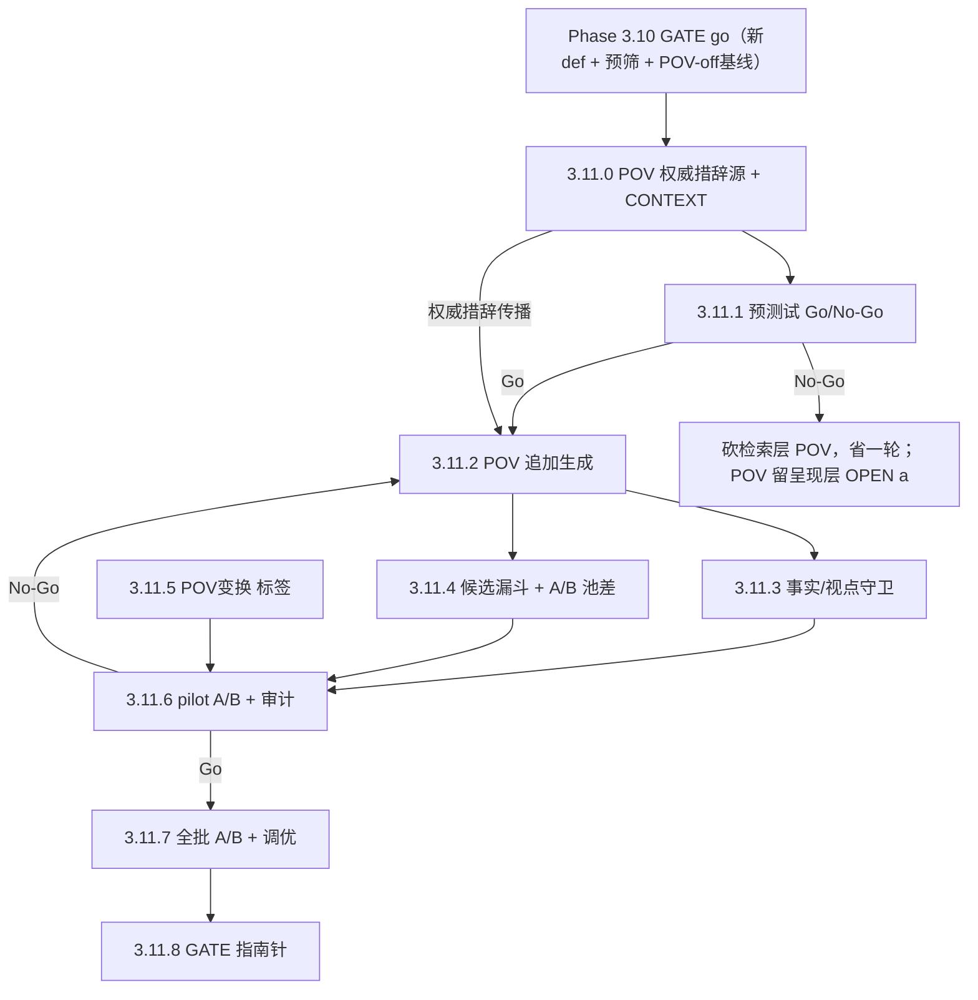

# Phase 3.11 · POV 聚焦能力（派生式追加 + 候选漏斗）

## 触发与定位

承接 [ADR-0007](../../docs/adr/0007-logic-resonance-judge-prescreen-and-pov-focalization.md) **D6–D8**，是分两步走的**第二步**。前置 **Phase 3.10**（新双轴定义 + judge 预筛）须先 GATE go——它既提供新定义的尺子，又是本 Phase 的**对照臂（POV-off 基线）**。

**核心**：从底层逻辑上**允许换视角**。人类感受到的共振常含视角变换（如从洪水中将溺亡的孩子视角讲述新闻），它产生「同逻辑、异结构」的深层联系（ADR-0007 D1 的 Gap A：Survival Family / At War / Sicario 等 8 例即此类）。当前 persona 只有 valence 取景 + 语气，**做不到 focalization**。本 Phase 把 POV 作为 persona lens 从 valence 到 vantage 的更深表达引入生成层。

**性质**：POV 是**底层必备的产品能力**（总编决策 · D6），**不设"通不过就砍"的判决闸**；3.11 度量是**调优指南针**——测「哪个 persona 的 POV 有用、哪里伤匹配、往哪调」。

**代码现状（实现前）：**

- **生成层**：`prompts/_shared/persona_screenwriter_contract.md` 仅 P-Tone 语气改写，无 focalization；pseudo 第三人称、事件外。
- **检索**：`scripts/retrieve.py` 现有 top-k + 撞车票，但无「POV 追加通道」「汇聚排序扩展」「预算 top-N」「A/B 池差」。
- **打分**：共振类型无 `POV变换` 子标签。
- **守卫**：现有 lens/hypernym 守卫，无 focal-char ∈ who-* 校验。

## Todo 依赖关系

`3.11.0` 是 **POV 聚焦的唯一权威措辞源**（派生视点 + 事实铁律）；`3.11.1` 手工示范、`3.11.2` 生成实现都**引用同一措辞**。`3.11.1` 预测试为 Go/No-Go 省钱闸。

> **执行分工标记**：`[需聪明模型]` = 提示词/契约/措辞设计或高质量 POV 示范，需强模型；`[部分需聪明模型]` = 代码为主、夹带提示词增改或靠判断的调优；无标记 = 守卫校验/漏斗/统计/管道等机械活。本 Phase 的 `[需聪明模型]` 在 `3.11.0`（POV 措辞源）/ `3.11.1`（手工 POV 示范）；`3.11.2`（逐 persona 派生措辞）/ `3.11.5`（judge 学打 POV变换）/ `3.11.7`（看结果迭代 POV 提示词）为部分。

## Scope

### In scope

- `prompts/_shared/persona_screenwriter_contract.md`：POV 聚焦权威措辞源（派生 / focal∈who-* / 不新增事实 / hypernym 锚）。
- `scripts/personas.py`（生成层）：POV pseudo 作**追加通道**。
- 运行时守卫：focal-char ∈ decon who-* + 事实守卫。
- `scripts/retrieve.py`：候选漏斗（去重 + 汇聚排序 + 预算 top-N）+ POV-recalled A/B 池差。
- 打分 schema：`POV变换` 子标签（judge + 人工双侧）。
- 预测试脚手架；单点 pilot；全批 A/B；调优。
- `CONTEXT.md`：补术语（POV 聚焦 / 派生式视点 / 候选漏斗 / POV-recalled）。
- `tests/`：派生视点、追加不顶替、事实守卫硬失败、漏斗去重/排序/预算、POV变换 标签、A/B 池差。
- GATE_RESULT。

### Out of scope

- **顶替式 POV**（已否决，见 D7：会塌匹配地板）。
- **呈现层 / Phase 4 文案 POV**（OPEN a）。
- **中性通道 / salience / alt-creator 改动**（D6 铁律：零改动）。
- **共振定义与 judge rubric 改动**（已在 3.10 定稿，本 Phase 复用）。
- **生产日报选片预筛 / 删 A1 / Phase 4 解封**。

## SSOT

| 文档 | 用途 |
| --- | --- |
| [docs/adr/0007-*.md](../../docs/adr/0007-logic-resonance-judge-prescreen-and-pov-focalization.md) | 本 Phase 决策（D6 派生式 POV / D7 追加+指南针 / D8 候选漏斗）；`proposed`，3.11 GATE go 后升 `accepted` |
| [.cursor/plans/Phase3.10-*.plan.md](Phase3.10-logic-resonance-and-judge-prescreen.plan.md) | 前置 Phase；提供新定义尺子 + POV-off 对照臂 |
| [prompts/_shared/persona_screenwriter_contract.md](../../prompts/_shared/persona_screenwriter_contract.md) | POV 聚焦措辞落地处（本 Phase 改） |
| [docs/SSOT/personas-12.md](../../docs/SSOT/personas-12.md) | persona 价值轴 Who 极（派生视点来源） |
| [output/Eval/phase3.9/llm-judge-scores.json](../../output/Eval/phase3.9/llm-judge-scores.json) | Gap A 8 例（POV-resonance 的样本来源，预测试参考） |

## 判据与口径（本 Phase 定稿 · 与 ADR-0007 D6/D7/D8 一致）

| 代号 | 定稿 |
| --- | --- |
| **派生式视点（D6）** | focal 从本 persona 价值轴 Who 极派生，不自由选；仅编剧步；中性零改 |
| **事实守卫（D6）** | focal∈decon who-*；不新增内心戏/事件/因果/结果；hypernym 锚保留；硬失败即重生成 |
| **追加式（D7）** | POV pseudo 与第三人称+中性并存；纯增召回；绝不顶替 |
| **度量=指南针（D7）** | A/B 池差（POV-recalled 新定义 2 分率）+ `POV变换` 子标签；非判决闸 |
| **候选漏斗（D8）** | 去重 → 汇聚排序（多视角命中排前）→ judge 预筛 → 预算 top-N；上限以下 judge≥1 进抽审 |
| **控量/保安全分离（D8）** | 控膨胀用排序+预算；保安全用门槛+抽审；**绝不调高 judge 门槛控量** |
| **GATE（指南针口径）** | POV-recalled 净新增 human-2>0 + 差集 2 分率不显著低于 baseline combo（精度不崩）+ 事实守卫零硬失败 |

---

## Todo 3.11.0 · POV 聚焦权威措辞源 + CONTEXT [需聪明模型] [需人工验收]

**依赖：** Phase 3.10 GATE go + ADR-0007 D6

- `prompts/_shared/persona_screenwriter_contract.md` 新增 POV 聚焦段（唯一权威措辞源）：focal 视点**派生自本 persona 价值轴 Who 极**（非自由选）；focal 角色**必须是 decon 既有 `who-*`**；**只换"从谁的眼睛看"，绝不新增内心戏/事件/因果/结果**；hypernym 锚要求保留。
- `CONTEXT.md`：补术语（POV 聚焦 / focalization / 派生式视点 / 追加通道 / 候选漏斗 / POV-recalled）。
- **传播契约**：声明 3.11.1（手工示范）/ 3.11.2（生成实现）须引用本措辞源。

### 验收

- [ ] POV 聚焦措辞含派生规则 + focal∈who-* + 事实铁律 + hypernym 锚，与 ADR-0007 D6 一致
- [ ] CONTEXT 术语补齐
- [ ] `[需人工验收]`：用户 approve POV 措辞口径 → 进 3.11.1

---

## Todo 3.11.1 · 预测试：手工 POV 重写跑检索差集 [需聪明模型] [需人工验收 · Go/No-Go]

**依赖：** 3.11.0 approve

- 选 N 条新闻（含 Gap A 那类），**手工**按 3.11.0 措辞写 POV 版 pseudo，跑检索。
- 比对 POV-on 与现有 POV-off（3.10）候选池**差集**：是否冒出当前 pseudo 漏掉的**新共振片**（人工速判）。

### 验收

- [ ] 差集中**真有**新共振片 → Go，进 3.11.2
- [ ] 差集全是老片/噪声 → **No-Go**：砍检索层 POV，POV 价值改押呈现层（OPEN a），省一轮
- [ ] `[需人工验收 · Go/No-Go]`：用户裁决

---

## Todo 3.11.2 · screenwriter POV 聚焦生成（派生 + 追加）+ 单测 [部分需聪明模型]

**依赖：** 3.11.1 Go（引 3.11.0 权威措辞）

- 生成层实现 POV pseudo：视点派生自 persona Who 极；作为**追加通道**与第三人称 toned + 中性 n1 并存（**不顶替**）。
- 逐 persona 校准派生措辞（The-Caregiver→受影响脆弱者 / The-Sage→抽离观察者 等）。
- `tests/`：派生视点正确、追加不顶替（第三人称仍在）、pseudo 计数与通道角色标注。

### 验收

- [ ] `python -m unittest`（生成相关）通过
- [ ] POV pseudo 措辞引 3.11.0 权威源；第三人称通道保留
- [ ] 视点确按 persona Who 极派生

---

## Todo 3.11.3 · 运行时守卫：focal∈who-* + 事实守卫 + 单测

**依赖：** 3.11.2

- 校验 focal-char ∈ decon `who-*`；事实守卫拒绝新增内心戏/事件/因果/结果；hypernym 锚仍校验。
- 硬失败即重生成（携错误重问 1 次）。

### 验收

- [ ] `python -m unittest`（守卫相关）通过
- [ ] 非法 focal / 新增事实即硬失败
- [ ] hypernym 锚守卫不被 POV 绕过

---

## Todo 3.11.4 · 候选漏斗 + A/B 池差 + 单测

**依赖：** 3.11.2

- `scripts/retrieve.py`：① 去重（tmdb_id 合并 POV 与第三人称同命中）；② 汇聚排序（多视角命中排前，扩展撞车票）；③ 预算 top-N 给人工；上限以下 `judge≥1` 进抽审池。
- 输出 **POV-recalled 池差**（POV-on ∖ POV-off 同新闻）供调优指南针。
- `tests/`：去重、汇聚排序权重、预算上限、池差正确性。

### 验收

- [ ] `python -m unittest`（漏斗相关）通过
- [ ] 去重/排序/预算/抽审兜底齐；不靠调高 judge 门槛控量
- [ ] POV-recalled 池差可输出

---

## Todo 3.11.5 · `POV变换` 共振类型子标签 + 单测 [部分需聪明模型]

**依赖：** 3.11.0（措辞）

- 打分 schema 加 `POV变换` 子标签：标记某个 2 是否「靠视角/尺度变换才看得出来」；judge 与人工双侧支持。
- `tests/`：标签解析、judge 输出含标签、与共振类型矩阵兼容。

### 验收

- [ ] `python -m unittest`（标签相关）通过
- [ ] judge/人工均可标 `POV变换`
- [ ] 标签与 2×2 共振类型兼容

---

## Todo 3.11.6 · 单点 pilot POV A/B + 防火墙审计 [需人工验收 · Go/No-Go]

**依赖：** 3.11.3 + 3.11.4 + 3.11.5

- 选 1 条新闻全链 POV-on，与 3.10 POV-off 对照。
- 人工审计：① 事实漂移（无新增内心戏/事件）；② 视点确按 Who 极派生；③ 追加未顶替第三人称；④ 漏斗去重/排序合理。

### 验收

- [ ] 事实守卫零硬失败；视点派生正确；第三人称保留
- [ ] `[需人工验收 · Go/No-Go]`：用户 approve → 进 3.11.7；反复漂移 → 回 3.11.2 收紧

---

## Todo 3.11.7 · 全批 A/B + 调优 + 抽审 [部分需聪明模型] [需人工验收]

**依赖：** 3.11.6 Go

- 全批 POV-on（同新闻集 01–10）vs 3.10 POV-off 基线（**同新闻同 def 同 judge**，唯一变量=聚焦）。
- 计 POV-recalled 差集新定义 2 分率 + `POV变换` 标签分布；按指南针口径**调优**（哪 persona POV 有用 / 哪里伤匹配 / 漏斗权重）。
- 拒绝集抽审延续，监控「零 human-2 被杀」。

### 验收

- [ ] 产出位于 `output/Eval/phase3.11/{run_id}/`；3.10 及更早未改写
- [ ] A/B 池差 + POV变换 分布 + 调优记录在案
- [ ] `[需人工验收]`：用户 approve 数据 → 进 3.11.8

---

## Todo 3.11.8 · GATE（调优指南针口径）→ GATE_RESULT [GATE · 需人工验收]

**依赖：** 3.11.7

- 写 `output/Eval/phase3.11/GATE_RESULT.md`：① POV-recalled 净新增 human-2 > 0（扩大强共振边界）；② 差集 2 分率不显著低于 baseline combo（精度不崩）；③ 事实守卫零硬失败。
- 裁决（D7 性质）：POV 是必备能力，GATE 为**调优是否收敛**，非「要不要 POV」。

### 验收

- [ ] GATE_RESULT 给出三条指南针口径 + 调优结论
- [ ] `[需人工验收]`：用户确认 GATE 结论

---

## Phase 3.11 整体验收

- [ ] 3.11.0 POV 权威措辞源 approve
- [ ] 3.11.1 预测试 Go（差集有新共振片）
- [ ] 3.11.2–3.11.5 各单测通过：POV 追加生成、事实/视点守卫、候选漏斗+A/B 池差、POV变换 标签
- [ ] 3.11.6 单点 pilot A/B + 审计 Go（事实守卫零硬失败）
- [ ] 3.11.7 全批 A/B + 调优 + 抽审
- [ ] 3.11.8 书面 GATE（指南针口径）→ 裁决

## 风险与约束

- **事实漂移（主要失败模式）**：POV 易编内心戏/新事实；靠 D6 硬守卫 + pilot 专审 + 运行时守卫三层兜底。
- **匹配地板**：靠追加式（D7）锁死——POV 只增不减，原第三人称命中不丢。
- **候选膨胀**：靠四层漏斗（D8）；预算 N 由 pilot 定（OPEN d）；二阶检索/打分成本上升。
- **混淆**：POV 净增量须以 3.10 POV-off 为对照臂、同新闻同 def 同 judge，唯一变量是聚焦。
- **预测试是省钱闸**：差集无新共振片 ⇒ 直接砍检索层 POV，避免整轮浪费。
- **措辞漂移**：3.11.0 是 POV 唯一措辞源；3.11.1/3.11.2 须引用，不私自改写。
- 受「人工验收阻断」约束：**3.11.0 / 3.11.1 / 3.11.6 / 3.11.7 / 3.11.8** 标 `[需人工验收]`；3.11.1 / 3.11.6 为 Go/No-Go。

## 交给下一 Phase

| 条件 | 下一动作 |
| --- | --- |
| **GATE go** | POV 扩大强共振边界且精度不崩 ⇒ POV 成生成层标配；ADR-0007 D6–D8 升 accepted；考虑呈现层 POV（OPEN a）、删 A1 复议（生成已变）、第二匹配轴（OPEN b） |
| **预测试 No-Go** | 检索层 POV 无召回价值 ⇒ 砍掉；POV 价值改押呈现层（Phase 4，OPEN a） |
| **GATE no-go（精度崩）** | POV 召回多但净是噪声 ⇒ 回 3.11.2 收紧派生/守卫，或调漏斗预算/排序权重 |
