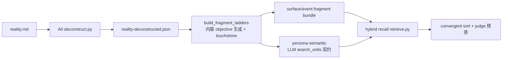

# Phase 3.12：代码侧与文档对齐（fragment ladder / search unit 单一口径）

## 目标与现状

文档侧（`docs/SSOT/*` + ADR-0009）已统一到 fragment ladder / search unit 口径，但代码停在**双口径并存**：

- [`scripts/personas.py`](scripts/personas.py)：新口径函数齐全（`build_fragment_ladders`、`build_search_units_payload`、`build_fragment_bundle_search_units`、`search_unit_from_pseudo`），但仍保留 ADR-0008 旧逻辑：`build_objective_floor_neutral_pseudo`、`tag_toned_pseudos`、`assemble_persona_channel_pseudos`、`validate_adr8_dual_floor`、`derive_expected_channel`、`validate_center_mutual_exclusion` 等；且 ladder 的 objective 层**依赖外部 `expansion` 入参**。
- [`scripts/objective_expansion.py`](scripts/objective_expansion.py)：完整独立 P-Expand pass，产 `reality-expanded.json`，是 ladder objective 层的真实数据来源（不是死代码，是活依赖）。
- [`scripts/retrieve.py`](scripts/retrieve.py)：已优先读 `search_units`，但保留 `neutral/toned/focalized` channel 兼容分支、`neutral_hit_rate`、A1 oracle 诊断。
- [`prompts/_shared/persona_screenwriter_contract.md`](prompts/_shared/persona_screenwriter_contract.md)：LLM 仍返回 `pseudos[]` + `channel: toned` + 强制 hypernym anchor。

## 决策（已确认）

- 深度统一：删除 neutral/toned/focalized 旧通道、dual-floor、neutral_hit_rate 诊断。
- objective 能力**内联**进 ladder：保留 `passes_objectivity_touchstone` / `filter_hypernyms` 纯函数（迁移复用），删除独立 pass 编排 + `reality-expanded.json` 产物 + `objective_expansion_contract.md`。
- LLM 契约**原生改 `search_units[]`**，去掉 `pseudos[]` wrapper。
- 验证门：N=10 eval 语料**等价性验证**（与 3.11.8 基线 bit-parity 或差异可解释），非完整人工 GATE。

## 数据流（目标态）

## 前置检查（Phase 依赖）

确认 Phase 3.11.8 已合并入 `main`。若已合并，从最新 `main` 检出 `feat/phase3.12-code-doc-sync`；若 3.11 尚未合并，按规则从 3.11 最新开发分支检出并在报告记录继承关系。**进入实现前先核对此项**。

## TODO 分解（每项按单 TODO 流水线执行）

### 3.12.1 objective 能力内联

- 新增 `scripts/fragment_ladder.py`（或并入 `personas.py`），迁移 `objective_expansion.py` 的 `passes_objectivity_touchstone`、`filter_hypernyms`、`_LENS_FRAMED_SNIPPETS`、`element_id_for`、`surface_text_for_element` 等纯函数。
- 改造 `build_fragment_ladders`：objective 层（`objective_close/mid/broad`）改由内联 LLM 调用 + touchstone 过滤自产，移除对 `expansion` 入参的依赖。
- 删除 `scripts/objective_expansion.py`、`prompts/_shared/objective_expansion_contract.md`，停止产出 `reality-expanded.json`。
- 更新 `tests/test_deconstruct_expansion.py`：移除独立 expansion pass 测试，新增 ladder 内联 objective 生成测试。

### 3.12.2 personas.py 旧通道清除

- 删除 `build_objective_floor_neutral_pseudo`、`tag_toned_pseudos`、`assemble_persona_channel_pseudos`、`validate_adr8_dual_floor`、`derive_expected_channel`、`validate_center_mutual_exclusion`、`_parse_composition_channel` 等 ADR-0008 通道/dual-floor 逻辑。
- 保留并收敛为单一路径：`build_fragment_ladders` → `build_fragment_bundle_search_units` + `search_unit_from_pseudo` → `build_search_units_payload`。
- 更新 `tests/test_personas.py`、`tests/test_pov_transform_label.py`。

### 3.12.3 LLM 契约原生 search_units[]

- 重写 `prompts/_shared/persona_screenwriter_contract.md`：输出根节点改 `search_units[]`（含 `kind/center_element/supporting_elements/search_text/fit`），删除 `pseudos[]` wrapper、`channel` 字段、`{{expansion_json}}` 输入、强制 hypernym anchor 改为 ladder objective anchor。
- 同步 `prompts/_shared/multi_pseudo_output_contract.md`（按需重命名/重写为 search-unit 口径）、`persona_alt_creator_contract.md` 中 provenance 表述。
- 改 `scripts/agents.py` 的 `parse_pseudos_response` → `parse_search_units_response`（或新增并切换调用）。

### 3.12.4 retrieve.py 旧 channel 诊断清除

- 删除 `neutral/toned/focalized` channel 兼容分支、`neutral_hit_rate`、`_count_neutral_hits`、A1 oracle 相关诊断；保留 `search_unit_kind` 分解、convergent sort、surface/event/persona_semantic_match。
- 删除/重写 `tests/test_retrieve_neutral_collision.py`、`tests/test_retrieve_a1_oracle.py`；更新 `test_retrieve_funnel.py`、`test_retrieve_quality.py`、`test_retrieve_multi_pseudo.py`。

### 3.12.5 编排入口与批处理对齐

- 检查 `scripts/run_phase311_*`、`run_persona_batch.py`、`run_eval.py` 等对 expansion pass / pseudos 字段的调用，切到新路径。
- 注意：3.11 批处理脚本承载 GATE 基线复算，改动须保证基线可复现。

### 3.12.6 等价性验证

- 在 N=10 eval 语料跑重构后管线，与 3.11.8 基线对比 net-new 2-rate、守卫硬失败数、search_unit_kind 分解；要求 bit-parity 或差异可逐条解释（纯重构不应改变召回结果）。
- 若出现非预期偏移，回到最早不确定阶段定位，不盲目扩面。

### 3.12.7 文档回填

- 更新 ADR-0009「SSOT 待同步 / 已知局限」：把「仍保留 pseudos wrapper」「dense-only」「objective 靠外部 pass」等 future-work 项标记为已落地。
- 更新 `docs/SSOT/电影宇宙「每日星轨观测」系统 PRD.md` §10 项目结构树（移除 `objective_expansion.py` / `objective_expansion_contract.md`），并修正 `simplified-news-to-film-workflow.md` 中残留指向 `docs/temp/` 的 propagation 引用。

## 风险

- 这是**跨 4 个核心模块 + 契约 + 大量测试**的大重构，回归面广。每个 TODO 后必须跑 `pytest` 相关用例确认无 regression。
- LLM 契约改动需重新验证模型输出可解析性（3.12.3 后建议先跑单条 smoke）。
- 标 `[需人工验收]`：3.12.6 等价性验证结果须人工确认后再合并。