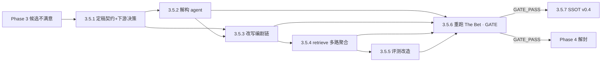

# Phase 3.5 · 转向：现实解构管线（Pivot）

## 触发与定位

Phase 3 闸门候选几乎只到 1、出不了 2。诊断为**新闻倒金字塔 vs overview 钩子的信息结构错位**，并据此做产品转向（[ADR-0002](../../docs/adr/0002-pivot-to-event-logic-resonance.md)）：表层共振合法、结构共振改由「事件逻辑解构 + agent 再加工」实现。

本 Phase = Phase 3 `GATE_FAIL` 后「回到 Phase 1/2」回流路径的**放大版**：它**重写** Phase 1（编剧）+ Phase 2（召回）、**新增**上游解构阶段、**改造** Phase 3 评测口径，并以新管线**重跑闸门**。**Phase 4（copywriter）保持暂停**，直到 3.5.6 `GATE_PASS`。

## Todo 依赖关系

## Scope

### In scope

- 新增 `prompts/A0_reality_deconstructor.md`、`scripts/deconstruct.py`（双写 `reality-deconstructed.json` / `.md`）
- 改写 `prompts/A1/A2/A4/A7`、`scripts/agents.py`（消费解构、挑碎片、产多段 pseudo）
- 放宽 `prompts/_shared/deentification_rules.md`（承重时可保留专名/具体元素）
- 改造 `scripts/retrieve.py`（多 pseudo 召回 + 聚合去重 + containment）
- 改造 `scripts/run_eval.py` + `scripts/summarize_eval.py`（`共振类型`、`structural_2_rate`）
- 以新管线重跑 N=10 闸门

### Out of scope

- C1/C2 `copywriter.py`（Phase 4，仍 gated）
- `fetch_news.py` 全自动（评测期继续手写 `--news-file`）
- 联网补全（`news-analyze.md §7` 占位，证据触发，本 Phase 不做）
- 索引侧改动（沿用 ADR-0001 复用产物）

## SSOT

| 文档                                              | 用途                                                        |
| ------------------------------------------------- | ----------------------------------------------------------- |
| `docs/temp/news-analyze.md`                       | 现实解构产出契约（v3.1·纯客观无损·镜头中立）                |
| `docs/adr/0002-pivot-to-event-logic-resonance.md` | 产品转向 + SSOT 待改清单                                    |
| `docs/eval-the-bet.md` §4/§5.1                    | 两轴 rubric + 共振类型体温计 + 闸门重心第 2 条（已更新）    |
| `CONTEXT.md`                                      | 共振（双层）、基线、撞车                                    |
| Phase 1/2/3 plan                                  | 既有 agents/retrieve/run_eval 契约（本 Phase 改写其一部分） |

---

## Todo 3.5.1 · 定稿契约 + 下游消费决策

**依赖：** Phase 3 结论

上游解构契约已收口（标签梯穷举客观、多值字段 list、零解读）。下游消费的延后岔路，**在此定稿**：

### 决策表（定稿）

| 项                     | 定稿                                                                                                                                                                               |
| ---------------------- | ---------------------------------------------------------------------------------------------------------------------------------------------------------------------------------- |
| **A 碎片取舍**         | 解构层给**全量** 起因/经过/结果，**不设 load_bearing、不预选**；挑选权 100% 在 persona。爆炸控制只在输出侧（B），不在输入侧。                                                      |
| **B 爆炸预算**         | **每 agent 产 3 段 pseudo（含 A1，对称）、每段 Top-2**；`4×3×2 = 24` raw → 去重后 **~15–19 候选/条**（N=10 ≈ 170 个评分点）。现阶段**多写**，跑完看压缩空间。                      |
| **C 抽象层级**         | **层级 = persona 身份，不做 `agent × 层级` 笛卡尔积**。每个 agent 的 3 段都用它**唯一**镜头；段间差异来自**挑了哪些碎片/碎片组合**，不是抽象程度。A1=表层直给；A2/A4/A7=各自镜头。 |
| **D 三类对称匹配**     | 起因/经过/结果**对称、无主次**（见下「匹配模型」）。`经过` 守"只取连续多条"（时序连贯），但**不弱化、不降期望**。                                                                  |
| **E 命中溯源**         | 每段 pseudo 带 `source = {agent_id, 用到的碎片 ids}`；retrieve 聚合时挂到候选上（喂将来的「共振类型」体温计 + 给总编解释）。                                                       |
| **F agents JSON 契约** | `agents[].text`（单段）→ `agents[].pseudos: [{id, text, source}]`；retrieve 遍历 pseudos、每段 Top-2、按 tmdb_id 聚合。                                                            |
| **G promote**          | `docs/temp/news-analyze.md` → `docs/SSOT/reality-deconstruction-contract.md`。                                                                                                     |

### 匹配模型（D 的概念对齐）

电影 overview 本身可能是剧情的**任意一个切片**——起因式设定钩子 / 经过式中段场景 / 结果式悬念结尾。新闻解构出的 起因/经过/结果 **任意一类**都可能对上某部 overview 的对应切片：**切片对切片**。故三类对称，`经过` 不天生更弱（已写入 contract §0 原则 1）。

### 验收

- [ ] 决策 A–G 写入本节，并与 contract §5/§6 一致
- [ ] 契约 promote 至 `docs/SSOT/reality-deconstruction-contract.md`（离开 temp）
- [ ] F 的新 agents/retrieve JSON 契约有书面定义（供 3.5.3 / 3.5.4 实现）

---

## Todo 3.5.2 · 现实解构 agent

**依赖：** 3.5.1

- `prompts/A0_reality_deconstructor.md`：身份/准则/few-shot（印度热浪 worked example）/任务注入，严格按 `reality-deconstruction-contract.md §1` 产出 JSON。
- `scripts/deconstruct.py`：news JSON → LLM（MiMo 2.5 Pro）→ 校验 JSON → 写 `reality-deconstructed.json` + 渲染 `.md` 人类视图。
- 失败/非法 JSON → 记 `errors`，不阻断（MVP 宽松）。

### 验收

- [ ] 喂 3 条真实新闻，产出合法 JSON 且字段符合契约（无 skeleton/load_bearing/共振类型；多值字段为 list）
- [ ] `.md` 视图可读，总编能扫
- [ ] 肉眼核「无主观/镜头中立」：无权力定性、无反讽框定

---

## Todo 3.5.3 · 改写编剧链

**依赖：** 3.5.1、3.5.2

- A1/A2/A4/A7 prompts：输入从「原始新闻字段」改为「`reality-deconstructed.json`」；按 persona 挑元素 + 组合 起因/经过/结果 碎片 → **多段** pseudo（每段钩子尺寸）。
- `agents.py`：注入解构 JSON、支持每 agent 多段输出（`render_prompt` / 输出契约调整）。
- `deentification_rules.md`：硬规则 2/4 放宽为「**默认抽象，承重时可有意识保留专名/具体元素**」——否则表层转向被重新抹掉、空转（ADR-0002 已记）。

### 验收

- [x] 每 agent 产出约定段数的 pseudo，风格符合 persona
- [x] A2/A4/A7 确实**抽象/注入镜头**（非把事实换说法）——这是转向成败核心，重点肉眼验
- [x] 承重专名（如「孟买」）在合适场景能保留，而非一律抹成「沿海城市」

---

## Todo 3.5.4 · retrieve 多路召回聚合

**依赖：** 3.5.3

- 每段 pseudo 套 `Overview: {pseudo}` → Top-K（ADR-0001 同分布）。
- 按 `tmdb_id` **聚合去重**，记录命中它的 `(agent, 碎片来源)`。
- **containment**：控候选总量（如每 agent/每碎片 Top-N 上限），避免组合爆炸压垮总编评分。

### 验收

- [x] 单条新闻候选总数可控（给出实测量级）
- [x] 聚合块标注命中视角/碎片，撞车展示不含 A1

---

## Todo 3.5.5 · 评测改造

**依赖：** 3.5.4

- `run_eval.py`：`candidates.md` 每候选加 `- **共振类型**:` 占位行（总编填）。
- `summarize_eval.py`：解析 `共振类型`，新增 `structural_2_rate`（`∈{结构,双重}`）；闸门第 2 条优先比该率，未填退回总 2 分率。
- 与 `eval-the-bet.md §4/§5.1`（已更新）保持一致。

### 验收

- [x] 对 2–3 份手填 fixture（含共振类型）跑通，`structural_2_rate` 与手算一致
- [x] 已生成的旧 10 份 candidates.md 不强制回填 `共振类型`（缺失走退回口径）

---

## Todo 3.5.6 · 重跑 The Bet [需人工验收]

**依赖：** 3.5.2–3.5.5

- 用新管线对 N=10 真实新闻重跑 `run_eval` → 总编填 `共振分` + `共振类型` → `summarize_eval` → GATE。
- **重心在闸门第 2 条**（创作 结构/双重 2 分率 > 基线）——回答「现实解构 + 碎片化 + 多 agent 是否真比 A1 白描多带来共振」。

### 验收

- [ ] 10 份评测产出 + 书面 GATE 结论（`output/Eval/GATE_RESULT.md`）
- [ ] **GATE_FAIL** → 回 3.5.1/3.5.3 调契约或 prompt，**不开** 3.5.7 与 Phase 4
- [ ] **GATE_PASS** → 进 3.5.7 并解封 Phase 4

---

## Todo 3.5.7 · SSOT 同步至 v0.4 [需人工验收]

**依赖：** 3.5.6 `GATE_PASS`

按 ADR-0002 待改清单一次性提进 PRD v0.4：

- `PRD §1.2/§1.3`：去掉「**绝妙的**非显然共振」口径，改为转向后口径。
- `PRD §4`：插入「现实解构 agent」阶段；编剧改为「挑碎片产多段 pseudo」。
- `PRD §5`：召回改「多 pseudo 多段 + 聚合 + 共振类型」。
- `PRD §8`：工作流表插 Step 1.5「现实解构」。
- `deentification_rules.md`：固化承重保留规则。
- `CONTEXT.md`：收录 `现实解构 agent` / `现实波澜` / `标签梯` / `镜头中立` 词条。

### 验收

- [ ] PRD 升 v0.4，各节自洽、与代码一致
- [ ] CONTEXT 新词条入表

---

## Phase 3.5 整体验收

- [ ] 新管线端到端可跑（deconstruct → agents → retrieve → run_eval）
- [ ] N=10 重跑有书面 GATE 结论
- [ ] GATE_PASS 时 SSOT 已同步 v0.4

## 交给下一 Phase

| 条件          | 下一动作                              |
| ------------- | ------------------------------------- |
| **GATE_PASS** | 解封 Phase 4 `copywriter.py`（C1/C2） |
| **GATE_FAIL** | 回 3.5.1/3.5.3，不建 Copy、不动 PRD   |

## 风险与约束

- **转向的核心赌注全压在 3.5.3**：「喂客观碎片，A2/A4/A7 会主动抽象出镜头」是未验证信念；若失败，结论是多 agent 编剧室过度设计——这正是闸门第 2 条要回答的。
- **候选爆炸 × 人工评分**：碎片组合无界，3.5.4 的 containment 不到位会压垮总编。
- **deentification 放宽的尺度**：放太松 → pseudo 退回新闻分布；放太紧 → 表层转向空转。需在 3.5.3 实测拿捏。
- **多一次 LLM 调用/条**（解构阶段）：成本与延迟上升，但 token 低、可接受。
- 受「人工验收阻断」约束：3.5.6、3.5.7 标 `[需人工验收]`，PASS/approve 前不标 complete、不写 report、不合并。
