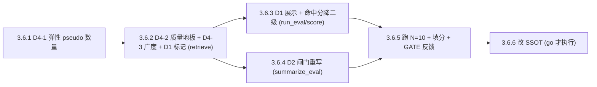

# Phase 3.6 · 优质候选判据落地（ADR-0003 代码层）

落地 [docs/adr/0003-multi-agent-resonance-quality-and-a1-as-peer.md](docs/adr/0003-multi-agent-resonance-quality-and-a1-as-peer.md) 中**可代码化**的决策，跑一轮 eval 拿反馈，再决定是否改 PRD。遵循 `todo-execution-pipeline` 规则：每个 TODO 一条 `feat/phase3.6-*` 分支 → 本地测试 → commit → 标记 → 报告 → PR 合并。

## 本轮范围（用户已确认）

- 上：**D1**（优质候选定义）+ **D2**（闸门重写：多 agent vs 单 agent）+ **D4**（弹性 pseudo + 质量地板 + 广度优先）。
- 不上：**D3**（去实体化下放 per-persona）→ 延到 3.6 之后的子阶段，避免与 D4 一起改生成内容、混淆反馈归因。
- SSOT 改动收尾在 **3.6.6**：仅当 3.6.5 GATE go 才按 ADR-0003 待改清单改 PRD/CONTEXT/eval-the-bet；no-go 由用户直接跳过本节（代码 → eval → 反馈 → 才改 SSOT）。

## 关键现状（已核对）

- `scripts/agents.py` 硬性要求恰好 3 段：`EXPECTED_PSEUDO_COUNT = 3` / `EXPECTED_PSEUDO_IDS = (p1,p2,p3)`，`parse_pseudos_response` 在 L380/L437 对数量与 id 集合做强校验。
- `scripts/retrieve.py` 已记录 `triggered_by`（仅 creative）/ `also_baseline`(A1) / `hit_sources`；containment 仅按相似度截断（L447–451）。
- `scripts/summarize_eval.py` 当前按 **baseline vs creative** 分桶（`_is_creative_candidate` L90），闸门第 2 条比 `creative_structural_2_rate`。
- `scripts/run_eval.py` `_candidate_heading` 用 `[A1, A7]` / `[baseline only]`；`_format_candidate_block` 写 `also_baseline` + `命中视角/碎片` + 共振分占位。

## TODO 依赖

## 各 TODO 细节

### 3.6.1 · D4-1 弹性 pseudo 数量（生成侧唯一改动）
- `scripts/agents.py`：把「恰好 3」放宽为「**1–3 段、id ∈ {p1,p2,p3} 且唯一**」；删除 `count != 3` 与 `missing ids` 的硬报错，改为接受 ≥1 段；保留 fragment/how 连续性校验。
- `prompts/_shared/multi_pseudo_output_contract.md`：`exactly 3` → `up to 3（1–3）；若某碎片组合只能凑出勉强/注水的 pseudo，宁可少写，不要凑数`。
- `prompts/A1/A2/A4/A7_*.md` 与 `scripts/run_eval.py` 中「3 pseudos」字样同步为「1–3」。
- 注意：**不引入生成前的『灵感自评分』**（ADR D4 明确反对）；这里只是允许少写，真正的筛选靠 3.6.2 的质量地板。

### 3.6.2 · D4-2 质量地板 + D4-3 广度优先 + D1 优质候选标记（`scripts/retrieve.py`）
- **质量地板**：新增 `--quality-floor`（默认值偏低、可调，如 0.40），低于地板的 hit **不计入** D1 的「多 agent」判定（仍可作为普通候选展示），防止注水 pseudo 伪造假共振。
- **优质候选标记**：每候选计算 `distinct_agents`（过地板后命中它的不同 `agent_id` 数，A1 平权计入）；`quality_candidate = distinct_agents >= 2`；写入 `retrieve.json`（`quality_candidate` / `distinct_agents` / `quality_reason`）。
- **广度优先 containment**：截断时**先保留 `quality_candidate=true`**，再用相似度填满剩余预算（替换 L447–451 的纯相似度排序）。
- 单测：`tests/` 加用例覆盖 地板过滤、distinct_agents 计数、优质优先截断。

### 3.6.3 · D1 展示 + 命中分降为二级（`scripts/run_eval.py` + `scripts/score_eval_candidates.py`）
- `candidates.md`：优质候选加显式标记（如标题后 `[优质·多agent]` 或新增 `- **优质候选**: true`）；候选排序改为**优质优先、组内按 pseudo 命中分**（命中分降为二级键，不作准入）。
- heading 的 agent 括号**列出全部命中 agent（含 A1）**，为 3.6.4 的 multi-vs-single 解析铺路（去掉 `baseline only` 特例语义）。
- `score_eval_candidates.py`：`pseudo命中分` 保留为审阅辅助，明确其为二级排序键。

### 3.6.4 · D2 闸门重写（`scripts/summarize_eval.py`）
- 分桶从 **baseline/creative** 改为 **multi-agent（优质）/ single-agent**：按候选过地板后的 distinct agent 数 ≥2 / ==1 划分（`_is_creative_candidate` 及 heading 解析相应改）。
- 闸门第 2 条（用户选定）：`single_structural_2_rate < multi_structural_2_rate`（多 agent 候选的 双重/2 分率**明显高于**单 agent）——直接检验 D1 主判据。
- 第 1 条（批次 ≥60% 出 2 分）保留。输出 `multi_*` / `single_*` 率 + `gate.compare_mode = multi_vs_single`。
- 单测：手填 fixture 覆盖 multi>single（PASS）与 multi≤single（FAIL）。

### 3.6.5 · 跑一轮 eval（N=10 新管线）[需人工验收]
- 用 3.6.1–3.6.4 的新管线对 `tests/eval_news/01..10` 重跑 `run_eval` → `score_eval_candidates` → 总编填 `共振分`/`共振类型` → `summarize_eval` → 写 `output/Eval/GATE_RESULT.md`（或新目录，保留 3.5.6 旧结果对照）。
- 产出**反馈**：优质候选(多 agent)是否确实质量更高、弹性 pseudo 是否减少注水、地板阈值是否合适。

### 3.6.6 · 改 SSOT（仅 GATE go 时执行）
- **前置门槛**：3.6.5 结果为 go 才执行；no-go 时用户直接跳过本节，不改 SSOT。
- 按 [ADR-0003](docs/adr/0003-multi-agent-resonance-quality-and-a1-as-peer.md) 末尾「SSOT/代码 待改清单」同步文档层：`PRD §4.1/§4.2`（A1 平权）、`§5.1/§5.2`（优质候选定义 + 命中分二级）、`§8` + `docs/eval-the-bet.md`（闸门改 multi-vs-single）、`CONTEXT.md`（术语）。
- D3（去实体化下放 per-persona）不在本节，留作后续独立子阶段。

## Out of scope
- D3 per-persona 去实体化（后续独立子阶段）；C1/C2；fetch_news 全自动；索引侧改动。SSOT 改动仅在 3.6.6 且 GATE go 时做。

## 风险
- **反馈归因**：D1+D2+D4 同轮，仍混合「弹性 pseudo」与「优质判据」两个变量；3.6.5 评估时按 per-candidate 信号尽量区分。
- **质量地板阈值**：数据显示相似度不分离精度（2 个 0 分候选 sim 反而高），故地板定位是「防注水」而非「提精度」，默认值需在 3.6.5 实测微调。
- **小样本**：N=10 只够定方向；闸门第 2 条的「明显高于」阈值需谨慎，避免被 9 条样本过拟合。
- 受人工验收阻断：3.6.5 标 `[需人工验收]`，approve 前不标 complete、不写 report、不合并；3.6.6 仅在 GATE go 时由用户启动。