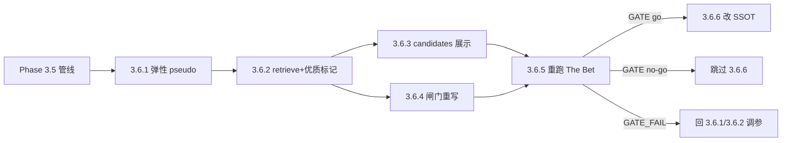

# Phase 3.6 · 优质候选判据落地（ADR-0003）

## 触发与定位

Phase 3.5 新管线方向验证成立（`GATE_FAIL（发布）`），总编对 N=10 人工评估后形成 [ADR-0003](../../docs/adr/0003-multi-agent-resonance-quality-and-a1-as-peer.md)：**多 agent 共振为主判据**、`pseudo 命中分` 降为二级排序、**A1 从对照改为平权 agent**、弹性 pseudo 用「选择优先、分配延后」（不预定义「灵感」）。

本 Phase = **不改 PRD 前提下**先落代码 + 再跑一轮 eval 验证判据；**3.6.6 改 SSOT 仅当 3.6.5 GATE go**，no-go 由用户直接跳过。**D3**（去实体化下放 per-persona）延到后续子阶段，避免与 D4 同轮混淆反馈归因。**Phase 4 仍 gated**（与 3.5.6 结论一致，直至未来发布闸门通过）。

**代码现状（实现前）：**

- `scripts/agents.py` 硬性 `EXPECTED_PSEUDO_COUNT = 3`。
- `scripts/retrieve.py`：`triggered_by` / `also_baseline` / `hit_sources` 已有；containment 纯按相似度。
- `scripts/summarize_eval.py`：baseline vs creative 分桶 + 创作 2 分率 > 基线。
- `scripts/run_eval.py`：heading `[baseline only]` / 不含 A1 的撞车展示语义。

## Todo 依赖关系

- **3.6.3**、**3.6.4** 均依赖 **3.6.2**，彼此可并行开发
- **3.6.5** 依赖 **3.6.1–3.6.4** 全部合并后跑 eval
- **3.6.6** 依赖 **3.6.5** 且 **仅 GATE go** 执行

## Scope

### In scope

- `scripts/agents.py` + `prompts/_shared/multi_pseudo_output_contract.md` + `prompts/A1/A2/A4/A7`：1–3 段 pseudo（上限 3，可少写/跳过）
- `scripts/retrieve.py`：`--quality-floor`、优质候选字段、`quality_candidate` 广度优先 containment
- `scripts/run_eval.py` + `scripts/score_eval_candidates.py`：优质标记、排序、heading 含全 agent
- `scripts/summarize_eval.py`：multi-agent vs single-agent 闸门 + `gate.compare_mode = multi_vs_single`
- `tests/` 单测（retrieve 优质逻辑、summarize_eval 闸门 fixture）
- N=10 重跑 `run_eval` → 总编填 `共振分`/`共振类型` → `summarize_eval` → `output/Eval/GATE_RESULT.md`（保留 3.5.6 产物作对照）
- **3.6.6（条件）**：PRD / `CONTEXT.md` / `docs/eval-the-bet.md` 按 ADR-0003 待改清单同步

### Out of scope

- **D3** per-persona 去实体化（后续独立子阶段）
- SSOT 改动（除非 3.6.5 go 后执行 3.6.6）
- C1/C2、`copywriter.py`（Phase 4，仍 gated）
- `fetch_news.py` 全自动、索引侧改动
- 生成前「灵感」自评 / 适配度预测器（ADR D4：选择问题，非分配问题）

## SSOT

| 文档 | 用途 |
| --- | --- |
| `docs/adr/0003-multi-agent-resonance-quality-and-a1-as-peer.md` | D1/D2/D4 决策与 N=10 证据；SSOT 待改清单 |
| `docs/adr/0002-pivot-to-event-logic-resonance.md` | 表层合法、事件逻辑解构（前置） |
| `docs/eval-the-bet.md` §4/§5.1 | 评分 rubric；3.6.4 后需与 multi-vs-single 闸门对齐（3.6.6） |
| `docs/SSOT/电影宇宙「每日星轨观测」系统 PRD.md` v0.4 | 现行产品 SSOT；3.6.6 go 时升口径 |
| `output/Eval/multi-agent-hits-review.md` | 9 条多 agent 打分 ground truth（方向验证） |
| Phase 3.5 plan | 解构 + 多 pseudo 管线基线 |

## 判据与闸门（本 Phase 定稿 · 实现须一致）

| 代号 | 定稿 |
| --- | --- |
| **D1 优质候选** | `distinct_agents >= 2`（过质量地板后的不同 `agent_id`，**A1 平权计入**）；`pseudo 命中分` **仅**排序/截断/打平，不作质量闸 |
| **D2 闸门第 2 条** | `single_structural_2_rate < multi_structural_2_rate`（多 agent 候选的结构/双重 2 分率 > 单 agent） |
| **D2 闸门第 1 条** | 保留：≥60% 批次至少 1 个 2 分候选 |
| **D4 质量地板** | 默认 `--quality-floor`（如 0.40，3.6.5 可调）；未过地板的 hit **不参与** D1 多 agent 计数 |
| **D4 弹性 pseudo** | 每 agent **1–3 段**（`p1`–`p3` 唯一）；宁可少写不凑数；**不**做生成前灵感自评 |
| **延后** | 是否强制 A1 在场（纯 An+An vs 含 A1）：样本不足，**3.6.5 后再议** |

---

## Todo 3.6.1 · D4-1 弹性 pseudo 数量

**依赖：** Phase 3.5 编剧链（3.5.3）

- `scripts/agents.py`：`parse_pseudos_response` 接受 **1–3** 段，`id ∈ {p1,p2,p3}` 且唯一；去掉「恰好 3 / missing ids」硬错；保留 fragment / how 连续性校验。
- `prompts/_shared/multi_pseudo_output_contract.md`：`exactly 3` → **up to 3（1–3）**；低适配宁可少写。
- `prompts/A1_reality_recorder.md` 等 + `run_eval.py`：「3 pseudos」→「1–3 pseudos」；A1 prompt 顶部 **baseline/control** 文案暂留（A1 平权口径在 3.6.6 SSOT，本 todo 仅数量契约）。

### 验收

- [ ] `python tests/test_agents_p35.py`（或新增用例）通过：1 段、2 段、3 段 JSON 均可解析
- [ ] 0 段仍报错；重复 id / 非法 fragment 仍报错

---

## Todo 3.6.2 · retrieve：质量地板 + 优质标记 + 广度 containment

**依赖：** 3.6.1

- `scripts/retrieve.py`：
  - CLI `--quality-floor`（默认 ~0.40，可调）
  - 每 `hit_sources` 行：`similarity >= floor` 才计入 `distinct_agents`
  - 候选字段：`quality_candidate`、`distinct_agents`、`quality_reason`（写入 `retrieve.json`）
  - containment：**先保留** `quality_candidate=true`，再按相似度填满 `max_candidates`
- A1 计入 `distinct_agents`（与 `triggered_by`/`also_baseline` 展示字段解耦，供 3.6.3/3.6.4 消费）

### 验收

- [ ] `python -m unittest tests.test_retrieve_multi_pseudo tests.test_retrieve_quality -v`（新建 quality 用例）通过
- [ ] 样例 `retrieve.json` 含 `quality_candidate`；注水低 sim hit 不抬升 `distinct_agents`

---

## Todo 3.6.3 · candidates 展示与命中分二级

**依赖：** 3.6.2

- `scripts/run_eval.py`：
  - `_candidate_heading`：括号列出**全部**命中 agent（含 A1）；优质候选标题或字段标记（如 `[优质·多agent]` / `- **优质候选**: true`）
  - 候选排序：**优质优先**，组内按 `pseudo命中分合计`（二级）
  - 去掉「仅 creative / baseline only」的展示语义（与 ADR D1 一致）
- `scripts/score_eval_candidates.py`：文档/注释明确命中分为**二级审阅键**，非准入闸

### 验收

- [ ] 单条 `run_eval` 产出 `candidates.md`：优质候选可见标记；heading agent 列表含 A1
- [ ] `score_eval_candidates.py` 仍可从 `hit_sources` 写命中分

---

## Todo 3.6.4 · 闸门重写（multi vs single）

**依赖：** 3.6.2（`quality_candidate` / heading 解析约定）

- `scripts/summarize_eval.py`：
  - 分桶：**multi-agent（优质）** vs **single-agent**（替代 baseline/creative）
  - 解析：`quality_candidate` 字段或 heading 中 ≥2 agent（与 3.6.3 一致）
  - 闸门第 2 条：`single_structural_2_rate < multi_structural_2_rate`；`gate.compare_mode = multi_vs_single`
  - 第 1 条（batch ≥60% 有 2 分）保留；未填 `共振类型` 时 structural 口径 fallback（同 3.5.5）
- `tests/test_summarize_eval.py`：fixture PASS（multi > single）/ FAIL

### 验收

- [ ] `python -m unittest tests.test_summarize_eval -v` 通过
- [ ] 对手填 fixture stdout 显示 `Gate line 2 compare: multi_vs_single`

---

## Todo 3.6.5 · 重跑 The Bet [需人工验收]

**依赖：** 3.6.1–3.6.4

- 对 `tests/eval_news/01..10` 重跑 `run_eval`（建议输出至 `output/Eval/` 新 run 或覆盖前备份 3.5.6）
- `score_eval_candidates.py` → 总编填 `共振分` + `共振类型` → `summarize_eval --dir output/Eval` → 更新 `GATE_RESULT.md`
- **反馈重点**：优质候选 2 分/双重率是否高于单 agent；弹性 pseudo 是否减注水；地板阈值是否合理

### 验收

- [ ] 10 份评测产出完整（含 `retrieve.json` 的 `quality_candidate`）
- [ ] 书面 GATE 结论（go / no-go（发布））
- [ ] **GATE_FAIL** → 回 3.6.1/3.6.2 调 prompt 或 `--quality-floor`；**不解封** Phase 4
- [ ] **GATE_PASS（发布）** → 可启动 3.6.6；仍 **不解封** Phase 4（除非产品另定发布线）

---

## Todo 3.6.6 · 改 SSOT [仅 GATE go]

**依赖：** 3.6.5 **GATE go**（no-go → 用户跳过，不执行本节）

按 ADR-0003「SSOT/代码 待改清单」同步文档（**不改代码逻辑**，与 3.6.1–3.6.4 已实现行为对齐）：

- `PRD §4.1/§4.2`：A1 平权，去掉「实验对照 / 不算创作视角」
- `PRD §5.1/§5.2`：优质候选 = 多 agent 共振；命中分二级；撞车升级为主判据
- `PRD §8` + `docs/eval-the-bet.md` §5.1：闸门第 2 条改为 multi vs single
- `CONTEXT.md`：优质候选、多 agent 共振、实体预算（术语）；去掉 A1「对照组」

### 验收

- [ ] PRD / eval-the-bet / CONTEXT 与代码、`summarize_eval` 输出一致
- [ ] ADR-0003 `Status` 可升为 `accepted`（若用户确认）

---

## Phase 3.6 整体验收

- [ ] 3.6.1–3.6.4 端到端可跑（deconstruct → agents → retrieve → run_eval → summarize_eval）
- [ ] N=10 重跑 + 总编填分 + 书面 GATE（3.6.5）
- [ ] GATE go 时完成 3.6.6 SSOT；no-go 时 3.6.6 显式跳过并记录于 `GATE_RESULT.md`

## 交给下一 Phase

| 条件 | 下一动作 |
| --- | --- |
| **GATE_PASS（发布）** | 执行 3.6.6 改 SSOT；Phase 4 仍按 PRD 发布线 gated（copywriter 未在本 Phase 解封） |
| **GATE_FAIL（发布）** | 回 3.6.1/3.6.2 迭代；跳过 3.6.6；Phase 4 仍暂停 |
| **后续（独立）** | D3 per-persona 去实体化子阶段；地板/配额参数再调 |

## 风险与约束

- **反馈归因**：D1+D2+D4 同轮 eval，弹性 pseudo 与优质判据仍可能混合；3.6.5 按 per-candidate 对照填分。
- **质量地板**：定位为防注水伪多 agent，非提精度；N=9 多 agent 样本显示 sim 与共振分弱相关，阈值靠 3.6.5 实测。
- **小样本**：纯 An+An（无 A1）在 3.5 N=10 为 0；「A1 是否必要」延后，勿在 3.6.4 硬编码。
- 受「人工验收阻断」约束：**3.6.5** 标 `[需人工验收]`，approve 前不标 complete、不写 report、不合并；**3.6.6** 仅用户 GATE go 后启动。
