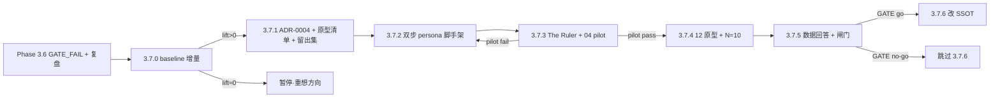

# Phase 3.7 · 12 原型情绪扩散（persona resonance）

## 触发与定位

Phase 3.6 `GATE_FAIL（发布）`。总编对 N=10 + 08–10 补分的复盘（见对话与 `output/Eval/phase3.6/high-hit-score-review.md`）得出几个结论：

1. **A1（baseline=忠实复述）是最强单一信号**：含 A1 候选共振均值 ≈1.4，非 A1 ≈0.29。
2. **当前 An（A2/A4/A7）靠"注入/虚构"产生关联**（prompt 原文：A2 "inject … not already stated"、A4 "mythologize"、A7 "invent micro-causes"），样本外检验中 Dead Mail（A7 主导，把"举报信"虚构关联到"求助纸条"）伪分 13 却共振 0——**流畅的伪关联是人工审核里最贵的**。
3. **伪命中分是坏的质量代理**：它数 fragment 数量，Killing Room 伪 16 仍只 1 分。真正预测共振的是**语义/主题对题 + 老片关联加成**。

**本 Phase 的赌注**：把"创作视角"从"注入式 An"重构为 **12 原型 = A1 的情绪化扩散**——原型只从现实里**选择 + 重配语气**地讲述同一批事实，不注入新事实。目标是在保住 A1"对题"优势的前提下，叠加情绪维度的关联。

**纪律**：证据先行（3.7.0 Go/No-Go）→ 单点 pilot（3.7.3 Go/No-Go）→ 再扩 12。**留出集**（3.7.1）防止重蹈"5 点归纳被样本外推翻"。**Phase 4 仍 gated**。

**代码现状（实现前）：**

- `prompts/A0_reality_deconstructor.md`：**已是 lens-neutral 纯解构**（禁 de-entification / 价值框架 / 共振字段），保留 `who.relations`、`role_in_event`。本 Phase **不动 A0**——A0 只拆解、**不产替代词**（含中性），替代词全由下游 alt-creator 自产。
- `scripts/agents.py`：`PERSONA_FILENAMES` 固定 A1/A2/A4/A7；`_ROLE_BY_AGENT` A1=baseline；`render_prompt` 注入 `{{deconstruction_json}}`；`parse_pseudos_response` 校验 1–3 段 + fragment + how 连续。
- `scripts/retrieve.py`：pseudo `text` ↔ overview embedding；`triggered_by` / `also_baseline` / `quality_candidate`。
- 匹配仍是**叙事 prose ↔ overview prose**，A1（不加替换词、中性拼接）天然是"alternatives 关闭"的消融基线。

## Todo 依赖关系

## Scope

### In scope

- `scripts/analyze_baseline_lift.py`（新）：从 `output/Eval/phase3.6/*/` 已打分数据算 baseline-only / creative-only / both 的 2 分率
- `docs/adr/0004-persona-emotional-diffusion.md`（新）：本 Phase 全部设计决策（见「判据与闸门」）
- 12 原型清单（`docs/SSOT/personas-12.md` 或 ADR 内表）：名称 / 情绪 / 价值倾向
- `prompts/_shared/`：新增 `persona_alt_creator_contract.md` + `persona_screenwriter_contract.md`（后者在 `multi_pseudo_output_contract` 基础上加 `fit` 字段 + alternatives 选用规则 + "可重配语气、禁加事件"）
- `prompts/personas/<persona>/persona_card.md`：每原型的情绪定义与价值倾向（pilot 仅 The Ruler，3.7.4 补齐）
- `scripts/personas.py`（新，复用 `agents.py` 的 render/parse/LLM 工具）：decon → alt-creator(persona) → screenwriter(persona) → pseudos(+fit)；产出 flavored-decon overlay（**1 份中性 decon SSOT + 每 persona 一层 alt-pool**，不 fork 全文）
- `scripts/retrieve.py` / `run_eval.py`：消费 persona pseudos 与 `fit`；闸门侧在 3.7.5 加 `fit × 相似度`
- `tests/`：alt-creator/screenwriter 解析、fit 字段、overlay 结构单测
- N=10 重跑 → 留出集打分 → `output/Eval/phase3.7/GATE_RESULT.md`
- **3.7.6（条件）**：PRD / `CONTEXT.md` / `reality-deconstruction-contract.md` 按 ADR-0004 同步

### Out of scope

- A0 元素 schema 瘦身（删 tags/geocode/scale）：**本 Phase 不做**；alt-creator 直接读现有 `text`/`relations` 生成替换词。列为后续 cleanup。
- 第二条结构化匹配轴（元素/alternatives ↔ 电影 metadata）：延后，先验证叙事轴。
- 硬弃权阈值：本 Phase 只记 `fit`，**用留出集数据决定**将来是否加（见判据）。
- 题材安全闸：仅点出，不拦内容。
- C1/C2、copywriter、发布全自动：Phase 4，仍 gated。
- 其他维度筛选（体量压缩的非命中分维度）：本 Phase 不引入，避免干扰归因。

## SSOT

| 文档 | 用途 |
| --- | --- |
| `docs/adr/0004-persona-emotional-diffusion.md`（新） | 本 Phase 决策与 N=10 证据；SSOT 待改清单 |
| `docs/adr/0003-multi-agent-resonance-quality-and-a1-as-peer.md` | A1 平权、命中分二级（前置） |
| `docs/adr/0002-pivot-to-event-logic-resonance.md` | 表层合法、事件逻辑解构（前置） |
| `docs/SSOT/reality-deconstruction-contract.md` | A0 输出契约；3.7.6 go 时补 alternatives/overlay 说明 |
| `docs/eval-the-bet.md` §4/§5.1 | 共振 rubric；3.7.1 去"讽刺"措辞 |
| `docs/SSOT/电影宇宙「每日星轨观测」系统 PRD.md` | 产品 SSOT；3.7.6 go 时升口径 |
| `output/Eval/phase3.6/high-hit-score-review.md` | 复盘 ground truth（A1 信号、伪分不可靠、老片加成） |

## 判据与闸门（本 Phase 定稿 · 实现须一致）

| 代号 | 定稿 |
| --- | --- |
| **P-Source** | **A0 只拆解，不产任何替代词（含中性）**。全部替代词由 **per-persona alt-creator 自产**：每 element 生成 **正向–中性–负面整条 spectrum**，再按本 persona 偏好取舍 |
| **P-Select** | alt-creator/screenwriter 只能 **Select + 重配语气**，**禁 Inject 事件**。spectrum 上每个替换词必须**事实蕴含**（可从中性 decon、尤其 `who.relations`/`why`/`how` 推出），可激进推正/负价值（如 "rumor spreader" ✓，因新闻确证散布不实指控）；**禁 fact-additive**（如 "foreign agent" / "convicted criminal" ✗） |
| **P-SSOT** | 1 份中性 decon = 单一事实源；每 persona 仅产出 **alt-pool overlay**（引用同一 element/fragment id）。**不 fork 12 份全文** |
| **P-Tone** | screenwriter 可调措辞/语域/语气（如 "secured a warrant" → "moved to restore order"），但**不得新增人物/因果/事件** |
| **P-Force** | **强迫生产 + 不硬弃权**：所有被运行的 persona 都产出 pseudo（零生成期 false negative）；每 pseudo 附 **`fit` 自评（0–1）**；过滤交给下游 `fit × 相似度`，不在上游硬丢 |
| **P-Abstain** | 是否加弃权阈值 = **留出集打分后用数据决定**（看"低 fit 是否从不命中 2 分"）；本 Phase 不硬编码 |
| **P-Match** | 匹配不变：pseudo prose ↔ overview embedding。A1（中性拼接、无 alternatives）= 干净消融基线 |
| **P-Cost** | 追求**表达强度**优先：alt-creator 每 persona 专属（成本经测可忽略） |
| **闸门 1** | 保留：≥60% 批次至少 1 个 2 分候选 |
| **闸门 2（新）** | persona 候选的结构/双重 2 分率 **>** A1 中性基线（验证情绪 steering 增量）|

---

## Todo 3.7.0 · baseline 增量统计 [Go/No-Go]

**依赖：** Phase 3.6 已打分数据（`output/Eval/phase3.6/*/candidates.md` + `high-hit-score-review.md`）

- `scripts/analyze_baseline_lift.py`（新）：解析每候选的 `also_baseline` / `triggered_by` / `共振分`，分桶统计 **baseline-only / creative-only / both** 的 2 分率与样本数。
- 写 `output/Eval/phase3.7/baseline-lift.md`：给出"creative 相对 A1 中性的 2 分增量"数字锚。

### 验收

- [x] `python scripts/analyze_baseline_lift.py --dir output/Eval/phase3.6` 产出三桶统计
- [x] **Go/No-Go**：**No-Go** — creative-only 2 分率 9.5% (4/42) vs baseline-only 37.5% (3/8)，lift **−28.0%**；暂停 3.7.1，见 `output/Eval/phase3.7/baseline-lift.md`

---

## Todo 3.7.1 · ADR-0004 + 12 原型清单 + 留出集 + rubric 去"讽刺" [需人工验收]

**依赖：** 3.7.0 Go

- `docs/adr/0004-persona-emotional-diffusion.md`：固化 P-Select / P-SSOT / P-Tone / P-Force / P-Abstain / P-Match / P-Cost 与闸门 2；`Status: proposed`。
- **12 原型清单**（Pearson）草案 → 用户确认。每项：`persona_id`、名称、核心情绪、价值倾向（正/负/中）、典型替换取向示例。草案 roster：

  | id | 原型 | 核心情绪 | 价值取向示例（04 的 YouTuber） |
  | --- | --- | --- | --- |
  | The-Ruler | 统治者 | 秩序 / 控制 | the rumor spreader（负·捍卫秩序）|
  | The-Outlaw | 反叛者 | 反抗 / 颠覆 | the system's scapegoat（视角反转）|
  | The-Caregiver | 照护者 | 保护 / 受害 | the harmed star / a wronged family |
  | The-Hero | 英雄 | 抗争 / 正义 | the investigators who closed in |
  | The-Innocent | 天真者 | 信任 / 幻灭 | — |
  | The-Sage | 智者 | 真相 / 辨识 | fabricated evidence vs verified fact |
  | The-Lover | 爱人 | 亲密 / 背叛 | — |
  | The-Jester | 弄臣 | 荒诞 / 反讽 | a viral hoax gone to court |
  | The-Explorer | 探索者 | 自由 / 越界 | — |
  | The-Creator | 创造者 | 造物 / 失控 | an AI-forged illusion |
  | The-Magician | 魔法师 | 转化 / 操纵 | the puppeteer of perception |
  | The-Everyman | 凡人 | 归属 / 排斥 | — |

  （"—" = 该原型对此新闻天然弱契合，正好用 `fit` 体现，不硬凑。）
- **留出集切分**：`01–07` 观察集 / `08–10` 留出集（与现有打分一致；写入 ADR）。
- `docs/eval-the-bet.md` §4/§5.1：删除"讽刺"作为目标的措辞，统一为"关联/共振"（讽刺仅作为关联的一种，不单列）。

### 验收

- [ ] ADR-0004 落盘（proposed）；12 原型清单经用户确认
- [ ] 留出集切分写入 ADR；rubric 去"讽刺"
- [ ] `[需人工验收]`：用户 approve 原型清单与切分后再进 3.7.2

---

## Todo 3.7.2 · 双步 persona 管线脚手架 + 输出契约

**依赖：** 3.7.1 approve

- `prompts/_shared/persona_alt_creator_contract.md`：输入中性 decon（A0 **不**预置替代词），按 persona 偏好自产**每 element 的全谱 alternatives 池**（正向–中性–负面，标 `valence` + 原词）；硬约束 = P-Source + P-Select（事实蕴含、禁加事件）。
- `prompts/_shared/persona_screenwriter_contract.md`：在 `multi_pseudo_output_contract` 基础上加：① 从 alt-pool 选词拼碎片成 prose；② 允许重配语气（P-Tone）；③ 输出 `fit`（0–1）字段；④ 1–3 段、fragment/how 连续校验沿用。
- `scripts/personas.py`（新）：`decon → alt_creator(persona) → screenwriter(persona) → pseudos(+fit)`；复用 `agents.py` 的 `render_prompt` / `extract_json_object` / `parse_pseudos_response`（扩 `fit` 解析）/ LLM 调用；产出 flavored-decon overlay（alt-pool，引用 id，不 fork 全文）。
- `tests/test_personas.py`（新）：alt-pool 结构解析、`fit` 字段解析、overlay 引用合法 id、screenwriter pseudo 校验。

### 验收

- [ ] `python -m unittest tests.test_personas -v` 通过
- [ ] overlay JSON 仅含 alt-pool + id 引用，不复制中性 decon 全文
- [ ] screenwriter 输出含合法 `fit ∈ [0,1]`，pseudo 通过既有 fragment/how 校验

---

## Todo 3.7.3 · The Ruler card + 04 单点 pilot [需人工验收]

**依赖：** 3.7.2

- `prompts/personas/The-Ruler/persona_card.md`：情绪=秩序/控制，价值倾向=负向捍卫秩序。
- 在 **04-celebrity-scandal**（已有中性 decon：`output/Eval/phase3.6/04-celebrity-scandal/`）跑：alt-creator → screenwriter → retrieve。
- 人工核四件事：
  1. **格式/匹配**：screenwriter prose 能正确撞 overview、retrieve 出候选；
  2. **steering**：召回是否被推向秩序/司法/犯罪类电影（vs A1 中性）；
  3. **fit**：自评是否合理（04 对 Ruler 应偏高）；
  4. **无注入**：alt-pool 每词可由 decon 事实推出（P-Select）。

### 验收

- [ ] 04 端到端产出 The-Ruler 的 alt-pool overlay + pseudos(+fit) + retrieve 候选
- [ ] `[需人工验收]`：四项核查通过 → **Go**（进 3.7.4）；不过 → 回 3.7.2 修脚手架/契约

---

## Todo 3.7.4 · 余下 11 原型 + N=10 重跑 [需人工验收]

**依赖：** 3.7.3 Go

### 输出路径约定（非破坏性 · 强制）

- 本 Phase 全部 run 写 **`output/Eval/phase3.7/{run_id}/`**（`run_id` 与 `tests/eval_news/batch-manifest.json` 一致）。
- **不得改写** `output/Eval/phase3.5/`、`phase3.6/` 内任何文件（只读对照）。
- `run_eval` 须对每条显式 `--out output/Eval/phase3.7/{run_id}`；`summarize_eval --dir` / `score_eval_candidates --dir` 仅指向 `output/Eval/phase3.7`；review 文件显式 `--review-out output/Eval/phase3.7/high-hit-score-review.md`。

### 执行步骤

1. 补齐 `prompts/personas/<其余 11 原型>/persona_card.md`。
2. 12 原型 × `tests/eval_news/01..10` 跑 persona 管线 → retrieve → `run_eval`（含 A1 中性基线以支撑闸门 2 对比）。
3. `score_eval_candidates.py --dir output/Eval/phase3.7 --review-out …`。
4. 总编**仅在留出集 08–10**（必填）+ 观察集（可选）填 `共振分` / `共振类型`。
5. 反馈重点：persona 候选 2 分/双重率是否高于 A1 中性基线；`fit` 与共振是否相关；是否出现 Dead Mail 式流畅伪关联。

### 验收

- [ ] 10 份产出位于 `output/Eval/phase3.7/{run_id}/`；3.5/3.6 树未改写
- [ ] 留出集 08–10 完成打分
- [ ] `[需人工验收]`：总编确认数据可用于 3.7.5 判定

---

## Todo 3.7.5 · 数据回答 + 闸门改造 [需人工验收]

**依赖：** 3.7.4

- `scripts/summarize_eval.py`：闸门 2 改为 **persona vs A1 中性基线** 的结构/双重 2 分率对比；引入 `fit × 相似度` 作为候选排序/过滤维度（`gate.compare_mode = persona_vs_baseline`）。
- 分析（写入 `output/Eval/phase3.7/GATE_RESULT.md`）：
  1. **fit ↔ 共振** 相关性 → 决定 P-Abstain（低 fit 是否从不命中 2 分）；
  2. **persona steering vs A1** 增量（呼应 3.7.0 锚）；
  3. 闸门把 `fit × 相似度` 调到目标人工体量（"去低质、不错杀"）。

### 验收

- [ ] `python -m unittest tests.test_summarize_eval -v` 通过（persona_vs_baseline fixture）
- [ ] `GATE_RESULT.md` 给出三问结论 + GATE go/no-go
- [ ] `[需人工验收]`：用户确认 GATE 结论

---

## Todo 3.7.6 · 改 SSOT [仅 GATE go]

**依赖：** 3.7.5 **GATE go**（no-go → 用户跳过）

- `reality-deconstruction-contract.md`：补 alternatives / overlay 与 persona 两步管线说明。
- `PRD` / `CONTEXT.md`：12 原型 = A1 情绪化扩散；An 注入式视角退场；"关联性"为核心目标（讽刺仅子类）；`fit` 与闸门 2 新口径。
- `docs/adr/0004-*` `Status` → `accepted`（用户确认）。

### 验收

- [ ] PRD / CONTEXT / contract 与代码、`summarize_eval` 输出一致 —（仅 GATE go）
- [ ] ADR-0004 升 `accepted`

---

## Phase 3.7 整体验收

- [ ] 3.7.0 Go + 3.7.1 原型清单/留出集 approve
- [ ] 3.7.2 脚手架端到端可跑（decon → alt-creator → screenwriter → retrieve）
- [ ] 3.7.3 04 pilot 四项核查通过
- [ ] 3.7.4 N=10 + 留出集打分
- [ ] 3.7.5 书面 GATE（persona vs baseline、fit↔共振、闸门体量）
- [ ] 3.7.6 仅 GATE go 执行

## 交给下一 Phase

| 条件 | 下一动作 |
| --- | --- |
| **GATE go** | 执行 3.7.6 改 SSOT；按数据加 P-Abstain 阈值；考虑第二匹配轴 / A0 schema 瘦身 |
| **GATE no-go** | 回 3.7.2/3.7.3 调原型契约或 steering；跳过 3.7.6 |
| **后续（独立）** | 其他体量压缩维度；题材安全闸；A0 元素 schema 瘦身 cleanup |

## 风险与约束

- **过拟合**：规律先在 **08–10 留出集** 验证，不在观察集自证（3.6 已演示过拟合翻车）。
- **流畅伪关联（Dead Mail 型）**：强迫生产会造，靠 `fit × 相似度` 在下游压，不靠上游硬弃权（防 false negative）。
- **P-Select 边界**：alt-creator 是唯一注入风险点，"事实蕴含 vs fact-additive" 须在契约 + pilot 人工核查双重把关。
- **归因**：闸门 2 必须有 **A1 中性基线同跑** 才能隔离"情绪 steering 增量"。
- **小样本**：留出集仅 3 条新闻；结论按 per-candidate 对照，必要时扩样。
- 受「人工验收阻断」约束：**3.7.1 / 3.7.3 / 3.7.4 / 3.7.5** 标 `[需人工验收]`，approve 前不标 complete、不写 report、不合并；**3.7.6** 仅 GATE go 后启动。
