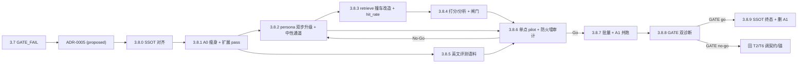

# Phase 3.8 · 客观抽取 + 中性通道 + 撞车票（objective extraction · neutral channel · collision vote）

## 触发与定位

承接 [ADR-0005](../../docs/adr/0005-objective-extraction-neutral-channel-and-collision-vote.md)（`Status: proposed`），它是 **Phase 3.7 `GATE_FAIL`（2026-06-05）复盘后的重设计**。3.7 硬数据：toned persona path 结构/双重 2 分率 **20%** vs A1 **75%**（lift −55%）；`fit↔共振 r≈0.14`（情绪滤镜**不**预测命中，对题才预测）。

**复盘的两条致命前提错误**（ADR-0005 §背景）：① 原文文本本身已带价，不存在真空中性源；② 各 persona 对「中性」本就不一致。**对策**：把 A0 被混为一谈的职责拆三件（抽取 / 客观扩展 / persona 价值），并复活 [ADR-0003](../../docs/adr/0003-multi-agent-resonance-quality-and-a1-as-peer.md) 的撞车主判据形状（**中性 + ≥1 creative**）。

**本 Phase 的赌注**：强制 **hypernym 锚** 让 toned 留在题面，截断对题漂移；新增**中性通道**扛召回，让 toned 只需在其上**加精度/加汇聚**。证据先行：单点 pilot → 批量（A1 并跑）→ **双诊断 GATE** 裁决「产品到底是中性召回、还是 persona」。

**代码现状（实现前）：**

- **已落地（prompt/SSOT 层 · 3.7-review · 未提交、待 gate）**：12 张 `persona_card.md` 已加 `## 价值轴 (Value Axis)`（persona-relative，who/where/when-opt-in）；`persona_alt_creator_contract.md` / `persona_screenwriter_contract.md` prose 已写入 persona-relative valence、两个中性区分、三层 provenance（`provenance` 为可选 tag，现 parser 安全忽略）。
- **未实现（本 Phase 主体）**：A0 contract/prompt 仍是「全维度无损 + 标签梯 + geocode/scale」；`scripts/deconstruct.py` 仍产 inert 字段；**无客观扩展 pass**；`scripts/personas.py` `parse_alt_pool_response` 仍**强制三桶绝对 valence**、**无中性通道生成**；`scripts/retrieve.py` 仍用对称 `distinct_agents>=2`、A1=baseline、**无 neutral_hit_rate**；评测语料为中文（phase3.6 decon 复用）。

## Todo 依赖关系

## Scope

### In scope

- `docs/SSOT/reality-deconstruction-contract.md`：A0 = **verbatim only**；新增**客观扩展 pass**（只产 hypernym 梯）；三层 provenance；**丢 inert 字段**（geocode/coordinates/scale/scene_archetype）。
- `CONTEXT.md`：补术语（客观地板中性 / persona 中点中性 / 中性通道 / 语气通道 / neutral hit rate / 三层 provenance）。
- `prompts/A0_reality_deconstructor.md` + `scripts/deconstruct.py`：A0 英进英出、verbatim、丢 inert。
- 新 `prompts/_shared/objective_expansion_contract.md` + `scripts/`（共享扩展步骤）：hypernym 梯 + 客观性试金石闸。
- `scripts/personas.py`：`parse_alt_pool_response` 放宽（persona-relative valence、`provenance` 解析、不再强制绝对三桶）；新增**每 persona 1 条客观地板中性 pseudo** 生成；角色标注 `neutral` / `toned`。
- `scripts/retrieve.py`：撞车口径改非对称（中性 union=1 去重票 + ≥1 toned 汇聚）；`_ROLE_BY_AGENT` 改 neutral/toned；新增 `neutral_hits` / `neutral_total` / `neutral_hit_rate` 字段。
- `scripts/score_eval_candidates.py` + `scripts/summarize_eval.py`：控相似度的双诊断；闸门口径。
- `scripts/run_persona_batch.py`（或新 runner）：双通道编排 + A1 并跑 + 写 `output/Eval/phase3.8/{run_id}/`。
- 英文评测语料（`tests/eval_news/` 英文 fixtures + `batch-manifest.json`）。
- `tests/`：A0 verbatim、扩展 pass 试金石、alt-pool provenance/persona-relative 解析、中性通道生成、retrieve 撞车新口径、neutral_hit_rate、summarize 双诊断 fixtures。
- pilot + 批量 run + GATE_RESULT。

### Out of scope

- **第二条结构化匹配轴**（元素/alternatives ↔ 电影 metadata）：延后。
- **P-Abstain 硬阈值**：仍由留出集数据决定，不硬编码（ADR-0004 / ADR-0005 OPEN (b)）。
- **toned 改纯 re-ranker**：ADR-0005 OPEN (a) 已锁「发 anchored query」，本 Phase 不重启。
- **C1/C2 / copywriter / 发布全自动**：Phase 4，仍 gated。
- **重新训练/换嵌入模型**：保持 `paraphrase-multilingual-MiniLM-L12-v2`（与 build_index 同模型）。
- **题材安全闸**：仅点出，不拦内容。

## SSOT

| 文档 | 用途 |
| --- | --- |
| [`docs/adr/0005-*.md`](../../docs/adr/0005-objective-extraction-neutral-channel-and-collision-vote.md) | 本 Phase 全部决策（P-Extract/P-Expand/P-Lens/P-Compose、两中性、两通道、撞车票、neutral_hit_rate、A1 退场）；`Status: proposed`，3.8.9 GATE go 后升 `accepted` |
| [`docs/adr/0003-*.md`](../../docs/adr/0003-multi-agent-resonance-quality-and-a1-as-peer.md) | 撞车主判据 / A1 平权（本 Phase 复活其形状） |
| [`docs/adr/0002-*.md`](../../docs/adr/0002-pivot-to-event-logic-resonance.md) | 表层共振合法、事件逻辑解构（对题召回前提） |
| [`docs/SSOT/reality-deconstruction-contract.md`](../../docs/SSOT/reality-deconstruction-contract.md) | A0 契约；3.8.0 重写 |
| [`docs/SSOT/personas-12.md`](../../docs/SSOT/personas-12.md) + 各 persona card | 价值轴（3.7-review 已落地，待 gate 确认） |
| [`docs/eval-the-bet.md`](../../docs/eval-the-bet.md) §4/§5.1 | 共振 rubric |
| [`output/Eval/phase3.7/GATE_RESULT.md`](../../output/Eval/phase3.7/GATE_RESULT.md) | 3.7 结案数字（20% vs 75%、lift −55%、r≈0.14） |

## 判据与闸门（本 Phase 定稿 · 实现须与 ADR-0005 一致）

| 代号 | 定稿 |
| --- | --- |
| **P-Extract** | A0 纯逐字抽取（who/where/when/why/how/result + role + relations），逐字记录原文用词与原文自带价；**不产中性替代词、不扩展**；英进英出 |
| **P-Expand** | 一份共享客观扩展 pass，**只产 hypernym 梯**，过**客观性试金石**（A2&A4 不吵）；**丢 inert** 字段（retrieve.py 只嵌 `pseudo.text`） |
| **P-Lens** | per-persona alt-creator 产 **persona-relative valence**；仅 fact-entailed；禁加事件/人物/指控 |
| **P-Compose** | screenwriter 从 **三层 provenance 池**（surface/hypernym/lens，每层可多词）组装 pseudo |
| **两中性** | 通道用 **(a) 客观地板中性**（surface+hypernym，共享）；**(b) persona 中点中性** 仅活在 lens spectrum，**不**进通道 |
| **C-Neutral** | 每 persona 恰 1 条客观地板中性 pseudo（无 lens）= 题面召回骨架 + 度量基线；**取代 A1** |
| **C-Toned** | 每条 toned = hypernym 锚 + lens 倾斜，**发自己的 anchored query** |
| **撞车主判据** | 中性 union = **1 张去重票**；**优质候选 = 中性票 + ≥1 toned lens 汇聚同一片** |
| **neutral_hit_rate** | `命中该片中性 pseudo 数 / persona 数`；top_k=2 + quality_floor=0.40；**必须控 max_similarity** 才下结论；top-k 敏感 |
| **闸门 1** | 保留：≥60% 批次至少 1 个 2 分候选（必要下限） |
| **闸门 2（新口径）** | 优质候选（中性 + ≥1 toned 汇聚）的结构/双重 2 分率，且**诊断② toned-convergence 在中性之上加精度**（控相似度） |
| **A1-superset 闸（删 A1 前置）** | 删 A1 前，**首轮批量须 A1 并跑**，证明中性 union 检索出 A1 命中的**超集**且 **2 分率 ≥ A1** |

---

## Todo 3.8.0 · SSOT 对齐 ADR-0005 [需人工验收]

**依赖：** ADR-0005（proposed）

- 重写 `docs/SSOT/reality-deconstruction-contract.md`：A0 = verbatim only（删「全维度无损 + 多分辨率标签梯 + geocode/scale」诸节，保留 who/where/when/why/how/result + role + relations 的逐字抽取）；新增「客观扩展 pass（hypernym 梯 + 客观性试金石）」一节；引入三层 provenance；明列**丢弃** geocode/coordinates/scale/scene_archetype 及理由（引 retrieve.py 只嵌 pseudo.text）。
- `CONTEXT.md`：补术语条目（客观地板中性 / persona 中点中性 / 中性通道 / 语气通道 / neutral hit rate / 三层 provenance）；标注「现实解构 agent」职责收窄。
- 确认 3.7-review 已落地的 persona card 价值轴 + alt/screenwriter 契约 prose 与 ADR-0005 口径一致（不一致则在此对齐）。

### 验收

- [x] contract / CONTEXT 与 ADR-0005 §决策逐条对齐，无残留旧口径（标签梯/geocode/无损全维度）
- [x] `[需人工验收]`：用户 approve 契约口径 → 可进 3.8.1

---

## Todo 3.8.1 · A0 verbatim 瘦身 + 共享客观扩展 pass + 单测

**依赖：** 3.8.0 approve

- `prompts/A0_reality_deconstructor.md`：改纯逐字抽取、英进英出、**不产 tags/geocode/season/scale/scene_archetype**；保留 role/relations。
- `scripts/deconstruct.py`：产物 schema 去 inert 字段；保证英文 I/O。
- 新 `prompts/_shared/objective_expansion_contract.md` + 共享扩展步骤（新脚本或 `scripts/` 内函数）：读 A0 decon → 为 who/where 等元素挂 **hypernym 梯**；硬约束 = **客观性试金石**（A2&A4 不吵才留）。一份共享，不 per-persona。
- `tests/`：A0 输出无 inert 字段；扩展 pass 产 hypernym、且能挡住「带镜头」标签（试金石负例）。

### 验收

- [x] `python -m unittest`（A0 + 扩展 pass 相关）通过
- [x] A0 产物仅含 verbatim 抽取（无 hypernym/geocode/scale）；hypernym 仅出现在扩展 pass 产物
- [x] 扩展 pass 对「贫民窟=slum」留、对「宿命的牢笼」弃（试金石）

---

## Todo 3.8.2 · persona 双步升级 + 中性通道生成 + 单测

**依赖：** 3.8.1

- `scripts/personas.py`：
  - `parse_alt_pool_response` 放宽——**不再强制 positive/neutral/negative 三桶齐全**；valence 按 **persona-relative** 解读；解析可选 `provenance`（surface/hypernym/lens），每层可多词。
  - 新增**中性通道生成**：每 persona 恰 **1 条客观地板中性 pseudo**（仅用 surface+hypernym，**无 lens**）；与 toned pseudos 分离标注。
  - 角色标注 `neutral` / `toned`（供 retrieve 区分）。
- `prompts/_shared/*`：alt-creator/screenwriter 契约（3.7-review 已写 prose）按代码实际再校一遍（中性通道 = 客观地板）。
- `tests/test_personas.py`：persona-relative valence 解析、provenance 解析、中性 pseudo 只含 surface+hypernym、toned 必带 hypernym 锚。

### 验收

- [x] `python -m unittest tests.test_personas -v` 通过
- [x] 每 persona 产 1 条中性 pseudo（无 lens）+ ≥1 条 toned（带 hypernym 锚）
- [x] alt-pool 含 `provenance` 三层、valence persona-relative；overlay 不 fork decon

---

## Todo 3.8.3 · retrieve.py 撞车口径改造 + neutral_hit_rate + 单测

**依赖：** 3.8.2

- `scripts/retrieve.py`：
  - `_ROLE_BY_AGENT` / 角色：改 `neutral` / `toned`（A1 暂以并跑形式保留，见 3.8.7）。
  - 撞车口径：**中性通道整体 = 1 张去重票**（union of neutral hits）；`quality_candidate = 中性票 + ≥1 toned lens 汇聚同一 tmdb_id`（替换对称 `distinct_agents>=2`）。
  - 新增候选字段 `neutral_hits` / `neutral_total`（=persona 数）/ `neutral_hit_rate`；命中口径复用 top_k=2 + quality_floor=0.40。
- `tests/`：中性 12 条全撞同片只记 1 票；中性+1 toned 汇聚才 quality；neutral_hit_rate 分母=persona 数、计数正确；top-k 敏感性注释。

### 验收

- [x] `python -m unittest`（retrieve 相关）通过
- [x] 12 条中性撞同片 → `quality_candidate=False`（无 toned 汇聚）；加 1 条 toned 汇聚 → `True`
- [x] 候选含正确 `neutral_hit_rate`

---

## Todo 3.8.4 · 打分/分析改造 + 闸门口径 + 单测

**依赖：** 3.8.3

- `scripts/score_eval_candidates.py` / `scripts/summarize_eval.py`：
  - **诊断①**：`neutral_hit_rate vs 共振分`，**控制 `max_similarity`**（分桶/偏相关）。
  - **诊断②**：`toned-convergence vs 共振分`（toned 是否在中性之上加精度），**控相似度**。
  - 闸门 1 保留；**闸门 2 改**为「优质候选（中性+≥1 toned 汇聚）2 分/双重率 + 诊断②」。
  - 输出含 A1-superset 对照口径（供 3.8.8）。
- `tests/test_summarize_eval.py`：双诊断 fixture（含相似度控制）、新闸门口径。

### 验收

- [x] `python -m unittest tests.test_summarize_eval -v` 通过
- [x] summarize 输出含控相似度的诊断①②与新闸门 2
- [x] 报告含 A1-superset 对照位（占位即可，数据在 3.8.8 填）

---

## Todo 3.8.5 · 英文评测语料

**依赖：** 3.8.1（A0 英文 I/O 就绪）

- 英文新闻 fixtures：`fetch_news.py` 接英文源 **或** 为评测集作者英文 `reality`（英文 title/summary）。
- 更新 `tests/eval_news/batch-manifest.json`（run_id 命名沿用 `01..10` 语义；如换新闻须记继承/对照关系）。
- 跑通 A0 → 客观扩展 → persona（中性+toned）一条，验证全链英文、无中文残留。

### 验收

- [x] 评测集为英文；A0/扩展/persona 产物全英文
- [x] 至少 1 条端到端跑通（decon → 扩展 → 中性+toned pseudo → retrieve）

---

## Todo 3.8.6 · 单点 pilot + 防火墙人工审计 [需人工验收 · Go/No-Go]

**依赖：** 3.8.2 + 3.8.4 + 3.8.5

### 输出路径约定（非破坏性 · 强制）

- 本 Phase 全部 run 写 **`output/Eval/phase3.8/{run_id}/`**；**只读** `phase3.5/3.6/3.7`，不得改写。

### 执行

- 选 1 条英文新闻 × 全链（A0 → 扩展 → 12 persona 中性+toned → retrieve 新口径）。
- 人工核五件事：
  1. **A0 verbatim**：无 hypernym/inert 字段泄漏；
  2. **扩展 pass**：hypernym 过试金石、无镜头框定；
  3. **中性通道**：12 条中性确为客观地板（无 lens）、撞车只记 1 票；
  4. **toned 锚**：每条 toned 带 hypernym 锚、留在题面（非漂移）；
  5. **防火墙审计**：抽查 lens 词是否 fact-entailed、hypernym/lens 是否被混层（唯一注入风险点）。

### 验收

- [ ] 端到端产出位于 `output/Eval/phase3.8/{run_id}/`
- [ ] `[需人工验收]`：五项核查通过 → **Go**（进 3.8.7）；不过 → 回 3.8.2/3.8.6 修契约/锚

---

## 3.8.6 试点缺陷处置（3.8.6.1–3.8.6.3）

**触发：** 3.8.6 单点 pilot（`01-grid-outage`）12 persona 中 **8/12 通过**，4 例失败（Caregiver fragment id 混用；Hero/Lover/Jester 带调句缺 hypernym 锚）。

---

## Todo 3.8.6.1 · screenwriter 契约/prompt 硬化 + expansion 注入 + 单测

**依赖：** 3.8.6（pilot 暴露缺陷）

### 验收

- [x] `python -m unittest tests.test_personas -v` 通过
- [x] screenwriter prompt 注入了 `expansion_json`；契约明列 element_id≠fragment id
- [x] 锚点正/负例单测覆盖

---

## Todo 3.8.6.2 · channel_assembly 锚点集鲁棒性 + 一次 repair/retry + 单测

**依赖：** 3.8.6.1

### 验收

- [x] `python -m unittest`（personas/retrieve 相关）通过
- [x] 锚点集仅含短语级词；repair/retry 路径有覆盖
- [x] meta 记录重试次数与失败原因

---

## Todo 3.8.6.3 · 重跑单点 pilot 验证合规率 [需人工验收 · Go/No-Go]

**依赖：** 3.8.6.1 + 3.8.6.2

### 验收

- [ ] 重跑产出位于新 run 目录；首跑与 3.5/3.6/3.7 未改写
- [ ] 合规率较首跑提升（记录 before/after）
- [ ] `[需人工验收]`：用户确认达可接受下限 → **Go**（回主线 3.8.7）；不过 → 回 3.8.6.1/3.8.6.2

---

## Todo 3.8.7 · 批量 run（A1 并跑）+ 留出集打分 [需人工验收]

**依赖：** 3.8.6 Go

- 批量跑全集（观察 01–04 / 留出 05–10）× 12 persona（中性+toned），**A1 并跑**（从历史或重跑，作 superset 对照基线）。
- `score_eval_candidates` → review 文件（`output/Eval/phase3.8/high-hit-score-review.md`）。
- 总编**留出集**填 `共振分` / `共振类型`（每轮 ≥2 条留出；观察集可选作对照）。

### 验收

- [ ] 产出位于 `output/Eval/phase3.8/{run_id}/`；3.5/3.6/3.7 未改写
- [ ] A1 并跑数据齐（供 A1-superset 闸）
- [ ] 留出集 ≥2 条已打分 → 数据可进 3.8.8

---

## Todo 3.8.8 · GATE：双诊断 + A1-superset → GATE_RESULT [GATE · 需人工验收]

**依赖：** 3.8.7

- 写 `output/Eval/phase3.8/GATE_RESULT.md`：
  1. **诊断①** neutral-hit-rate vs 共振（控相似度）→ 中性广度是不是真信号；
  2. **诊断②** toned-convergence vs 共振（控相似度）→ lens 在中性之上是否加精度；
  3. **闸门 1 / 闸门 2** 结论；
  4. **A1-superset 验证**：中性 union 是否检出 A1 命中超集且 2 分率 ≥ A1 → 决定 **A1 是否可删**。
- 产品裁决（ADR-0005 §两诊断）：①强②弱 ⇒ 中性召回+命中率排序、persona 降级；①&② 双强 ⇒ persona 赌注成立。

### 验收

- [ ] GATE_RESULT 给出双诊断 + 闸门 + A1-superset 结论与 **GATE go/no-go**
- [ ] `[需人工验收]`：用户确认 GATE 结论

---

## Todo 3.8.9 · (仅 GATE go) SSOT 终态 + 删 A1

**依赖：** 3.8.8 **GATE go**（no-go → 用户跳过，回 T2/T6）

- ADR-0005 `Status` → `accepted`。
- `PRD` / `CONTEXT.md` 升口径（A0 三分、中性通道取代 A1、撞车新形状、neutral_hit_rate、全英文链）。
- **删 A1**（仅在 A1-superset 闸通过后）：移除 baseline 角色与并跑脚手架。

### 验收

- [ ] PRD/CONTEXT/contract 与代码、summarize 输出一致 —（GATE no-go 则 skipped）
- [ ] ADR-0005 升 accepted —（GATE no-go 则保持 proposed）
- [ ] A1 移除且回归测试通过 —（仅 superset 闸通过）

---

## Phase 3.8 整体验收

- [x] 3.8.0 SSOT 对齐 approve
- [ ] 3.8.1–3.8.5 各单测通过、全链英文、撞车新口径 + neutral_hit_rate 落地
- [ ] 3.8.6 单点 pilot 五项核查 Go
- [ ] 3.8.7 批量 + A1 并跑 + 留出集打分
- [ ] 3.8.8 书面 GATE（双诊断 + A1-superset）→ go/no-go
- [ ] 3.8.9 仅 GATE go：SSOT 终态 + 删 A1

## 交给下一 Phase

| 条件 | 下一动作 |
| --- | --- |
| **GATE go · ①&②双强** | persona 赌注成立；考虑 P-Abstain 阈值、第二匹配轴；推进 Phase 4（仍需单独解封） |
| **GATE go · ①强②弱** | 产品定为「中性召回 + 命中率排序」；persona 降级为解读/重排层；据此精简 |
| **GATE no-go** | 回 3.8.2/3.8.6 调契约/锚或 steering；不升 SSOT、不删 A1 |

## 风险与约束

- **撞车票形状迁移**：旧对称 `distinct_agents>=2` → 新非对称「中性 union 1 票 + ≥1 toned」。改码须一次性切换，避免新旧口径混用（ADR-0005 §后果明列）。
- **防火墙弱化**：闭世界 → 分层类型闸；**alt-creator 是唯一注入风险点**，靠 3.8.6 人工审计 hypernym-vs-lens 把关。
- **neutral_hit_rate 是诊断非闸门**：未控相似度前不得当结论；top-k 敏感。
- **中性 pseudo 须碎片多样**：12 条中性若文本近重复，命中率退化为 0/1 两档、信息量为零——依赖「各 persona 按镜头选不同碎片」落地（3.8.2 校验）。
- **A1 不凭信仰删**：删 A1 前置 = A1-superset 闸（3.8.7 并跑 + 3.8.8 验证）。
- **小样本**：留出集 6 条，每轮可只评 2 条；结论按 per-candidate 对照，必要时扩样。
- **英文语料切换**：换新闻源可能引入与 3.6/3.7 不可直接对照的偏移；如换须记继承/对照关系。
- 受「人工验收阻断」约束：**3.8.0 / 3.8.6 / 3.8.7 / 3.8.8** 标 `[需人工验收]`，approve 前不标 complete、不写 report、不合并；**3.8.9** 仅 GATE go 后启动。
