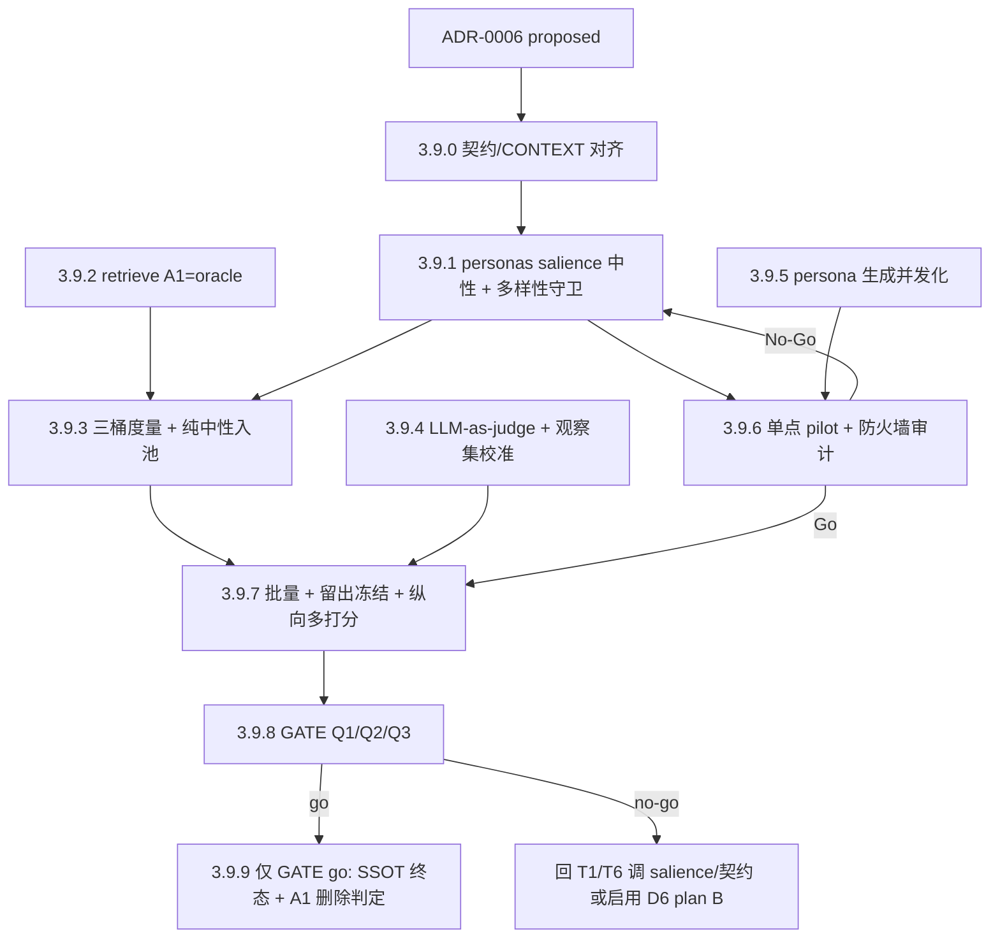

# Phase 3.9 · A1-oracle + per-persona salience 中性 + 三桶度量（干净重赌组合拳）

## 触发与定位

承接 [ADR-0006](../../docs/adr/0006-a1-as-held-out-oracle-per-persona-neutral-and-three-bucket-eval.md)（`Status: proposed`），它是 **Phase 3.8 `GATE no-go`（2026-06-06）复盘后的重设计**。3.8 硬数据（逐 run 重算，与 [GATE_RESULT](../../output/Eval/phase3.8/GATE_RESULT.md) 一致）：A1 命中桶 2 分率 **67%** > 中性涉及 **62%** > 纯情绪(toned-only) **35%**；中性 union 仅 26 唯一命中 vs A1 44；12 条中性 pseudo **逐字雷同** → top_k=2 下塌缩 **2 部/run**。

**复盘定性**：3.8 的 no-go **不是「组合拳赌输」，而是「实验没跑成」**——① 中性腿退化（执行缺陷：所有 persona 用同一组默认碎片 + 逐字照抄），② 诊断② 无对照组（`neutral_only_scored=0` 是结构性必然）。两个核心赌注（中性多样召回、组合拳>纯事实）**一个都没真正测到**。

**本 Phase 的赌注**：先把实验**修成可跑、可测**，再赌一次 `中性(事实联系) + toned(感受联系) = 表层 + 深层双重共振 > 纯事实`。手段：A1 从「待删竞争者」转为「不参与判断的 held-out 质量神谕」；per-persona salience 让中性腿站起来；三桶 + 纯中性入池让诊断② 有非空对照；LLM-judge + 留出冻结补统计力。证据先行：单点 pilot → 批量（A1 并跑）→ GATE 三问裁决。

**代码现状（实现前）：**

- **persona 生成**：`scripts/run_persona_batch.py` 虽为 `asyncio`，但 persona 是 `for ... await` **假串行**（并发=1），每 persona 2 次 LLM 调用。
- **中性通道**：`scripts/personas.py` 的 `build_objective_floor_neutral_pseudo` 对**固定默认碎片** `_default_neutral_fragments`（首 why + 前 3 how + 首 1 result，对每 persona 都一样）拼接逐字 `surface` + 客观 `hypernym`，且约 346–350 行**无条件追加所有 who/where**；`fragment_ids` 参数已存在但从未 per-persona 传。措辞客观性已由结构保证（无 LLM 书写 + lens 守卫）。
- **A1**：`retrieve-a1.json` 已并跑（held-out 雏形），但 superset/质量仅在 3.8.8 GATE 手算。
- **度量**：`scripts/summarize_eval.py` 中 `toned_convergence=distinct_agents>=1` 恒真 → `is_neutral_only` 恒空；high-hit review 只收「≥5 命中分且仅 toned 行计分」→ 纯中性候选进不了打分池。
- **A0 decon + `reality-expanded.json`**：本 Phase **不改**，复用 phase3.8 产物（只读）。

## Todo 依赖关系

`3.9.2` / `3.9.4` / `3.9.5` 相互独立，可与 `3.9.1` 并行推进。

## Scope

### In scope

- `prompts/_shared/persona_alt_creator_contract.md`：新增 `salience` 字段规格 +「salience 只驱动中性 SELECTION、绝不碰 wording」铁律。
- `scripts/personas.py`：per-persona salience 驱动 `fragment_ids`（取代默认碎片）；who/where 改可选；多样性守卫；`salience` subset/permutation 硬校验。
- `scripts/retrieve.py`：A1 仅并跑、不进候选/撞车/排序（held-out oracle）；保留 superset/质量对照输出。
- `scripts/summarize_eval.py` + `scripts/score_eval_candidates.py`：三桶（纯事实/纯情绪/组合）控相似度度量；纯中性候选入打分池；重定义 `toned_convergence`/`is_neutral_only`；A1-oracle 对照。
- 新 `scripts/`（LLM-as-judge 打分器）：规模化评分 + 观察集人工分校准/验证。
- `scripts/run_persona_batch.py`（或 phase3.9 runner）：persona 生成并发化（`Semaphore`/`gather`/原序重组/抖动/429 退避/`--concurrency`）；`--eval-phase 3.9`（复用 phase3.8 decon+expansion，写 phase3.9）。
- 评测编排：留出冻结纪律（obs 调参→冻结→holdout 一次性打分）+ 纵向多打分。
- `CONTEXT.md`：补术语（held-out oracle / per-persona salience / 三桶对照 / 留出冻结）。
- `tests/`：salience 解析/校验、who/where 可选、多样性守卫、A1 不污染候选、三桶+非空 neutral-only fixture、judge 校准、并发原序与退避。
- pilot + 批量 run + GATE_RESULT。

### Out of scope

- **第二匹配轴**（元素/alternatives ↔ 电影 metadata，ADR-0006 OPEN c）：延后。
- **P-Abstain 硬阈值**（OPEN e）：仍留出数据驱动，不硬编码。
- **删 A1**：仅 GATE go 且 Q1 满足后另议；本轮只衡量、不删。
- **扩 run 语料**：维持 3.8 的 10 run（obs 01–04 / holdout 05–10）；只纵向多打分。
- **A0/扩展 pass 改动**、**换嵌入模型**、**Phase 4 解封**。

## SSOT

| 文档 | 用途 |
| --- | --- |
| [docs/adr/0006-*.md](../../docs/adr/0006-a1-as-held-out-oracle-per-persona-neutral-and-three-bucket-eval.md) | 本 Phase 全部决策（D1 A1-oracle / D2·D6 salience 中性 / D3 情绪主轴 / D4 三桶度量 / D5 GATE 三问）；`proposed`，3.9.9 GATE go 后升 `accepted` |
| [docs/adr/0005-*.md](../../docs/adr/0005-objective-extraction-neutral-channel-and-collision-vote.md) | 管线四段 / 撞车形状 / hypernym 锚（本 Phase 保留）；其「删 A1」「中性=共享」被 ADR-0006 推翻 |
| [docs/adr/0003-*.md](../../docs/adr/0003-multi-agent-resonance-quality-and-a1-as-peer.md) | 撞车主判据形状（A1 改 oracle 角色） |
| [docs/SSOT/personas-12.md](../../docs/SSOT/personas-12.md) + 各 persona card | 价值轴（salience 软偏好回退方案 plan B 的来源） |
| [docs/eval-the-bet.md](../../docs/eval-the-bet.md) §4/§5.1 | 共振 rubric（judge 校准基准） |
| [output/Eval/phase3.8/GATE_RESULT.md](../../output/Eval/phase3.8/GATE_RESULT.md) | 3.8 结案数字（A1 67% / 中性 62% / 纯情绪 35% / 中性 union 26 vs A1 44 / superset 1/10） |

## 判据与闸门（本 Phase 定稿 · 实现须与 ADR-0006 一致）

| 代号 | 定稿 |
| --- | --- |
| **A1-Oracle（D1）** | A1 仅并跑，**不进候选/撞车/排序**；作召回+质量基准（用于 Q1）。本轮不删 |
| **Neutral-Salience（D2/D6）** | 每 persona 按 `salience` Top-K(4–5) 选**不同**碎片；中性措辞由模板从 `surface`+`hypernym` 拼装（架构中立）；who/where 可选；多样性守卫:仅中性+toned 均近重复才硬失败,仅中性撞车 ⇒ warning |
| **salience≠valence（D6 铁律）** | persona LLM 只发既有 `element_id` 有序列表，**绝不书写中性散文**；subset/permutation 硬校验；运行时 lens 守卫保留 |
| **三桶度量（D4）** | 纯事实 / 纯情绪 / 组合 三桶均可评，**纯中性候选入打分池**；`toned_convergence` 重定义使 neutral-only 非空 |
| **留出冻结（D4）** | 只在 obs 调 prompt/阈值 → 冻结 → holdout **只打一次分**；留出≈观察 ⇒ 提升为真 |
| **LLM-judge（D4）** | 规模化打分；**观察集人工分校准对齐后方采信**；人工只复核分歧 |
| **闸门 1** | 保留：≥60% run 至少 1 个 2 分候选（按 run 计） |
| **Q1（D5）** | per-persona 中性 union **召回 ⊇ A1 命中** 且 结构 2 分率 **≥ A1**（oracle 对照） |
| **Q2（D5）** | 组合桶 结构/双重 2 分率 **显著 > 纯事实桶**，**控 `max_similarity` 后仍成立**（真·诊断②） |
| **Q3（D5）** | 纯情绪桶低也不拖累；组合相对纯事实的增量来自「汇聚」而非「漂移」 |

---

## Todo 3.9.0 · 契约/CONTEXT 对齐 ADR-0006 [需人工验收]

**依赖：** ADR-0006（proposed）

- `prompts/_shared/persona_alt_creator_contract.md`：新增 `salience` 字段规格——本 persona 价值轴关注的**既有 `element_id` 有序列表（最→次）**；**只重排/取子集既有 ids、不新增词、不写散文/评注**；明确「salience 只驱动中性碎片 SELECTION，绝不影响 wording」。
- `CONTEXT.md`：补术语（held-out oracle / per-persona salience / 三桶对照 / 留出冻结）。
- 确认 persona card 价值轴可作 D6 子决策① 回退（plan B 软偏好）的来源。

### 验收

- [x] 契约含 `salience` 字段规格与「选材≠措辞」铁律，与 ADR-0006 D6 逐条一致
- [x] CONTEXT 术语补齐
- [x] `[需人工验收]`：用户 approve 契约口径 → 可进 3.9.1

---

## Todo 3.9.1 · personas.py per-persona salience 中性选材 + 单测

**依赖：** 3.9.0 approve

- `scripts/personas.py`：解析 alt-pool 的 `salience` → 取 Top-K(4–5) 作 `fragment_ids` 传 `build_objective_floor_neutral_pseudo`，**取代 `_default_neutral_fragments` 的固定默认用法**。
- who/where 改为**可选 salience 候选**：收口约 346–350 行「无条件追加所有 `who-`/`where-`」逻辑，全部 who/where 仍留可选池，由 salience 选取决定是否纳入。
- 新增**多样性守卫**：批内两两检查中性 pseudo 近重复;**硬失败**仅当中性与 toned **均**近重复;仅中性撞车而 toned 各异 ⇒ warning 并继续。中性 body 按 surface 文本去重(避免 why/how 同句重复)。
- `salience` **subset/permutation 硬校验**：非法 id 或新增词即拒。
- `tests/test_personas.py`：salience 正/负例解析、Top-K 选材、who/where 可选、多样性守卫触发、subset/permutation 校验。

### 验收

- [x] `python -m unittest tests.test_personas -v` 通过
- [x] 同一新闻下 12 条中性 pseudo **非逐字雷同**（多样性守卫通过）
- [x] 中性 pseudo 仍仅含 surface+hypernym（lens 守卫不触发）；who/where 由 salience 决定纳入

---

## Todo 3.9.2 · retrieve.py A1 → held-out oracle + 单测

**依赖：** ADR-0006（可与 3.9.1 并行）

- `scripts/retrieve.py`：A1 命中**不进 `candidates`、不进撞车票、不进排序**；A1 仅并跑产出独立命中集供 oracle 对照。
- 保留/规整 superset + 质量对照输出（供 3.9.3 / Q1 使用）。
- `tests/`：断言含 A1 的输入下，候选/撞车/排序**不被 A1 污染**；A1 命中集仍可取。

### 验收

- [x] `python -m unittest`（retrieve 相关）通过
- [x] A1 不出现在 `candidates`/`triggered_by`/撞车计票
- [x] A1 命中集可供 oracle 对照读取

---

## Todo 3.9.3 · 三桶度量 + 纯中性入打分池 + 单测

**依赖：** 3.9.1 + 3.9.2

- `scripts/summarize_eval.py`：**重定义** `toned_convergence` / `is_neutral_only`，使 neutral-only 桶非空；产**三桶（纯事实/纯情绪/组合）** 控 `max_similarity` 的 2 分率/双重率；A1 作 **oracle 对照**（Q1 口径，非 deletion 闸）。
- `scripts/score_eval_candidates.py`：取消「≥5 命中分且仅 toned 行计分」过滤，**纯中性候选入打分池**。
- `tests/test_summarize_eval.py`：含**非空 neutral-only** 对照 fixture；三桶口径；A1-oracle 对照口径。

### 验收

- [x] `python -m unittest tests.test_summarize_eval -v` 通过
- [x] 三桶均可产出、`neutral_only_scored > 0` 可达（对照组非空）
- [x] 报告含 Q1（A1-oracle）/ Q2（三桶控相似度）口径位

---

## Todo 3.9.4 · LLM-as-judge 打分器 + 观察集校准 + 单测

**依赖：** 3.9.3（打分口径）；可与 3.9.5 并行

- 新增 `scripts/`（judge）：按共振 rubric（`docs/eval-the-bet.md`）对候选打 0/1/2 + 共振类型。
- **校准**：以观察集人工分作校准/验证集，报对齐度（一致率/相关）；**未达对齐阈值则其分不采信**（仅作初筛、人工复核）。
- `tests/`：judge 输出 schema、校准对齐度计算、未达阈值时的降级行为。

### 验收

- [x] `python -m unittest`（judge 相关）通过
- [x] judge 在观察集上报对齐度，低于阈值则标「不采信」
- [x] judge 分与人工分可并存、可标注分歧供复核

---

## Todo 3.9.5 · run_persona_batch 并发化 + 单测

**依赖：** 无（独立，建议早做以加速 pilot/批量）

- `scripts/run_persona_batch.py`：把假串行 `for ... await` 改 **`Semaphore(N=3)` + `gather`**；按 `persona_ids` **原序重组** `agents`（保证 retrieve.json 稳定可复现）。
- 启动**抖动** `sleep 5–15s`（错开到达）；LLM 调用 **429/超时指数退避重试**；新增 `--concurrency` 参数；**run 间维持串行**。
- 新增 `--eval-phase 3.9`：复用 phase3.8 decon+expansion（只读），写 `output/Eval/phase3.9/{run_id}/`。
- `tests/`：并发后 `agents` 顺序稳定；单 persona 失败被隔离不拖垮其他；退避重试路径覆盖。

### 验收

- [x] `python -m unittest`（batch 相关）通过
- [x] 并发=3 下输出顺序与串行一致（原序重组生效）
- [x] 小样实测不触发 429（或触发后退避恢复）

---

## Todo 3.9.6 · 单点 pilot + 防火墙审计 [需人工验收 · Go/No-Go]

**依赖：** 3.9.1 + 3.9.5（+ 3.9.3 口径）

### 执行

- 选 1 条新闻全链（复用 phase3.8 decon+expansion → 12 persona salience 中性+toned → retrieve 新口径），写 `output/Eval/phase3.9/{run_id}/`。
- 人工核：① salience 选材确按 persona 镜头各异；② **专审 salience≠valence 边界**（中性无情绪泄漏）；③ 12 条中性**非雷同**（多样性守卫生效）；④ toned 仍带 hypernym 锚、留题面；⑤ A1 未污染候选。

### 验收

- [ ] 端到端产出位于 `output/Eval/phase3.9/{run_id}/`；3.6/3.7/3.8 未改写
- [ ] 多样性守卫通过；中性无 lens 泄漏
- [ ] `[需人工验收 · Go/No-Go]`：用户 approve → 进 3.9.7；若反复泄漏/退化 → No-Go 回 3.9.1 或启用 **D6 plan B**（A1 式 2–3 条多视角共享中性）

---

## Todo 3.9.7 · 批量 run（A1 oracle 并跑）+ 留出冻结 + 纵向多打分 [需人工验收]

**依赖：** 3.9.6 Go（+ 3.9.4 judge 就绪）

- 批量全集（obs 01–04 / holdout 05–10）× 12 persona（salience 中性 + toned），**A1 oracle 并跑**。
- **留出冻结纪律**：只在 obs 上调 prompt/阈值 → 冻结 → holdout **只打一次分**。
- **纵向多打分**：人工 + judge，每条新闻多候选（补 per-candidate 统计力）；judge 仅在校准达标后采信。
- `score_eval_candidates` → review 文件（`output/Eval/phase3.9/high-hit-score-review.md`，含三桶+纯中性）。

### 验收

- [ ] 产出位于 `output/Eval/phase3.9/{run_id}/`；3.6/3.7/3.8 未改写
- [ ] A1 oracle 并跑数据齐（供 Q1）；三桶+纯中性已打分（人工+judge）
- [ ] 留出冻结纪律执行记录在案 → 数据可进 3.9.8

---

## Todo 3.9.8 · GATE：Q1/Q2/Q3 → GATE_RESULT [GATE · 需人工验收]

**依赖：** 3.9.7

- 写 `output/Eval/phase3.9/GATE_RESULT.md`：
  1. **Q1** 中性 union 召回是否 ⊇ A1 命中、结构 2 分率是否 ≥ A1（oracle 对照）；
  2. **Q2** 组合桶结构/双重 2 分率是否显著 > 纯事实桶，**控相似度后**（真·诊断②，对照组非空）；
  3. **Q3** 纯情绪是否不拖累、组合增量是否来自汇聚而非漂移；
  4. **闸门 1** 结论；obs vs holdout 是否一致（过拟合检验）。
- 产品裁决（D5）：Q1&Q2 双成立 ⇒ 组合拳成立；仅 Q1 ⇒ 中性召回+撞车置信、persona 降级。

### 验收

- [ ] GATE_RESULT 给出 Q1/Q2/Q3 + 闸门 1 + obs/holdout 一致性与 **GATE go/no-go**
- [ ] `[需人工验收]`：用户确认 GATE 结论

---

## Todo 3.9.9 · (仅 GATE go) SSOT 终态 + A1 删除判定

**依赖：** 3.9.8 **GATE go**（no-go → 跳过，回 T1/T6）

- ADR-0006 `Status` → `accepted`。
- `PRD` / `CONTEXT.md` 升口径（A1-oracle、per-persona salience 中性、三桶度量、留出冻结、LLM-judge）。
- **A1 删除判定**：**仅当 Q1 满足**（中性 union ⊇ A1 召回 且 质量 ≥ A1）才移除 A1 并跑脚手架；否则 A1 保留再议。

### 验收

- [ ] PRD/CONTEXT/contract 与代码、summarize 输出一致 —（GATE no-go 则 skipped）
- [ ] ADR-0006 升 accepted —（GATE no-go 则保持 proposed）
- [ ] A1 删除仅在 Q1 满足后执行且回归测试通过；否则保留

---

## Phase 3.9 整体验收

- [x] 3.9.0 契约/CONTEXT 对齐 approve
- [ ] 3.9.1–3.9.5 各单测通过：salience 中性多样化落地、A1=oracle、三桶+纯中性入池、judge 校准、并发化
- [ ] 3.9.6 单点 pilot Combined Go（salience≠valence 无泄漏 + 多样性守卫生效）
- [ ] 3.9.7 批量 + A1 oracle 并跑 + 留出冻结 + 纵向多打分（人工+judge）
- [ ] 3.9.8 书面 GATE（Q1/Q2/Q3 + 闸门 1 + obs/holdout 一致性）→ go/no-go
- [ ] 3.9.9 仅 GATE go：SSOT 终态 + A1 删除判定

## 交给下一 Phase

| 条件 | 下一动作 |
| --- | --- |
| **GATE go · Q1&Q2 双成立** | 组合拳成立；考虑删 A1（Q1 满足）、第二匹配轴（OPEN c）、P-Abstain（OPEN e）；推进 Phase 4（仍需单独解封） |
| **GATE go · 仅 Q1 成立** | 中性腿站起但情绪未净加分；产品收敛为「中性召回 + 撞车置信排序」，persona 降级为解读/重排层 |
| **GATE no-go** | 回 3.9.1/3.9.6 调 salience/契约，或启用 **D6 plan B**（A1 式 2–3 条多视角共享中性）；不升 SSOT、不删 A1 |

## 风险与约束

- **route (a) salience/valence 泄漏**（主要失败模式）：靠 D6 三层架构守卫（只发 id / 只取 surface+hypernym / lens 运行时守卫）+ pilot 专审；反复泄漏 → 启用 plan B。
- **多样性退化**：salience 若各 persona 仍趋同则中性又雷同；多样性守卫为硬闸，退化即重生成；必要时检查 decon 是否有足够 why/how/result 碎片供区分。
- **A1 并跑成本保留**：A1 不删 ⇒ 每 run 仍并跑 retrieve-a1。
- **judge 不可盲信**：未经观察集校准对齐前其分不采信；judge 仅初筛、人工复核分歧。
- **留出冻结须真执行**：obs 调参后必须冻结再打 holdout，否则 GATE 数字过拟合、失去意义。
- **小样**：维持 10 run；靠纵向多打分增 per-candidate 样本；结论按 per-candidate 对照。
- **并发限流**：并发=3 + 抖动为保守起点，须先小样实测；配 429 退避。
- 受「人工验收阻断」约束：**3.9.0 / 3.9.6 / 3.9.7 / 3.9.8** 标 `[需人工验收]`，approve 前不标 complete、不写 report、不合并；**3.9.9** 仅 GATE go 后启动。
