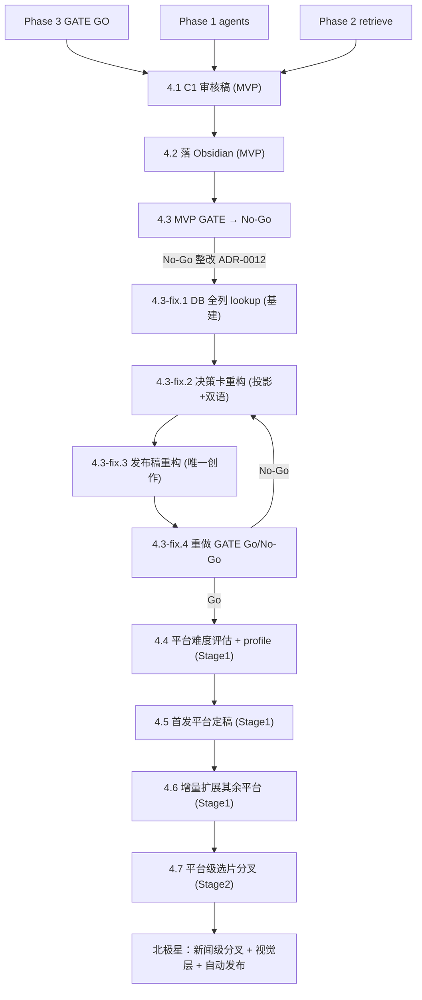

# Phase 4 · Copywriter（分层渐进 · 审核稿 MVP → 平台定稿 → 平台选片分叉）

## 前置：Phase 3 闸门（已通过）

Phase 3 全部 GATE GO（3.10 / 3.11.8，见 PRD §8.3）。架构链路已收敛，本 Phase 解封。

**重写说明（2026-06）**：本 plan 经多次改写。① 原稿停在「3 agent / 4 pseudo / toned-neutral-focalized 三通道」旧设计，已按 **fragment ladder + search unit + 12 persona**（[ADR-0009](../../docs/adr/0009-fragment-ladder-and-search-unit-architecture.md) / [ADR-0010](../../docs/adr/0010-pseudo-drop-granularity-and-pipeline-first-derisking.md)）改写 candidate 契约。② 总编（2026-06-14）确立**平台化北极星**与**渐进路径**。③ 总编同日**收窄 MVP**：MVP 只产出中文审核稿文本并落 Obsidian 供审核，平台定稿（含中英双语 / 多平台）整体后移到「文本确认 OK 之后」，且从最简单平台起步、增量推进。本稿据此定稿。

## 北极星与渐进路径（总编 2026-06-14 拍板）

**北极星（终态愿景，非本 Phase 实现）**：平台是一等公民，fan-out 提前到**新闻级**——每平台可能跑不同新闻、推不同电影、配不同图片，最终自动发布。

**路径纪律**：**先 MVP，通过后再一点点丰富**。MVP 边界极窄——只验证「**审核稿文本读起来对不对**」，不碰平台、不碰中英双语、不碰图片。文本质量过关后，平台定稿**从最简单的平台起步、一个一个加**，不一次性铺三平台。

| Stage                    | 做到哪                                          | 产物落点                | 解封条件             |
| ------------------------ | ----------------------------------------------- | ----------------------- | -------------------- |
| **0 · MVP（审核稿）**    | retrieve 候选 → C1 中文审核稿                   | 落 Obsidian，总编肉眼审 | Phase 3 GO（已满足） |
| **1 · 平台定稿（增量）** | 选定审核稿 → 平台定稿，从最简单平台起，逐个扩展 | 可复制粘贴成品          | 4.3 MVP GATE Go      |
| **2 · 平台选片分叉**     | 同一条新闻下每平台可选不同电影                  | 各平台各自的片+稿       | Stage 1 跑通 ≥1 平台 |
| **北极星**               | 新闻级全分叉 + 视觉生成层 + 自动发布            | ——                      | 转后续独立 Phase     |

> **平台优先级（倾向，4.4 评估后定稿）**：discord（无注册/审核门槛、结构最简，最易实现）→ 小红书（中文 + hashtag 关联新闻）→ X（英文 + 引用新闻原帖转贴）。先打通一个，再加下一个。
> **图片**：独立成**视觉生成层 Phase**（先定义「与主项目 og 图共用的一套设计逻辑」——当前 og 是随意设计，需先被定义）。本 Phase 完全不碰图片，平台 profile 仅**预留字段位**。
> **自动发布**：北极星才做（discord 因无门槛适合当首个自动发布试点）；本 Phase 全程**手动发布**。

## 债务口径（总编 2026-06-14 拍板）

| 项                                 | 决策                                                                                                                           | 对本 Phase 的影响              |
| ---------------------------------- | ------------------------------------------------------------------------------------------------------------------------------ | ------------------------------ |
| **债1 · 5 部 baseline 强共振落出** | **不做 retention 调优**。5 部里 4 部是可接受常规损失、1 部（A Ticket to Space, judge=0）本就该挤掉                             | 无 todo；仅 PRD 记一句已知事实 |
| **债2 · judge 人工校准**           | 当前分布下**不补校准**（judge 为 screening-only + 有 GATE 抽审背书）；**重对齐挪到 Phase 5**（RSS 新分布上线后做）             | 本 Phase 不处理；Phase 5 承接  |
| **OPEN a · 文案视角聚焦**          | **软方案**：不做硬性视角聚焦；把 `center_dimensions` / `POV变换` 标签作为**可选提示**透传给 C1，LLM 可参考可不用，总编人工定夺 | 落在 **4.1**                   |

## Todo 依赖关系



> **Stage 边界即解封 gate**：`4.3` 判 No-Go，进入 **4.3-fix 整改循环**（ADR-0012）；整改后由 `4.3-fix.4` 重做 GATE，**未 Go 一律不启动 Stage 1**。这是「先验证文本、再谈平台」纪律的硬约束点。

## Scope

### In scope（本 Phase 全部 Stage）

- 新建 `scripts/copywriter.py`（README 已引用，仓库中尚无此脚本）
- **C1** `prompts/C1_copywriter_review.md`（**已存在**，按新 candidate 字段微调变量说明）：`--stage review`
- **MVP 产物**：审核稿 JSON + Obsidian 可读 Markdown 候选块
- MiMo（`scripts/lib/llm`）；失败记 `errors`，不阻断
- OPEN a 软提示：视角标签作为 C1 可选元数据透传
- **Stage 1**：`--stage publish`（C2，`prompts/C2_copywriter_multiplatform.md` 已存在）+ 平台 profile 抽象（**增量**，从最简单平台起）+ 图片字段**占位**

### Out of scope

- **MVP 内的任何平台定稿 / 中英双语**（后移到 Stage 1，4.3 Go 后才做）
- 自动发布社媒（**北极星**；discord 为首个自动发布试点，但不在本 Phase）
- **图片生成**（独立视觉生成层 Phase；本 Phase 仅预留字段位）
- **新闻级 fan-out**（每平台跑不同新闻 = 北极星，转后续 Phase）
- Instagram / Threads / 日韩语（Post-MVP）
- `run_eval` / 闸门评分；`fetch_news` / `main` 全链路（Phase 6）
- **判 judge 真值 / 人工校准**（债2，Phase 5）；**baseline retention 调优**（债1，不做）
- **硬性视角聚焦改造**（OPEN a 取软方案）

## SSOT

| 文档                                                                            | 用途                                                                                           |
| ------------------------------------------------------------------------------- | ---------------------------------------------------------------------------------------------- |
| PRD §5.3、§7.2、§7.3、§7.4                                                      | C1/C2 职责、简报栏位、文案定稿口径、视觉/发布的 Post-MVP 边界                                  |
| [ADR-0009](../../docs/adr/0009-fragment-ladder-and-search-unit-architecture.md) | search unit / candidate 字段来源（`search_unit_kinds` / `center_dimensions` / `triggered_by`） |
| [docs/SSOT/personas-12.md](../../docs/SSOT/personas-12.md)                      | 12 persona roster（candidate `triggered_by` 用 persona_id）                                    |
| `prompts/C1_*.md`、`C2_*.md`                                                    | 模板变量；**均为初稿**，Phase 4 跑出产物后按效果迭代，措辞调整与代码 PR 分开                   |
| `scripts/retrieve.py`                                                           | candidates[] / a1_oracle 输出契约                                                              |

## retrieve 候选契约（本 Phase 实际消费的数据形状 · 已对齐 3.11 真实产物）

> **数据源（2026-06-14 定）**：Phase 4 **直接复用 Phase 3.11 全批产出，不重新找新闻、不重跑链路**。产物根：`output/Eval/phase3.11/full-batch-20260613-3117/`，10 条新闻每条一个目录（`01-grid-outage` … `10-whistleblower-leak`），各含 `retrieve.json` + `reality*.json`。judge 分数在批次根的 `llm-judge-scores-thinking-enabled.json`。

`retrieve.json` 顶层键：`per_agent` / `candidates` / `human_candidates` / `audit_pool` / `funnel` / `a1_oracle` / `oracle_comparison` / `divergence` / `meta`。

**C1 只消费 `candidates[]`（= `human_candidates`，已过漏斗+预算）。** 每条 candidate 的**真实字段**（已核对，与早期 plan 假设有出入）：

```text
tmdb_id / title / overview / genres / release_year / language / poster_path
movie_url            # https://themoviecosmos.com/movie/{tmdb_id}
similarity
triggered_by[]       # persona_id 列表（如 THE-INNOCENT），即「哪些视角召回了它」 ✓顶层
quality_candidate / quality_reason          # 观察字段，非硬闸
convergence_channels / convergence_channel_count / convergence_persona_count
convergent_score                            # 漏斗汇聚排序分
match_diagnostics{}  # 嵌套对象，OPEN a 软提示来源都在这里：
  ├ surface_match / event_match / persona_semantic_match  (bool)
  ├ search_unit_kinds[]   # surface-fragment-bundle / event-fragment-bundle / persona-semantic
  └ center_dimensions[]   # who / where / when / why / how / result
```

**字段位置修正（关键，实现时照此读）：**
- `search_unit_kinds` / `center_dimensions` **不在 candidate 顶层**，嵌在 `candidate["match_diagnostics"]` 内。
- **`judge_score` 不在 `retrieve.json`**：在批次根 `llm-judge-scores-thinking-enabled.json` 的 `scores` 里，C1 组装时按 `tmdb_id`（+ 新闻 id）关联回填；缺失则视为空（screening-only，可空）。
- 其余 `tmdb_id / title / overview / triggered_by / movie_url` 等照旧在顶层。

**A1 不在 candidates。** A1 是 `a1_oracle`（held-out oracle，仅作评测对照），C1/C2 一律不渲染、不写文案。

---

# Stage 0 · MVP（审核稿落 Obsidian）

> 目标：只验证「**审核稿文本读起来对不对**」。retrieve 候选 → C1 写中文审核稿 → 落 Obsidian 供总编肉眼审核。**不碰平台、不碰中英双语、不碰图片、不碰定稿。**

## Todo 4.1 · [MVP] C1 `--stage review`

**依赖：** Phase 1、2

### CLI

```text
python scripts/copywriter.py --stage review --retrieve-json output/phase2_retrieve.json --agents-json output/phase1_agents.json
python scripts/copywriter.py --stage review --retrieve-json ... --out output/copy_review.json
```

### 输入组装

- `{{news_context}}`：新闻 `title` + `description`；可附 1 段代表性 **persona-semantic** search unit 文本（取 `per_agent` 中相似度最高的一条 persona-semantic；**不取 A1/oracle**）
- `{{candidates}}`：对 `candidates[]` 每条格式化为：
  - title / year / overview（可截断）
  - `triggered_by`（persona_id 列表 → 自然语言「被 X 视角击中」）
  - **OPEN a 软提示**：`center_dimensions` + `POV变换`（若有）作为一行可选元数据，措辞写明"可参考、非强制"
  - `movie_url`

### 输出

- 解析 C1 返回的**多段纯文本**（段首 `《片名》(年份)`），映射回 `tmdb_id`
- JSON 形状：

```json
{
  "review_copies": [
    {
      "tmdb_id": 157336,
      "title": "...",
      "year": 2014,
      "triggered_by": ["THE-INNOCENT", "THE-HERO"],
      "center_dimensions": ["who", "result"],
      "text_zh": "《...》(...)\n..."
    }
  ],
  "errors": []
}
```

### 验收

- [x] 候选 N 部 → `review_copies` 长度 N（允许单路 LLM 失败有 errors）
- [x] 中文、无 hashtag、无明显剧透腔
- [x] A1/oracle 候选**不出现**在 review_copies
- [x] 视角标签作为软提示透传，文案不被强制聚焦（OPEN a）

---

## Todo 4.2 · [MVP] 审核稿落 Obsidian

**依赖：** **4.1**

### 交付

- `copywriter.py` 统一 `--help`；`--provider` 透传；失败记 `errors` 不阻断
- 在 JSON 之外产出 **Obsidian 可读的 Markdown 候选块**（总编在 Obsidian 里肉眼审核 / 勾选），每候选一块：
  - `### 《片名》(年份)`
  - `- 触发视角: THE-INNOCENT, THE-HERO`
  - `- 切面（可选参考）: who, result`
  - `- 中文文案（审核稿，C1）: ...`
  - `- 链接: https://themoviecosmos.com/movie/{tmdb_id}`
  - `- [ ] ✅ 选用`（总编手动勾，**不自动**）
- README「MVP 执行顺序」补 C1 审核稿生成命令与示例路径

### 端到端验收

```powershell
python scripts/agents.py --news-file tests/sample_news.json --out output/phase1_agents.json
python scripts/retrieve.py --agents-json output/phase1_agents.json --out output/phase2_retrieve.json
python scripts/copywriter.py --stage review --retrieve-json output/phase2_retrieve.json --agents-json output/phase1_agents.json --out output/copy_review.json
# 产物含 JSON + Obsidian 可读 Markdown 候选块
```

### 验收

- [x] 候选 N 部 → Markdown 候选块 N 块，可直接在 Obsidian 阅读
- [x] 每块含片名/触发视角/审核稿文本/链接/勾选位
- [x] A1/oracle 候选**不出现**

---

## Todo 4.3 · [MVP GATE] 真实新闻审核稿验证 [需人工验收 · Go/No-Go]

> **【结论：No-Go · 2026-06】**
>
> 总编判定 4.3 **No-Go**：当前审核稿产出的**格式与内容不达标**——根因是 `compose --stage review` 把「面向总编的决策材料」与「面向读者的内容初稿」焊在同一 prompt（双受众），叠加「内核数据流回溯」「为 N 部候选写读者文案最终只用 1 部」三重结构问题。详见 [ADR-0012](../../docs/adr/0012-compose-responsibility-split-and-db-fullcolumn-lookup.md)。
>
> - No-Go 不回退已合并代码（4.1/4.2 实现仍在 `main`，PR #74）；整改在 **4.3-fix 循环**内进行，仍属 Phase 4，不违反顺序执行。
> - 整改完成后由 **4.3-fix.4** 重做本 GATE 的 Go/No-Go。
> - **整改期间不推进 Stage 1**（4.4 及之后一律不启动），直到 4.3-fix.4 Go。
> - **回归基准位置**：`docs/temp/golden/`（干净 main 基线 commit `d474943` 上的 `review` golden 快照）。整改后用同一输入重跑，按 README 比对口径校验回归。

**依赖：** **4.2**

- （原始 GATE 已执行并得出 No-Go 结论，下列为当时的验收口径，保留备查。）
- 用**一条真实新闻**跑通 `agents → retrieve → C1`，把审核稿候选块落到 Obsidian。
- 总编在 Obsidian 肉眼审：审核稿文本**读起来对不对**。

### 验收

- [x] 全链无致命错误，审核稿候选块在 Obsidian 可读
- [ ] ~~总编确认审核稿文本质量 OK~~ → **No-Go**：格式/内容不达标，转 4.3-fix 整改
- [x] `[需人工验收 · Go/No-Go]`：**No-Go** → 进入 4.3-fix 整改循环（按 ADR-0012），整改后由 4.3-fix.4 重做 GATE

---

# Stage 0.5 · 4.3 No-Go 整改循环（ADR-0012 · 先于 Stage 1）

> 目标：按 [ADR-0012](../../docs/adr/0012-compose-responsibility-split-and-db-fullcolumn-lookup.md) 把 `compose` 的职责按「投影 vs 创作」重切，并打通 DB 全列 lookup，再重做 4.3 GATE。**本循环全程不启动 Stage 1。**

## Todo 4.3-fix.1 · [基建·前置] DB 数据回填（by-id 全列 lookup）

**依赖：** 4.3 No-Go 结论

- 区分两条通路（ADR-0012 D3）：
  - **通路 A**：`meta.parquet` 保持检索精简（`META_COLUMNS` 维持现状或仅按需微调展示列），不进多余列。
  - **通路 B**（新增）：按 `tmdb_id` 点查的全列明细 lookup —— `cleaned.csv` 全 28 列经此可得，不进检索热路径。
- 给下游（决策卡 / 发布稿）一个稳定的「按 tmdb_id 取字段」接口。
- **不在本 TODO 决定**决策卡/发布稿具体用哪些列（那是下游 prompt 设计，解耦）。

### 验收

- [ ] 任取一个 `tmdb_id` 能拿到全部 28 列
- [ ] 检索路径（retrieve）无 regression（对 `docs/temp/golden/` 重跑比对）
- [ ] 通路 A 元数据未被无谓撑大

## Todo 4.3-fix.2 · [整改] 选片决策卡重构（投影 + 极轻双语翻译）

**依赖：** 4.3-fix.1

- 决策卡**不创作**：移除标题 / 读者文案 / Hashtag（全部转入发布稿）。
- 字段 = judge 投影（`judge_score` / `resonance_type` / `causal_test` / `rationale`）+ DB 投影（overview/title/year…经通路 B）+ 新闻原文链接。
- 翻译（ADR-0012 D2）：`causal_test` / `rationale` **原文 EN + 译文 ZH 成对并列**，逐句忠实、禁止润色加工。

### 验收

- [ ] 决策卡不含任何读者级创作内容（标题/文案/Hashtag）
- [ ] judge 内核字段齐全；causal_test/rationale 双语并列
- [ ] 翻译为忠实直译，可对照原文兜底

## Todo 4.3-fix.3 · [整改] 发布稿重构（唯一创作环节）

**依赖：** 4.3-fix.2

- 发布稿是**唯一创作环节**，只对**选定的 1 部**精写。
- 主体 = 电影介绍（热度 vs 质量，由通路 B 的真实评分/热度数字支撑，而非 LLM 臆测）+ 共振钩子（消费 judge 的 `resonance_type` / `causal_test`）。
- 输入 = 选定片 + DB 全列（通路 B）+ judge 内核 + 新闻语境；**暂不分平台**。
- `director` 等字段**可选透传**（有则用、无则省略该句），不被回填进度阻塞。

### 验收

- [ ] 发布稿以「电影介绍（热度 vs 质量）」为主体，数字有 DB 来源
- [ ] 共振钩子来自 judge 内核，不重新逆向考古
- [ ] 单平台产出；无平台变体；director 可选透传不报错

## Todo 4.3-fix.4 · [MVP GATE · 重做] 整改后重做 Go/No-Go [需人工验收]

**依赖：** 4.3-fix.1 / 4.3-fix.2 / 4.3-fix.3

- 用一条真实新闻重跑 `retrieve → 决策卡 → 发布稿`，落 Obsidian。
- 总编确认**产出格式与内容**达标（决策卡可判断、发布稿可发布）。

### 验收

- [ ] 全链无致命错误，决策卡 + 发布稿在 Obsidian 可读
- [ ] 总编确认格式/内容 OK
- [ ] `[需人工验收 · Go/No-Go]`：Go → 解封 Stage 1（4.4）；No-Go → 回 4.3-fix.2/4.3-fix.3 继续整改

---

# Stage 1 · 平台定稿（增量 · 4.3 Go 后解封）

> 目标：把确认 OK 的审核稿改写成平台发布版本。**从最简单平台起步，一个一个加**，不一次性铺三平台。同新闻、同选定片。

## Todo 4.4 · [Stage1] 平台难度评估 + profile 抽象 + 选首发平台

**依赖：** **4.3 Go**

- 评估三平台的实现难度与依赖，确定**首发平台**（倾向 discord——无注册/审核门槛、结构最简）。
- 定义 platform profile 数据结构（落配置常量或 `prompts/_shared/platform_profiles.*`），先把首发平台填满，其余平台留骨架：

| profile     | 语言              | 长度上限    | 结构约定                    | hashtag | 转贴                           | 图片字段                 | 难度             |
| ----------- | ----------------- | ----------- | --------------------------- | ------- | ------------------------------ | ------------------------ | ---------------- |
| **discord** | 中/英（先定一种） | 宽松        | 最简纯文本 + 链接           | 无      | 无                             | 占位 `image_ref`（暂空） | 最低（首发倾向） |
| **小红书**  | 中文              | ≤140 字正文 | 正文 + hashtag 关联新闻话题 | 1–3 个  | 无                             | 占位 `image_ref`（暂空） | 中               |
| **X**       | English           | ≤280 字符   | 引用新闻原帖（quote）+ 短评 | 0–2     | **quote 新闻原帖**（需源 URL） | 占位 `image_ref`（暂空） | 高（依赖源 URL） |

- **图片字段只占位不生成**：`image_ref` 预留，关联未来视觉生成层。
- **X 转贴依赖**：profile 需要「新闻原帖 URL」入参——确认 Phase 5 `fetch_news` 的新闻字段是否含可引用的源链接；缺失则记为上游待补，X 顺位后置。
- 文档：在 PRD §7.3 / §7.4 或新建 `docs/SSOT/platform-profiles.md` 登记 profile 口径 + 平台优先级。

### 验收

- [ ] 首发平台确定，理由（难度/依赖）在案
- [ ] profile 数据结构落地（首发平台填满，其余留骨架）
- [ ] X 的新闻原帖 URL 来源已确认（有则接，无则记上游待补）

---

## Todo 4.5 · [Stage1] 首发平台定稿 `--stage publish`

**依赖：** **4.4**

### CLI

```text
python scripts/copywriter.py --stage publish --platform discord --tmdb-id 157336 --selected-file path/to_selected.txt
python scripts/copywriter.py --stage publish --platform discord ... --out output/Daily_Briefing/2026-05-29_copy.md
```

### 输入 / 输出

- 输入：`{{selected_copy}}`（总编在 Obsidian 勾选的审核稿）+ `{{movie_title}}` / `{{year}}` / `{{tmdb_id}}` + 首发平台 profile + `{{news_context}}`
- 输出：首发平台的可复制粘贴成品，含 `https://themoviecosmos.com/movie/{tmdb_id}`；`image_ref` 占位字段透传（空）

### 验收

- [ ] 首发平台产出可直接复制粘贴的成品，结构符合该 profile
- [ ] 含跳转链接；`image_ref` 占位在场
- [ ] 总编确认该平台成品质量

---

## Todo 4.6 · [Stage1] 增量扩展其余平台

**依赖：** **4.5**

- 在首发平台跑通后，**逐个**加入其余平台（按 4.4 优先级，倾向 小红书 → X）：
  - **小红书**：中文正文 + hashtag 关联新闻话题。
  - **X**：英文短评 + 引用新闻原帖（quote 结构，附源 URL；源 URL 缺失则此平台阻塞，记上游待补）。
- 每加一个平台单独验收，不要求一次性三平台齐活。

### 验收

- [ ] 每新增平台产出符合其 profile 的成品，单独通过验收
- [ ] 小红书带新闻关联 hashtag；X 含新闻原帖引用结构（或明确标注因源 URL 缺失而阻塞）
- [ ] 各平台成品均含跳转链接

---

# Stage 2 · 平台级选片分叉（Stage 1 跑通 ≥1 平台后解封）

## Todo 4.7 · [Stage2] 同新闻下每平台可选不同电影 [需人工验收]

**依赖：** **4.6**

- fan-out 点从「定稿」提前到「**选片环节**」：同一条新闻的候选池，允许每平台挑/分到**不同电影**（人工按平台偏好挑，或规则按 `triggered_by` / `center_dimensions` 的平台亲和度初筛）。
- copywriter 接受「平台 → tmdb_id」映射，按平台各自的选定片走 publish。
- 这是迈向北极星（新闻级分叉）前的中间形态：新闻仍单条，电影开始按平台分叉。

### 验收

- [ ] 同一条新闻可对不同平台指定不同电影并各自产稿
- [ ] 平台亲和度初筛（若做）逻辑有据可查，不引入新的事实漂移
- [ ] `[需人工验收]`：总编确认分叉后的多平台产物质量

---

## Phase 4 整体验收

- [ ] **Stage 0**：C1 审核稿命令可运行，候选块落 Obsidian，4.3 GATE Go
- [ ] **Stage 1**：≥1 平台定稿跑通并验收；其余平台按优先级增量推进
- [ ] **Stage 2**：同新闻下平台级选片分叉可用
- [ ] 与 PRD §7.2 / §7.3 / §7.4 栏位语义一致
- [ ] candidate 新字段（triggered_by / center_dimensions）正确流转

## 交给后续 Phase

| 产出 / 条件                          | 用途 / 下一动作                                                                   |
| ------------------------------------ | --------------------------------------------------------------------------------- |
| `copy_review.json` + Obsidian 候选块 | `main.py` 渲染候选中文文案 + 触发视角                                             |
| 平台定稿 `*_copy.md`                 | 总编复制发布；发布仍全手动                                                        |
| platform profile 抽象                | 视觉生成层 Phase 据此填 `image_ref`；自动发布 Phase 据 discord profile 做首个试点 |
| **北极星：新闻级 fan-out**           | 每平台跑不同新闻 → 需上游 retrieve/选新闻分叉，开新 Phase 另议                    |
| **视觉生成层**                       | 先定义「与主项目 og 图共用的一套设计逻辑」，再生成各平台图片填 `image_ref`        |
| **自动发布层**                       | discord（无注册/审核门槛）为首个自动发布可行性试点                                |

## 风险与约束

- C1 一次 prompt 含多部候选 → token 随候选数增长；MVP ≤8 部通常可接受
- **勿**在 C1 自动替总编「选用」；**勿**渲染 A1/oracle 候选
- OPEN a 软提示**只透传不强制**：避免重蹈生成层 POV 的事实漂移（让 LLM 硬从某视角写易编内心戏）
- **路径纪律铁律**：未过 4.3 MVP GATE（审核稿文本 OK）不启动任何平台定稿；平台定稿**增量**推进，先跑通一个再加下一个。防止在文本未验证时提前铺平台/背债。
- **图片解耦**：本 Phase 完全不碰图片生成，profile 仅占位 `image_ref`；防止把两种生成模态塞进 copywriter 破坏内聚。
- **X 转贴依赖上游**：quote 新闻原帖需要新闻源 URL，依赖 Phase 5 `fetch_news` 字段；缺失则 X 顺位后置。
- 修改 `C1/C2` prompt 正文属产品迭代，与代码 PR 分开