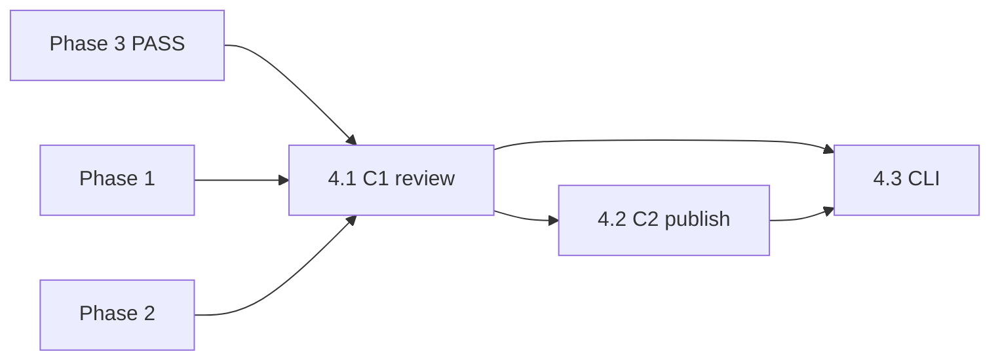

# Phase 4 · Copywriter（C1 / C2）

## 前置：Phase 3 闸门

**产品门禁：** 仅当 Phase 3 评测结论为 **GATE_PASS** 后启动本 Phase（`summarize_eval` 或总编书面记录）。代码可不硬编码拦截，但 plan/agent 须知晓。

## Todo 依赖关系



- **4.1** 依赖 Phase 1、2（及 Phase 3 通过决策）
- **4.2** 依赖 **4.1**（C2 针对总编从 C1 中选定的一条）
- **4.3** 依赖 **4.1**、**4.2**

## Scope

### In scope

- 新建 `scripts/copywriter.py`（README 已引用，仓库中尚不存在）
- **C1** `prompts/C1_copywriter_review.md`：`--stage review`
- **C2** `prompts/C2_copywriter_multiplatform.md`：`--stage publish`
- MiMo（`scripts/lib/llm`）；失败记 `errors`，不阻断另一 stage
- 输出：JSON 和/或 Markdown 片段，供 Phase 6 `main.py` 写入 `Daily_Briefing`

### Out of scope

- 自动发布社媒
- Instagram / Threads / 日韩语（Post-MVP）
- `run_eval` / 闸门评分
- `fetch_news` / `main` 全链路（Phase 6）

## SSOT

| 文档 | 用途 |
|------|------|
| PRD §5.3、§7.2、§7.4 | C1/C2 职责与简报栏位 |
| `prompts/C1_*.md`、`C2_*.md` | 模板变量 |
| Phase 2 plan | `retrieve.json` / `candidates[]` |

---

## Todo 4.1 · C1 `--stage review`

**依赖：** Phase 1、2

### CLI

```text
python scripts/copywriter.py --stage review --retrieve-json output/phase2_retrieve.json --agents-json output/phase1_agents.json
python scripts/copywriter.py --stage review --retrieve-json ... --out output/copy_review.json
```

### 输入组装

- `{{news_context}}`：新闻 `title` + `description`；可附 1 段代表性 pseudo（如最高相似度 agent 的文本）
- `{{candidates}}`：对 `candidates[]` 每条格式化为：
  - title / year / overview（截断可选）
  - `triggered_by`
  - `movie_url`

### 输出

- 解析 C1 返回的**多段纯文本**（段首 `《片名》(年份)`），映射回 `tmdb_id`
- JSON 建议：

```json
{
  "review_copies": [
    { "tmdb_id": 157336, "title": "...", "year": 2014, "text_zh": "《...》(...)\n..." }
  ],
  "errors": []
}
```

### 验收

- [ ] 候选 N 部 → `review_copies` 长度 N（允许单路 LLM 失败有 errors）
- [ ] 中文、无 hashtag、无明显剧透腔

---

## Todo 4.2 · C2 `--stage publish`

**依赖：** **4.1**

### CLI

```text
python scripts/copywriter.py --stage publish --tmdb-id 157336 --selected-file path/to_selected.txt
python scripts/copywriter.py --stage publish --selected-copy "《大都会》(1927)\n..." --movie-json ...
python scripts/copywriter.py --stage publish ... --out output/Daily_Briefing/2026-05-29_copy.md
```

### 输入

- `{{selected_copy}}`：总编从 C1 勾选的中文基稿（文件或 CLI 字符串）
- `{{movie_title}}` / `{{year}}` / `{{tmdb_id}}`
- `{{news_context}}`：同 4.1

### 输出

- 按 C2 prompt 分节：`[微博 / 小红书 · 中文]`、`[X / Twitter · English]`
- 含 `https://themoviecosmos.com/movie/{tmdb_id}` 与 0–2 标签
- 长度：中文 ≤140 字、英文 ≤280 字符（超长则 warnings + 截断）

### 验收

- [ ] 英文版非直译痕迹（人工扫一眼）
- [ ] 两节均含链接

---

## Todo 4.3 · CLI 整合与文档

**依赖：** **4.1**、**4.2**

### 交付

- `copywriter.py` 统一 `--help`；`--provider` 透传
- 将 C1 结果**合并进简报候选块**的字段约定（供 Phase 6）：
  - `- 中文文案（审核稿，C1）: ...`
  - `- ✅ 选用` 仍由人类在 Obsidian 勾选，**不自动**
- README「MVP 执行顺序」第 4、7 步命令与示例路径
- 可选：`tests/fixtures/selected_copy.txt` 样例

### 端到端验收

```powershell
python scripts/agents.py --news-file tests/sample_news.json --out output/phase1_agents.json
python scripts/retrieve.py --agents-json output/phase1_agents.json --out output/phase2_retrieve.json
python scripts/copywriter.py --stage review --retrieve-json output/phase2_retrieve.json --agents-json output/phase1_agents.json --out output/copy_review.json
# 人工从 review 挑一段写入 tests/fixtures/selected_copy.txt
python scripts/copywriter.py --stage publish --tmdb-id ... --selected-file tests/fixtures/selected_copy.txt --out output/Daily_Briefing/sample_copy.md
```

---

## Phase 4 整体验收

- [ ] C1 + C2 命令可独立运行
- [ ] 与 PRD §7.2 栏位语义一致（审核稿 + 定稿分文件）

## 交给 Phase 6

| 产出 | 用途 |
|------|------|
| `copy_review.json` | `main.py` 渲染候选中文文案 |
| `*_copy.md` | 总编复制发布；`--stage publish` 可人工触发 |

## 风险与约束

- C1 一次 prompt 含多部候选 → token 随候选数增长；MVP ≤8 部通常可接受
- **勿**在 C1 自动替总编「选用」
- 修改 `C1/C2` prompt 正文属产品迭代，与代码 PR 分开
