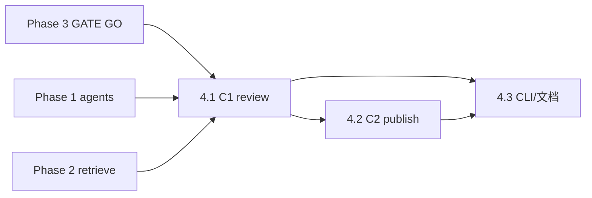

# Phase 4 · Copywriter（C1 / C2）

## 前置：Phase 3 闸门（已通过）

Phase 3 全部 GATE GO（3.10 / 3.11.8，见 PRD §8.3）。架构链路已收敛，本 Phase 解封。

**重写说明（2026-06）**：本 plan 原稿停在「3 agent / 4 pseudo / toned-neutral-focalized 三通道」的旧设计。Phase 3.5→3.12 把生成层换成了 **fragment ladder + search unit + 12 persona**（[ADR-0009](../../docs/adr/0009-fragment-ladder-and-search-unit-architecture.md) / [ADR-0010](../../docs/adr/0010-pseudo-drop-granularity-and-pipeline-first-derisking.md)），retrieve 候选契约也变了。本稿按新架构全文改写。**两条已敲定的债务决策见下「债务口径」。**

## 债务口径（总编 2026-06-14 拍板）

| 项 | 决策 | 对本 Phase 的影响 |
| --- | --- | --- |
| **债1 · 5 部 baseline 强共振落出** | **不做 retention 调优**。5 部里 4 部是可接受常规损失、1 部（A Ticket to Space, judge=0）本就该挤掉 | 无 todo；仅 PRD 记一句已知事实 |
| **债2 · judge 人工校准** | 当前分布下**不补校准**（judge 为 screening-only + 有 GATE 抽审背书）；**重对齐挪到 Phase 5**（RSS 新分布上线后做） | 本 Phase 不处理；Phase 5 承接 |
| **OPEN a · 文案视角聚焦** | **软方案**：不做硬性视角聚焦；把 `center_dimensions` / `POV变换` 标签作为**可选提示**透传给 C1，LLM 可参考可不用，总编人工定夺 | 落在 **4.1** |

## Todo 依赖关系



## Scope

### In scope

- 新建 `scripts/copywriter.py`（README 已引用，仓库中尚无此脚本）
- **C1** `prompts/C1_copywriter_review.md`（**已存在**，本 Phase 按新 candidate 字段微调变量说明）：`--stage review`
- **C2** `prompts/C2_copywriter_multiplatform.md`（**已存在**）：`--stage publish`
- MiMo（`scripts/lib/llm`）；失败记 `errors`，不阻断另一 stage
- 输出：JSON 和/或 Markdown 片段，供 Phase 6 `main.py` 写入 `Daily_Briefing`
- OPEN a 软提示：视角标签作为 C1 可选元数据透传

### Out of scope

- 自动发布社媒
- Instagram / Threads / 日韩语（Post-MVP）
- `run_eval` / 闸门评分
- `fetch_news` / `main` 全链路（Phase 6）
- **判 judge 真值 / 人工校准**（债2，Phase 5）
- **baseline retention 调优**（债1，不做）
- **硬性视角聚焦改造**（OPEN a 取软方案）

## SSOT

| 文档 | 用途 |
| --- | --- |
| PRD §5.3、§7.2、§7.3 | C1/C2 职责与简报栏位、文案定稿口径 |
| [ADR-0009](../../docs/adr/0009-fragment-ladder-and-search-unit-architecture.md) | search unit / candidate 字段来源（`search_unit_kinds` / `center_dimensions` / `triggered_by`） |
| [docs/SSOT/personas-12.md](../../docs/SSOT/personas-12.md) | 12 persona roster（candidate `triggered_by` 用 persona_id） |
| `prompts/C1_*.md`、`C2_*.md` | 模板变量 |
| `scripts/retrieve.py` | candidates[] / a1_oracle 输出契约 |

## retrieve 候选契约（本 Phase 实际消费的数据形状）

`retrieve` 输出顶层键：`per_agent` / `candidates` / `human_candidates` / `audit_pool` / `funnel` / `a1_oracle` / `oracle_comparison` / `divergence` / `meta`。

**C1 只消费 `candidates[]`（= `human_candidates`，已过漏斗+预算）。** 每条 candidate 字段：

```text
tmdb_id / title / overview / genres / release_year / language / poster_path
movie_url            # https://themoviecosmos.com/movie/{tmdb_id}
similarity
triggered_by[]       # persona_id 列表（如 THE-INNOCENT），即「哪些视角召回了它」
search_unit_kinds[]  # surface-fragment-bundle / event-fragment-bundle / persona-semantic
center_dimensions[]  # who / where / when / why / how / result —— OPEN a 软提示来源
quality_candidate    # 观察字段，非硬闸
judge_score          # screening-only，可空
```

**A1 不在 candidates。** A1 是 `a1_oracle`（held-out oracle，仅作评测对照），C1/C2 一律不渲染、不写文案。

---

## Todo 4.1 · C1 `--stage review`

**依赖：** Phase 1、2

### CLI

```text
python scripts/copywriter.py --stage review --retrieve-json output/phase2_retrieve.json --agents-json output/phase1_agents.json
python scripts/copywriter.py --stage review --retrieve-json ... --out output/copy_review.json
```

### 输入组装

- `{{news_context}}`：新闻 `title` + `description`；可附 1 段代表性 **persona-semantic** search unit 文本（取 `per_agent` 中相似度最高的一条 persona-semantic；**不取 A1/oracle**）
- `{{candidates}}`：对 `candidates[]` 每条格式化为：
  - title / year / overview（可截断）
  - `triggered_by`（persona_id 列表 → 自然语言「被 X 视角击中」）
  - **OPEN a 软提示**：`center_dimensions` + `POV变换`（若有）作为一行可选元数据，提示文案「这部片被新闻击中的最强切面是 who/result/…」，**措辞写明“可参考、非强制”**
  - `movie_url`

### 输出

- 解析 C1 返回的**多段纯文本**（段首 `《片名》(年份)`），映射回 `tmdb_id`
- JSON 建议：

```json
{
  "review_copies": [
    {
      "tmdb_id": 157336,
      "title": "...",
      "year": 2014,
      "triggered_by": ["THE-INNOCENT", "THE-HERO"],
      "center_dimensions": ["who", "result"],
      "text_zh": "《...》(...)\n..."
    }
  ],
  "errors": []
}
```

### 验收

- [ ] 候选 N 部 → `review_copies` 长度 N（允许单路 LLM 失败有 errors）
- [ ] 中文、无 hashtag、无明显剧透腔
- [ ] A1/oracle 候选**不出现**在 review_copies
- [ ] 视角标签作为软提示透传，文案不被强制聚焦（OPEN a）

---

## Todo 4.2 · C2 `--stage publish`

**依赖：** **4.1**

### CLI

```text
python scripts/copywriter.py --stage publish --tmdb-id 157336 --selected-file path/to_selected.txt
python scripts/copywriter.py --stage publish --selected-copy "《大都会》(1927)\n..." --movie-json ...
python scripts/copywriter.py --stage publish ... --out output/Daily_Briefing/2026-05-29_copy.md
```

### 输入

- `{{selected_copy}}`：总编从 C1 勾选的中文基稿（文件或 CLI 字符串）
- `{{movie_title}}` / `{{year}}` / `{{tmdb_id}}`
- `{{news_context}}`：同 4.1

### 输出

- 按 C2 prompt 分节：`[微博 / 小红书 · 中文]`、`[X / Twitter · English]`
- 含 `https://themoviecosmos.com/movie/{tmdb_id}` 与 0–2 标签
- 长度：中文 ≤140 字、英文 ≤280 字符（超长则 warnings + 截断）

### 验收

- [ ] 英文版非直译痕迹（人工扫一眼）
- [ ] 两节均含链接

---

## Todo 4.3 · CLI 整合与文档

**依赖：** **4.1**、**4.2**

### 交付

- `copywriter.py` 统一 `--help`；`--provider` 透传
- 将 C1 结果**合并进简报候选块**的字段约定（供 Phase 6）：
  - `- 触发视角: THE-INNOCENT, THE-HERO`
  - `- 中文文案（审核稿，C1）: ...`
  - `- ✅ 选用` 仍由人类在 Obsidian 勾选，**不自动**
- README「MVP 执行顺序」第 4、7 步命令与示例路径
- 可选：`tests/fixtures/selected_copy.txt` 样例

### 端到端验收

```powershell
python scripts/agents.py --news-file tests/sample_news.json --out output/phase1_agents.json
python scripts/retrieve.py --agents-json output/phase1_agents.json --out output/phase2_retrieve.json
python scripts/copywriter.py --stage review --retrieve-json output/phase2_retrieve.json --agents-json output/phase1_agents.json --out output/copy_review.json
# 人工从 review 挑一段写入 tests/fixtures/selected_copy.txt
python scripts/copywriter.py --stage publish --tmdb-id ... --selected-file tests/fixtures/selected_copy.txt --out output/Daily_Briefing/sample_copy.md
```

---

## Phase 4 整体验收

- [ ] C1 + C2 命令可独立运行
- [ ] 与 PRD §7.2 / §7.3 栏位语义一致（审核稿 + 定稿分文件）
- [ ] candidate 新字段（triggered_by / center_dimensions）正确流转

## 交给 Phase 6

| 产出 | 用途 |
| --- | --- |
| `copy_review.json` | `main.py` 渲染候选中文文案 + 触发视角 |
| `*_copy.md` | 总编复制发布；`--stage publish` 可人工触发 |

## 风险与约束

- C1 一次 prompt 含多部候选 → token 随候选数增长；MVP ≤8 部通常可接受
- **勿**在 C1 自动替总编「选用」
- **勿**渲染 A1/oracle 候选
- OPEN a 软提示**只透传不强制**：避免重蹈生成层 POV 的事实漂移（让 LLM 硬从某视角写易编内心戏）
- 修改 `C1/C2` prompt 正文属产品迭代，与代码 PR 分开