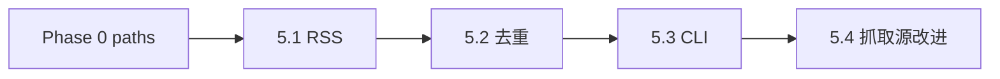

# Phase 5 · News（RSS 基础 + Guardian API 抓取源改进）

**重写说明（2026-06）**：5.1–5.3 的 RSS 设计与 Phase 3 的 fragment ladder / search unit 架构**无强耦合**，原设计基本保留。**5.4 已按 ADR-0014 与 `docs/SSOT/news-source-selection-design.md` 改为抓取源改进**：Guardian API 默认源、section 宽进黑名单、tone 格式感知抽取、`--pick` 降级为调试开关。原 judge 分布重对齐因真实新闻分布未定，挂起为后续 TODO。

## Todo 依赖关系



- **5.1** `state/` 路径策略：优先在 `scripts/lib/paths.py` 新增 `state_dir()` / `seen_news_db()` helper；若不改 paths，则在 `fetch_news.py` 内用 `repo_root() / "state"`。当前 paths.py 尚无 state helper，本 Phase 需自行补齐或本地构造
- **5.2** 依赖 **5.1**；**5.3** 依赖 **5.1**、**5.2**
- **5.4** 依赖 **5.3**（要能产出候选集合）+ ADR-0014 / `news-source-selection-design.md` 的抓取源与自动化边界口径
- 5.1–5.3 与 Phase 1–4 **无硬依赖**，可并行；Phase 6 集成时需要本 Phase 完成

## Scope

### In scope

- 实现 `scripts/fetch_news.py`（替换 TODO 空壳）
- **宽口径中立 RSS**（MVP **不对源做偏好**；`FEEDS` 常量可含多类国际源）
- 输出 PRD §6.3 payload + `url`
- URL 去重 + 14 天标题 `difflib` 相似度 ≥0.7 跳过
- CLI：**打印带序号列表** → 用户手挑
- `--url` 旁路：单条 URL 解析/抓取为 news dict（供 `orchestrate`(`main.py`) `--url`）
- 池子落盘：`state/news_pool_YYYY-MM-DD.json`（可选）
- **5.4 · 抓取源改进**：Guardian API 默认源、section 宽进黑名单、tone 格式感知抽取、`--pick` 降级为调试开关

### Out of scope

- 全文爬虫
- RSS **内容过滤**（政治敏感等）
- Post-MVP **热度算法**（多源同事件计数 + 时间加权）
- Post-MVP **小快灵开发开关**（`--personas N`、`--judge-topk`、缓存/并行等）
- `orchestrate`(`main.py`) 集成（Phase 6）
- **judge 分布校准 / judge rubric / 阈值机制改动**（原 5.4 因新闻分布未定挂起为后续 TODO）
- **常态化人工标注**

## SSOT

| 文档                                                                                       | 用途                                                                                                                                                                                                 |
| ------------------------------------------------------------------------------------------ | ---------------------------------------------------------------------------------------------------------------------------------------------------------------------------------------------------- |
| PRD §6.1–6.5                                                                               | 字段、去重、不过滤                                                                                                                                                                                   |
| Phase 1 plan                                                                               | `NewsItem` / `sample_news.json` schema；字段（title/description/pub_time/source_name/url）仍可用且 `run_eval.py --news-file` 兼容；架构阶段名以 ADR-0011 为准，不以 `agents.py` 作为当前生产阶段权威 |
| [ADR-0007](../../docs/adr/0007-logic-resonance-judge-prescreen-and-pov-focalization.md) D4 | judge 阈值纪律 / 分布漂移条目（5.4 依据）                                                                                                                                                            |
| [ADR-0010](../../docs/adr/0010-pseudo-drop-granularity-and-pipeline-first-derisking.md) D4 | 债2 来源（judge screening-only + RSS 新分布须重对齐）                                                                                                                                                |
| [docs/eval-the-bet.md](../../docs/eval-the-bet.md)                                         | 共振 rubric / judge 工作流                                                                                                                                                                           |

---

## Todo 5.1 · RSS 抓取与 payload

**依赖：** Phase 0 `paths`（建议）；`state/` 路径策略：优先在 `scripts/lib/paths.py` 新增 `state_dir()` / `seen_news_db()` helper；若不改 paths，则在 `fetch_news.py` 内用 `repo_root() / "state"`。当前 paths.py 尚无 state helper，本 Phase 需自行补齐或本地构造

### `FEEDS` 常量

- 在 `fetch_news.py` 顶部 `FEEDS: list[str]`
- **原则**：多源、跨领域、免费可访问；**不**在代码注释里写「高张力源优先」
- 至少 **3** 个 feed；解析失败不拖垮整批

### 抓取逻辑

- `feedparser.parse` 拉取各源，合并条目
- 字段映射：
  - `title` ← entry.title（必填，否则丢弃）
  - `description` ← summary / description（必填；strip HTML 标签）
  - `pub_time` ← published_parsed → ISO 字符串（可选）
  - `source_name` ← feed.title 或域名（可选）
  - `url` ← link（必填）
- **news payload 必填口径**：`url` 对 RSS 抓取 / 去重 / 溯源是必填；`title`、`description` 是下游最低必填；`pub_time`、`source_name` 可选。
- **不爬全文**

### 验收

```powershell
python -c "from scripts.fetch_news import fetch_all_entries; e=fetch_all_entries(); print(len(e), e[0].keys() if e else None)"
```

---

## Todo 5.2 · 去重状态

**依赖：** **5.1**

### URL 去重

- DB：`state/seen_news.sqlite`
- 表：`seen_urls(url_norm TEXT PRIMARY KEY, seen_at TEXT)`
- 规范化：剥 `utm_*`、`fbclid` 等 query；统一 scheme/host 大小写策略写清

### 标题相似度

- 表：`seen_titles(title TEXT, seen_at TEXT)` 或复用一张表
- 保留 **14 天**内「已选用」标题（在 **5.3 `--pick`** 或 `--mark-seen` 时写入）
- 新条目与历史比 `SequenceMatcher.ratio()`，≥ **0.7** → 标注 `skipped_title_dup` 或不展示

### 行为

- **抓取阶段**：仅 URL 已在 `seen_urls` 的跳过
- **选用阶段**：写 url + title 进 sqlite

### 验收

- [ ] 同一 url 二次抓取不出现
- [ ] 近似标题（手测两条）被过滤或标记

---

## Todo 5.3 · CLI 与输出

**依赖：** **5.1**、**5.2**

### CLI

```text
python scripts/fetch_news.py
python scripts/fetch_news.py --limit 30
python scripts/fetch_news.py --out state/news_pool_2026-05-29.json
python scripts/fetch_news.py --pick 3
python scripts/fetch_news.py --pick 3 --out-json output/selected_news.json
python scripts/fetch_news.py --url https://example.com/article
```

### 默认：`fetch` 子命令或无子命令

1. 拉取 → 去重 → 按 `pub_time` **降序**
2. 终端打印：

```text
[1] 2026-05-29 · Source · Title…
    https://...
[2] ...
```

3. `--pick N`：输出第 N 条的 **news JSON** 到 stdout 或 `--out-json`；并 **mark seen**（url + title）

### `--url` 旁路

- 不经过 RSS 列表；尝试 feedparser/简单 GET+解析，**或**要求用户同时提供 `--title` `--description`
- 最小实现：无法解析时打印说明并 exit 1；推荐配合 `--title` / `--description`

### news JSON（与 Phase 1 一致）

```json
{
  "title": "...",
  "description": "...",
  "pub_time": "...",
  "source_name": "...",
  "url": "..."
}
```

### README

- 手挑流程：`fetch_news` → 记下序号 → `main.py --news-file` / `main.py --url`（Phase 6）或 `run_eval.py --news-file`

### 验收

```powershell
python scripts/fetch_news.py --limit 10
python scripts/fetch_news.py --pick 1 --out-json output/picked_news.json
python -c "import json; json.load(open('output/picked_news.json')); print('ok')"
```

---

## Todo 5.4 · 抓取源改进：Guardian API 默认源 + section 宽进黑名单 + tone 格式感知抽取 + --pick 降级 [需人工验收]

**依赖：** **5.3** + [ADR-0014](../../docs/adr/0014-news-source-selection-and-automation-boundary.md) + [news-source-selection-design.md](../../docs/SSOT/news-source-selection-design.md)

**背景**：ADR-0014 已确认新闻侧生产语义为全自动，`--pick` 只保留为评测/调试开关；`news-source-selection-design.md` 进一步规定 Phase 5.4 只交付抓取源改进，不做热度排序、小快灵开关或 judge 校准。

### 做法（本 Phase）

1. Guardian Content API 设为默认抓取源；RSS provider 保留为 `--provider rss` 可选路径。
2. section 策略改为「默认全放行，只排除结构性非内容」：`*-network` / professional 类、Guardian meta/工具页、纯功能页、地方新闻四类黑名单集中维护。
3. 正文抽取改为 tone 标签驱动：按 `tone/*` 查 `EXTRACTION_TABLE`；多 tone 按具体度仲裁；`tone/features` 回退段长衰减启发式；无 tone 默认前 3 段。
4. `--pick` 降级为评测/调试覆盖；未指定 `--pick` 时默认自动放行候选集合（可由 `--limit` 截断），不要求人工挑新闻才能继续。

### 产出

- `scripts/fetch_news.py`：Guardian API 默认 provider、section 黑名单、tone 路由表、自动放行默认路径。
- `tests/test_fetch_news.py`：mock Guardian API，不打真实 HTTP；覆盖 section 黑名单、tone 抽取路由、`--pick` 未指定自动放行。
- 本计划 5.4 描述更新，保持 `status: pending`，等待人工验收后再由后续流程标记 complete。

### 挂起 / 后续 TODO

- **热度排序**：Guardian API 无热度维度，按 ADR-0014 D4 / 设计文档 §6 挂起到 Post-MVP。
- **小快灵开发开关**：只登记方向，不在本 Phase 实现。
- **原 5.4 judge 分布重对齐**：因真实新闻分布尚未稳定，挂起为后续 TODO；待热度机制与真实输入分布明确后再盲标、算一致率 / 混淆矩阵、决定是否调 judge。

### 验收

- [ ] 默认 provider 为 Guardian API，请求包含 `show-fields=bodyText,trailText,headline`、`show-tags=all`、`order-by`、`section`、`page-size`。
- [ ] 四类 section 黑名单生效，film / culture / education / food / sport 等正常放行。
- [ ] tone 抽取覆盖 `tone/news`、`tone/recipes`、`tone/minutebyminute`、多 tone、`tone/features`、无 tone。
- [ ] 未指定 `--pick` 时可自动产出新闻集合；`--pick` 仍可用于调试指定单条。
- [ ] `[需人工验收]`：用户用真实 Guardian API 结果肉眼确认默认抓取和正文抽取效果。

---

## Phase 5 整体验收

- [ ] 能从真实 Guardian API 拉到 ≥1 条可喂 `extract → expand → rewrite → retrieve → compose` 链路的条目
- [ ] `--pick` 未指定时自动产出候选集合；`--pick` 指定时仍产出合法单条 news JSON
- [ ] `state/seen_news.sqlite` 产生且可重复运行
- [ ] 5.4 抓取源改进通过真实 API 肉眼验收；原 judge 分布校准保持挂起

## 交给 Phase 6

| 产出               | 用途                                    |
| ------------------ | --------------------------------------- |
| `fetch_news.py`    | `orchestrate`(`main.py`) 默认入口拉 Guardian API 新闻；RSS 可作可选 provider |
| `news_pool_*.json` | 自动候选池 / 调试浏览候选池                          |
| 抓取源验收结论     | 确认真实 API 下 section 放行与 tone 抽取质量        |

## 风险与约束

- Guardian API 需要 `.env` / 环境变量中的 `GUARDIAN_API_KEY`；真实源效果需人工肉眼验收
- 免费 RSS 不稳定：保留为 `--provider rss` 可选路径，解析失败要可见（logging/warning）
- **勿**在 MVP 实现源偏好、内容审查或新闻原文表层相似度筛选
- `state/*.sqlite` 可 gitignore；`news_pool_*.json` 视需要 ignore
- 中国网络环境部分源可能超时——可用 RSS provider 或手喂 JSON 旁路
- 原 5.4 judge 分布重对齐因新闻分布未定挂起；待热度机制与真实输入分布明确后再触发