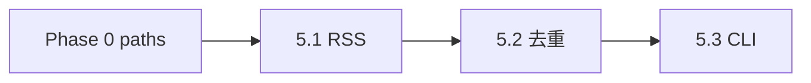

# Phase 5 · News（RSS 抓取）

## Todo 依赖关系



- **5.1** 建议依赖 Phase 0 `scripts/lib/paths`（`state/` 路径）；无 Phase 0 时可硬编码 `state/`
- **5.2** 依赖 **5.1**
- **5.3** 依赖 **5.1**、**5.2**
- 与 Phase 1–4 **无硬依赖**，可并行；Phase 6 集成时需要本 Phase 完成

## Scope

### In scope

- 实现 `scripts/fetch_news.py`（替换 TODO 空壳）
- **宽口径中立 RSS**（MVP **不对源做偏好**；`FEEDS` 常量可含多类国际源，避免只选单一领域）
- 输出 PRD §6.3 payload + `url`
- URL 去重 + 14 天标题 `difflib` 相似度 ≥0.7 跳过
- CLI：**打印带序号列表** → 用户手挑（grill 结论）
- `--url` 旁路：单条 URL 解析/抓取为 news dict（供 `main.py --url`）
- 池子落盘：`state/news_pool_YYYY-MM-DD.json`（可选，便于 Obsidian 侧查看）

### Out of scope

- 全文爬虫
- RSS **内容过滤**（政治敏感等）
- Post-MVP **热度算法**（多源同事件计数 + 时间加权）
- `main.py` 集成（Phase 6）
- 自动选 Top1 作为唯一入口（可保留 `--auto-top1` 调试开关，**非**默认）

## SSOT

| 文档 | 用途 |
|------|------|
| PRD §6.1–6.5 | 字段、去重、不过滤 |
| Phase 1 plan | `NewsItem` / `sample_news.json` schema |
| Phase 3 plan | N=10 手挑新闻来自本模块输出 |

---

## Todo 5.1 · RSS 抓取与 payload

**依赖：** Phase 0 `paths`（建议）

### `FEEDS` 常量

- 在 `fetch_news.py` 顶部 `FEEDS: list[str]`
- **原则**：多源、跨领域、免费可访问；**不**在代码注释里写「高张力源优先」
- 示例类型（实现时选能稳定解析的 URL，失败源记 warning 跳过）：
  - 国际综合 wire（如 Reuters / BBC World 等，以实际可访问 feed 为准）
- 至少 **3** 个 feed；解析失败不拖垮整批

### 抓取逻辑

- `feedparser.parse` 拉取各源，合并条目
- 字段映射：
  - `title` ← entry.title（必填，否则丢弃）
  - `description` ← summary / description（必填；strip HTML 标签）
  - `pub_time` ← published_parsed → ISO 字符串（可选）
  - `source_name` ← feed.title 或域名（可选）
  - `url` ← link（必填）
- **不爬全文**

### 验收

```powershell
python -c "from scripts.fetch_news import fetch_all_entries; e=fetch_all_entries(); print(len(e), e[0].keys() if e else None)"
```

---

## Todo 5.2 · 去重状态

**依赖：** **5.1**

### URL 去重

- DB：`state/seen_news.sqlite`
- 表：`seen_urls(url_norm TEXT PRIMARY KEY, seen_at TEXT)`
- 规范化：剥 `utm_*`、`fbclid` 等 query；统一 scheme/host 大小写策略写清

### 标题相似度

- 表：`seen_titles(title TEXT, seen_at TEXT)` 或复用一张表
- 保留 **14 天**内「已选用」标题（在 **5.3 `--pick`** 或 `--mark-seen` 时写入，不是仅抓取时）
- 新条目与历史比 `SequenceMatcher.ratio()`，≥ **0.7** → 抓取列表标注 `skipped_title_dup` 或根本不展示

### 行为

- **抓取阶段**：仅 URL 已在 `seen_urls` 的跳过
- **选用阶段**：写 url + title 进 sqlite

### 验收

- [ ] 同一 url 二次抓取不出现
- [ ] 近似标题（手测两条）被过滤或标记

---

## Todo 5.3 · CLI 与输出

**依赖：** **5.1**、**5.2**

### CLI

```text
python scripts/fetch_news.py
python scripts/fetch_news.py --limit 30
python scripts/fetch_news.py --out state/news_pool_2026-05-29.json
python scripts/fetch_news.py --pick 3
python scripts/fetch_news.py --pick 3 --out-json output/selected_news.json
python scripts/fetch_news.py --url https://example.com/article
```

### 默认：`fetch` 子命令或无子命令

1. 拉取 → 去重 → 按 `pub_time` **降序**（无热度算法）
2. 终端打印：

```text
[1] 2026-05-29 · Source · Title…
    https://...
[2] ...
```

3. `--pick N`：输出第 N 条的 **news JSON** 到 stdout 或 `--out-json`；并 **mark seen**（url + title）

### `--url` 旁路

- 不经过 RSS 列表；尝试用 feedparser/简单 GET+解析**或**要求用户同时提供 `--title` `--description`（若纯 url 难解析，文档写「MVP 可先用 JSON 手喂」）
- 最小实现：若无法解析，打印说明并 exit 1；推荐配合 `--title` / `--description` 可选参数

### news JSON（与 Phase 1 一致）

```json
{
  "title": "...",
  "description": "...",
  "pub_time": "...",
  "source_name": "...",
  "url": "..."
}
```

### README

- 手挑流程：`fetch_news` → 记下序号 → `main.py --url`（Phase 6）或 `run_eval --news-file`
- Phase 3：从池中挑 10 条做闸门

### 验收

```powershell
python scripts/fetch_news.py --limit 10
python scripts/fetch_news.py --pick 1 --out-json output/picked_news.json
python -c "import json; json.load(open('output/picked_news.json')); print('ok')"
```

---

## Phase 5 整体验收

- [ ] 能从真实 RSS 拉到 ≥1 条可喂 agent 的条目
- [ ] `--pick` 产出合法 news JSON
- [ ] `state/seen_news.sqlite` 产生且可重复运行

## 交给 Phase 6

| 产出 | 用途 |
|------|------|
| `fetch_news.py` | `main.py` 默认入口拉新闻 |
| `picked_news.json` | 与 `--news-file` 相同契约 |
| `news_pool_*.json` | 总编浏览候选池 |

## 风险与约束

- 免费 RSS 不稳定：解析失败要可见（logging/warning）
- **勿**在 MVP 实现源偏好或内容审查
- `state/*.sqlite` 可 gitignore；`news_pool_*.json` 视需要 ignore
- 中国网络环境部分 feed 可能超时——README 注明可换 feed 或用手喂 JSON
