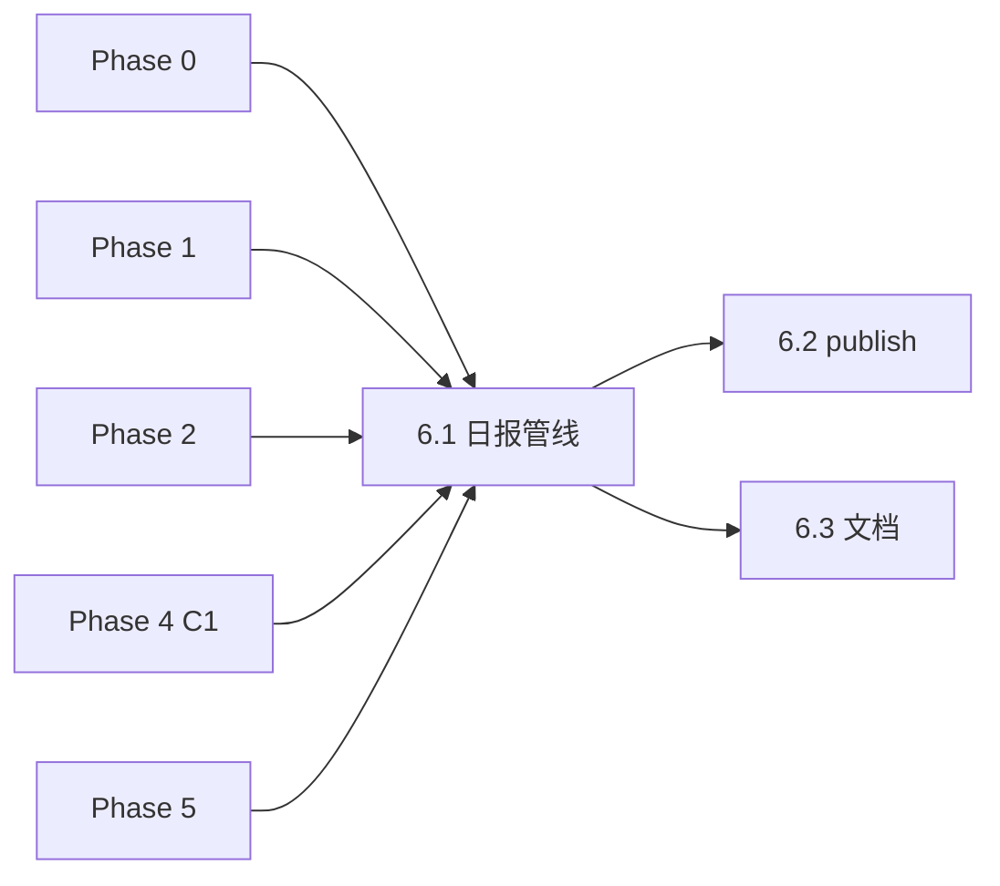

# Phase 6 · Main（端到端集成）

**重写说明（2026-06）**：原稿按 ADR-0007 之前的 4-agent 口径写（只列 A1/A2/A4/A7、手拼 `themoviecosmos.com/movie/{id}` URL）。当前架构（[ADR-0009](../../docs/adr/0009-fragment-ladder-and-search-unit.md) accepted）是 **12 persona + fragment ladder + search unit**，`retrieve.py` 已有稳定输出契约。本稿据此对齐：persona 数量、candidate 字段名、A1 held-out oracle 定位、C1 软 POV 提示。

## 前置条件

| Phase | 必须 |
| ----- | ---- |
| 0 | 索引 + `scripts/lib`（`paths` / `env` / `llm`） |
| 1 | `agents.py`（12 persona 全链） |
| 2 | `retrieve.py`（`retrieve_from_agents`，输出契约见下） |
| 4 | `copywriter.py` **C1**（Phase 3.11 GATE 已通过） |
| 5 | `fetch_news.py`（走 RSS 手挑时；`--news-file` 可绕过） |

## retrieve 输出契约（渲染所依据 · 勿臆造字段）

`retrieve_from_agents(...)` 顶层 payload key：

| key | 含义 | main 是否渲染 |
| --- | --- | --- |
| `per_agent` | 每个 persona 的 search unit + 命中明细 | 调试附录（可选） |
| `candidates` | **生产候选池**（去重 + convergent sort + 预算 top-N） | ✅ 主体 |
| `human_candidates` | 进人工抽审的候选（judge≥1 等口径） | ✅ 主体（与 candidates 口径对齐时取其一） |
| `audit_pool` | 抽审池 | 调试附录 |
| `funnel` | 漏斗各级计数 | 简报「漏斗」小节（可选） |
| `a1_oracle` | A1 Reality Recorder 的 held-out 召回 | **仅 oracle 附录**，不混入生产候选 |
| `oracle_comparison` | 生产候选 vs A1 oracle 的差集对照 | 可选附录 |
| `divergence` | persona 分歧信息 | 可选折叠块 |
| `meta` | run 元信息（new id / def / judge 版本） | 简报脚注 |

每个 candidate 字段（**直接用，勿手拼**）：

```text
tmdb_id, title, overview, genres, release_year, language,
poster_path, movie_url, similarity, triggered_by, search_unit_kinds
```

- `movie_url` 已是完整跳转链接 → **直接用**，不要再拼 `themoviecosmos.com/movie/{id}`
- `triggered_by` = 命中该片的 persona id 列表（如 `The-Sage` / `The-Magician`）→ 渲染撞车标签
- `search_unit_kinds` = 命中来自哪类 search unit（surface-fragment-bundle / event-fragment-bundle / persona-semantic）→ 可作归因小标签

## Todo 依赖关系



- **6.1** 依赖 Phase 0、1、2、4（C1）、5（可选）
- **6.2** 依赖 **6.1** 简报格式约定
- **6.3** 依赖 **6.1**

## Scope

### In scope

- `scripts/main.py` 完整实现（替换 MVP stub）
- 输出：`output/Daily_Briefing/YYYY-MM-DD.md`（`--date` 可覆盖）
- 新闻入口（**半自动**，与 PRD §6.2 一致）：
  - `--news-file path.json`
  - `--url ...`（+ 可选 `--title` / `--description`）
  - `--pick N`（内部调 `fetch_news` 选第 N 条并 mark seen）
- 串联：`agents`（12 persona）→ `retrieve_from_agents` → C1（`copywriter --stage review`）→ 渲染 Markdown
- **独立** `publish` 子命令：C2 → `YYYY-MM-DD_copy.md`
- `errors` 节（agents + copy 失败汇总）

### Out of scope

- 自动发社媒
- `generate_planet.py`
- 定时 cron / GitHub Actions
- 评测闸门逻辑（仍用 `run_eval.py`；`main` 可 `--no-copy` 调试）
- **A1 进生产候选池**（A1 是 held-out oracle，仅作附录对照）
- **judge 阈值 / rubric 改动**（沿用 3.10/3.11 定稿）

## SSOT

| 文档 | 用途 |
| --- | --- |
| PRD §7.2、§8 | 简报骨架、工作流 1–7 步 |
| [ADR-0009](../../docs/adr/0009-fragment-ladder-and-search-unit.md) | search unit / candidate 字段口径 |
| Phase 3.11 plan + GATE_RESULT | 评测 md 可复用渲染、A1 held-out 决策 |
| Phase 4/5 plan | C1/C2 / news 契约 |
| `scripts/retrieve.py`（`retrieve_from_agents`） | 输出契约真实来源 |

---

## Todo 6.1 · 日报管线

**依赖：** Phase 0–2、4；Phase 5（`--pick` 时）

### CLI

```text
python scripts/main.py --news-file output/picked_news.json
python scripts/main.py --url https://... --title "..." --description "..."
python scripts/main.py --pick 3
python scripts/main.py --news-file ... --date 2026-05-29
python scripts/main.py --news-file ... --no-copy          # 仅 agents+retrieve（调试）
python scripts/main.py --help
```

**默认无参数**：打印用法（**不要**静默自动 Top1 RSS，避免与「手挑」冲突）；可选 `--auto-first` 调试用第一条。

### 管线步骤

1. 解析 news → news dict（PRD §6.3 字段）
2. `agents` 跑 12 persona（产 search unit）
3. `retrieve_from_agents(agents_result)` → payload（契约见上）
4. 若未 `--no-copy`：C1 对 **生产候选**（`candidates` / `human_candidates`）逐片写中文审核稿
   - **软 POV 提示（OPEN a）**：把候选的 `center_dimensions` / `POV变换` 标签作为**可选 hint** 传给 C1，不做硬聚焦约束；C1 可参考也可忽略
5. 渲染 Markdown → `output/Daily_Briefing/{date}.md`

### Markdown 模板（PRD §7.2 + Phase 4，12 persona 口径）

```markdown
# 每日星轨观测 · YYYY-MM-DD

## 现实波澜
- **title** / **source_name** / **pub_time** / **url**
- **summary**: description

## 候选星轨（共 N 部）
### {title} ({release_year})  ·  命中视角 [The-Sage, The-Magician]
- **相似度**: 0.xx
- **genres**: ...
- **language**: ...
- **overview**: ...
- **命中来源**: persona-semantic / event-fragment-bundle  <!-- search_unit_kinds -->
- **跳转**: {movie_url}                                    <!-- 直接用，勿手拼 -->
- **中文文案（C1 审核稿）**: ...
- **选用**: ☐   <!-- 总编在 Obsidian 勾选 -->

## errors
（agents / retrieve / copy 失败汇总）

## 附录 · A1 Reality Recorder（held-out oracle）
<!-- a1_oracle + oracle_comparison：仅诊断对照，不是可选用候选 -->
- A1 召回但未进生产池: {title} ...
- 生产池独有: {title} ...

## 脚注
- run meta: {meta}（news id / def / judge 版本）
```

- **撞车标签**：用 `triggered_by`（persona id 列表），不再写 A2/A4/A7
- **A1 严格隔离**：A1 召回只出现在「附录 · oracle」，**不**进「候选星轨」、**不**给 C1 写文案、**不**可被总编勾选选用
- 可选附录：`funnel`（漏斗计数）、`divergence`（折叠块）

### 实现建议

- 优先 **import** 各模块函数（`agents` / `retrieve` / `copywriter`），避免反复 subprocess
- 渲染逻辑可与 `run_eval.py` 共用 `scripts/lib/render_briefing.py`（本 todo 或 6.3 抽离）
- candidate 字段缺失要容错（如 `poster_path` 为空）

### 验收

```powershell
python scripts/main.py --news-file tests/sample_news.json
# 检查 output/Daily_Briefing/<today>.md：
#   - 候选星轨用 triggered_by 标视角
#   - 每片有 movie_url（非手拼）与 C1 文案
#   - A1 只在 oracle 附录，未混入候选
```

---

## Todo 6.2 · `publish`（C2 定稿）

**依赖：** **6.1**

### CLI

```text
python scripts/main.py publish --date 2026-05-29 --tmdb-id 157336 --selected-file path/to_copy.txt
python scripts/main.py publish --date 2026-05-29 --selected-copy "《...》\n..."
```

- 读取该日期 news 语境（从同目录 `YYYY-MM-DD.md` 解析，或要求 `--news-file`）
- 调 `copywriter --stage publish`（C2，MVP 仅中英文：一个中文平台 + 一个英文平台）
- 输出：`output/Daily_Briefing/YYYY-MM-DD_copy.md`

### 验收

- [ ] `_copy.md` 含中英文两节 + 链接
- [ ] 与 Phase 4 C2 输出一致（MVP 中英文范围）

---

## Todo 6.3 · 文档与渲染复用

**依赖：** **6.1**

### 交付

- 更新 `README.md`「MVP 执行顺序」为**最终**端到端：

```text
fetch_news → 手挑 --pick N
main.py --pick N        # 或 --news-file
# Obsidian 勾选选用
main.py publish ...
```

- 说明与 `run_eval.py` 区别：评测写 `output/Eval/`，生产写 `Daily_Briefing/`
- **plumbing**：`--index-subsample` 或文档注明小索引仅测通、非日更

### 可选重构

- `scripts/lib/render_briefing.py`：`run_eval` 与 `main` 共用
  `render_daily(news, agents, retrieve_payload, review_copies=None, mode="prod"|"eval")`
- 抽离后两边 candidate 字段口径单点维护，避免再次出现 4-agent 式漂移

### Phase 6 整体验收

```powershell
python scripts/fetch_news.py --limit 5
python scripts/main.py --pick 1
# 编辑 selected_copy.txt
python scripts/main.py publish --date ... --tmdb-id ... --selected-file ...
```

- [ ] 日报 md 可在 Obsidian 打开
- [ ] 候选用 `triggered_by` / `search_unit_kinds` 口径，A1 仅 oracle 附录
- [ ] 全流程仅手动：选用、publish（符合 PRD §8 step 6–7）

## 风险与约束

- 单次运行多次 LLM（12 persona + 每候选一次 C1）→ 注意耗时与费用；可 `--no-copy` 或限制候选数调试
- 同日重复 `--date` 覆盖写：文档提醒或 `--force`
- C2 **不**在 `main` 默认路径自动跑（必须人工 `publish`）
- **A1 隔离**是硬约束：任何渲染/选用路径都不得把 `a1_oracle` 当生产候选
- candidate 字段以 `retrieve.py` 实际输出为准；改字段先改 `render_briefing` 单点