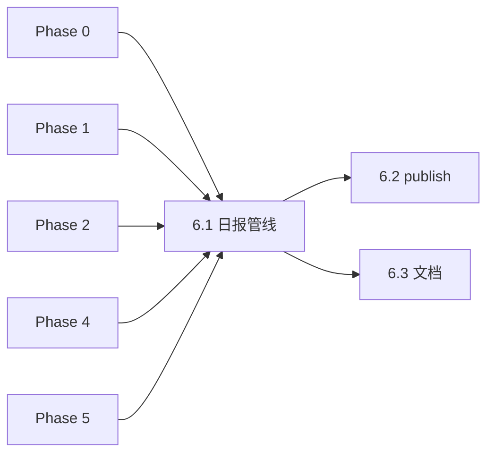

# Phase 6 · Main（端到端集成）

## 前置条件

| Phase | 必须 |
|-------|------|
| 0 | 索引 + `scripts/lib` |
| 1 | `agents.py` |
| 2 | `retrieve.py` |
| 4 | `copywriter.py` **C1**（Phase 3 闸门已通过） |
| 5 | `fetch_news.py`（若走 RSS 手挑；`--news-file` 可绕过） |

## Todo 依赖关系



- **6.1** 依赖 Phase 0、1、2、4（C1）、5（可选）
- **6.2** 依赖 **6.1** 简报格式约定
- **6.3** 依赖 **6.1**

## Scope

### In scope

- `scripts/main.py` 完整实现
- 输出：`output/Daily_Briefing/YYYY-MM-DD.md`（日期可 `--date` 覆盖）
- 新闻入口（**半自动**，与 grill/PRD §6.2 一致）：
  - `--news-file path.json`
  - `--url ...`（+ 可选 `--title` / `--description`）
  - `--pick N`（内部调 `fetch_news` 选用第 N 条并 mark seen）
- 串联：agents → retrieve → copywriter `--stage review` → 渲染 Markdown
- **独立** `publish` 子命令（或 `main.py publish ...`）：C2 → `YYYY-MM-DD_copy.md`
- `errors` 节（agents + copy 失败汇总）

### Out of scope

- 自动发社媒
- `generate_planet.py`
- 定时 cron / GitHub Actions
- 评测闸门逻辑（仍用 `run_eval.py`；`main` 可 `--no-copy` 调试）

## SSOT

| 文档 | 用途 |
|------|------|
| PRD §7.2、§8 | 简报骨架、工作流 1–7 步 |
| Phase 3 plan | 评测 md 可复用渲染 |
| Phase 4/5 plan | copy / news 契约 |

---

## Todo 6.1 · 日报管线

**依赖：** Phase 0–2、4；Phase 5（`--pick` 时）

### CLI

```text
python scripts/main.py --news-file output/picked_news.json
python scripts/main.py --url https://... --title "..." --description "..."
python scripts/main.py --pick 3
python scripts/main.py --news-file ... --date 2026-05-29
python scripts/main.py --news-file ... --no-copy          # 仅 agents+retrieve（调试）
python scripts/main.py --help
```

**默认无参数：** 打印用法（**不要**静默自动 Top1 RSS，避免与「手挑」冲突）；可选 `--auto-first` 调试用第一条。

### 管线步骤

1. 解析 news → `NewsItem`
2. `agents.run_all(news)` 
3. `retrieve.from_agents(agents_result)`
4. 若未 `--no-copy`：`copywriter.review(retrieve, agents)`
5. 渲染 Markdown → `output/Daily_Briefing/{date}.md`

### Markdown 模板（PRD §7.2 + Phase 4）

```markdown
# 每日星轨观测 · YYYY-MM-DD

## 现实波澜
- **title** / **source** / **pub_time** / **url**
- **summary**: description

## 伪剧情（去实体化 · 英文）
- **A2** The Sociologist: ...
- **A4** ...
- **A7** ...
- **A1** The Reality Recorder `[baseline]`: ...

## errors
...

## 候选星轨（共 N 部）
### {Title} ({year}) [A2, A4]
- **相似度**: 0.xx
- **genres**: ...
- **overview**: ...
- **跳转**: https://themoviecosmos.com/movie/{id}
- **中文文案（审核稿，C1）**: ...
- **选用**: ☐   <!-- 总编在 Obsidian 勾选 -->
```

- 撞车：`[A2, A4]` 仅创作视角；`also_baseline` 可注记
- 可选附录：`divergence` 折叠块（来自 retrieve）

### 实现建议

- 优先 **import** 各模块函数，避免反复 subprocess
- 渲染逻辑可与 `run_eval.py` 共用 `scripts/lib/render_briefing.py`（本 todo 或 6.3 抽离）

### 验收

```powershell
python scripts/main.py --news-file tests/sample_news.json
# 检查 output/Daily_Briefing/<today>.md 存在且含 4 pseudo + 候选 + C1 文案
```

---

## Todo 6.2 · `publish`（C2 定稿）

**依赖：** **6.1**

### CLI

```text
python scripts/main.py publish --date 2026-05-29 --tmdb-id 157336 --selected-file path/to_copy.txt
python scripts/main.py publish --date 2026-05-29 --selected-copy "《...》\n..."
```

- 读取对应日期的 news 语境（可从同目录 `YYYY-MM-DD.md` 解析，或要求 `--news-file`）
- 调用 `copywriter --stage publish`
- 输出：`output/Daily_Briefing/YYYY-MM-DD_copy.md`

### 验收

- [ ] `_copy.md` 含中英文两节 + 链接
- [ ] 与 Phase 4 C2 输出一致

---

## Todo 6.3 · 文档与渲染复用

**依赖：** **6.1**

### 交付

- 更新 `README.md`「MVP 执行顺序」为**最终**端到端：

```text
fetch_news → 手挑 --pick N
main.py --pick N   # 或 --news-file
# Obsidian 勾选选用
main.py publish ...
```

- 说明与 `run_eval.py` 区别：评测写 `output/Eval/`，生产写 `Daily_Briefing/`
- **plumbing**：`--index-subsample` 或文档注明 20 行索引仅测通、非日更

### 可选重构

- `scripts/lib/render_briefing.py`：`run_eval` 与 `main` 共用 `render_daily(news, agents, retrieve, review_copies=None, mode="prod"|"eval")`

### Phase 6 整体验收

```powershell
python scripts/fetch_news.py --limit 5
python scripts/main.py --pick 1
# 编辑 selected_copy.txt
python scripts/main.py publish --date ... --tmdb-id ... --selected-file ...
```

- [ ] 日报 md 可在 Obsidian 打开
- [ ] 全流程仅手动：选用、publish（符合 PRD §8 step 6–7）

## 风险与约束

- 单次运行多次 LLM（4 agent + 1 C1）→ 注意耗时与费用
- 同日重复 `--date` 覆盖写：文档提醒或 `--force`
- C2 **不**在 `main` 默认路径自动跑（必须人工 `publish`）
