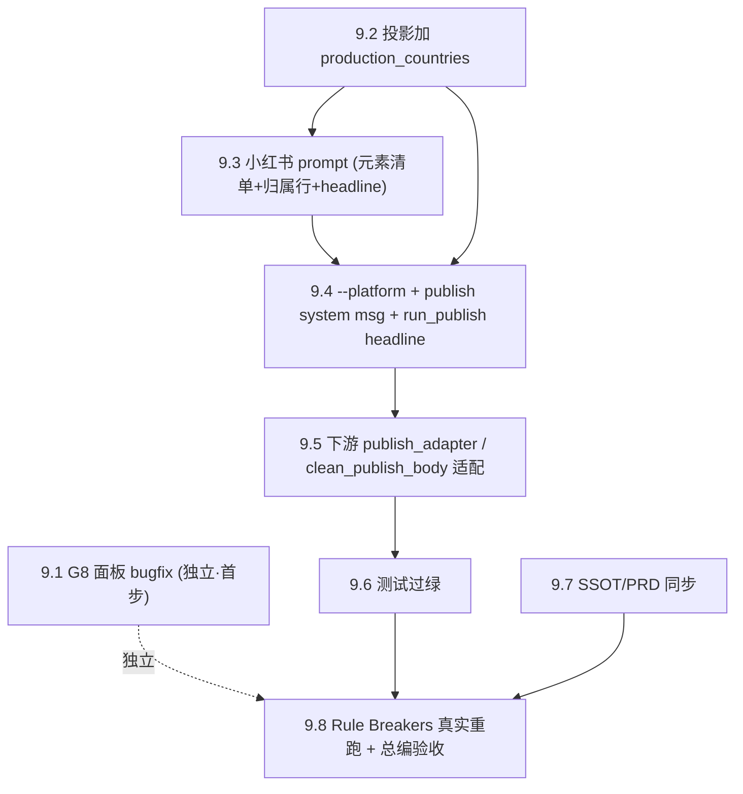

# Phase 9 · 发布稿平台化（C2-小红书）与元素化

## 背景

Phase 4 把发布稿（C2）认定为唯一创作环节（[ADR-0012](../../docs/adr/0012-compose-responsibility-split-and-db-fullcolumn-lookup.md)）、落地平视调性（[ADR-0013](../../docs/adr/0013-image-equality-creative-tone.md)），并以「平台中性单版」跑通 Phase 7 日批 + Phase 8 审核面板。真实产出（`output/daily_batch/2026-07-06/…_copy.md`，选定电影 Rule Breakers）复盘暴露三点：现行 prompt 过度规定格式（僵化三段式）、必含元素缺位（成稿不提任何主创）、平台变体已到落地时机（小红书需平台专属的创作标题）。

本 Phase 按 [ADR-0015](../../docs/adr/0015-publish-platformization-and-element-checklist.md) 把 C2 重构为「平台专用（小红书首发）+ 必含元素清单」，并顺带修一个 Phase 8 面板的生命周期 bug（改选不清旧稿）。

**与 Phase 4 「4.4 独立发布脚本」的关系（澄清，非冲突）**：4.4 定的是 **discord 的平台适配/渲染层**走独立脚本（`publish_discord.py`）；本 Phase 改的是 **创作层**（C2 本身平台化，因为小红书标题是创作元素）。二者不同层。当前日批/面板的活跃链路是 `review_panel/publish_adapter → compose.run_publish → _copy.md`，本 Phase 在此链路上落地；4.6「小红书独立脚本」在 Phase 4 已 cancelled，不构成活跃约束。

## 决策依据（ADR-0015）

| ADR-0015                                                               | 落到本 Phase    |
| ---------------------------------------------------------------------- | --------------- |
| D1 平台化：`--platform xiaohongshu` + `compose_publish_xiaohongshu.md` | 9.3 / 9.4       |
| D2 必含元素清单替代规定结构                                            | 9.3             |
| D3 归属行 `「片名」(YYYY) 导演名`（「」不用《》）                      | 9.3 / 9.5       |
| D4 新增 headline，`run_publish` 返回 `{tmdb_id, headline, body}`       | 9.3 / 9.4 / 9.5 |
| D5 关系侧忠于 causal_test/rationale、不暴露评审来源                    | 9.3             |
| D6 只用给定输入 + `production_countries` 进投影                        | 9.2 / 9.3       |
| 后果：G8 面板 bug 单独走                                               | 9.1             |

## Scope

### In scope

- **C2 平台化**：`compose.py --stage publish` 加 `--platform xiaohongshu`；提示词 `prompts/compose_publish.md` → `prompts/compose_publish_xiaohongshu.md`。
- **正文元素化**：必含（新闻侧具体 / 关系侧 / 电影侧＝导演〔必含若可得〕＋上映年＋剧情）+ 可选（制作国家 / 市场反馈 / 热度vs评价）+ 归属行；顺序自由、篇幅克制不限段。
- **headline**：新增创作产物；`run_publish` 返回结构扩容 + 解析。
- **publish 专用 system message**：现复用决策卡 message（与 headline 冲突），需拆分。
- **投影加列**：`production_countries` 进 `_DB_PROJECTION_FIELDS`。
- **下游适配**：`publish_adapter` / `clean_publish_body` 消费 headline、保留归属行。
- **G8 bugfix**：`handle_select` 变体 A。
- **测试 + SSOT 同步**。

### Out of scope

- **其他平台**（X / Discord）的 C2 创作变体——本 Phase 只建小红书，架构留口子。
- **图片 / hashtag / emoji** 等小红书视觉与话题元素（本 Phase 只做标题短语 + 正文；hashtag/图片另议）。
- **「必含若可得」静默降级的校验兜底**（ADR-0015 G6：本期不加，列已知缺口）。
- **自动发布**（全程手动）。
- **算法口径**（judge / retrieve / fragment ladder 一律不动）。

## SSOT

| 文档                                                                                     | 用途                                              |
| ---------------------------------------------------------------------------------------- | ------------------------------------------------- |
| [ADR-0015](../../docs/adr/0015-publish-platformization-and-element-checklist.md)         | 本 Phase 的决策单一来源（D1–D6 + 后果）           |
| [ADR-0013](../../docs/adr/0013-image-equality-creative-tone.md)                          | 调性契约（正文全约束；headline 见 0015 D4 例外）  |
| [ADR-0012](../../docs/adr/0012-compose-responsibility-split-and-db-fullcolumn-lookup.md) | 通路 B 加列（production_countries）、唯一创作环节 |
| `scripts/compose.py`                                                                     | run_publish / 投影 / clean_publish_body / CLI     |
| `review_panel/publish_adapter.py`、`review_panel/serve.py`                               | 活跃发布链路 + selection.json 读写                |
| `docs/SSOT/news-to-film-pipeline.md`                                                     | compose 段（9.7 同步平台化描述）                  |

## Todo 依赖关系

---

## Todo 9.1 · [bugfix·首步] G8 面板改选不清旧稿

**依赖：** 无（独立于主线，先做）

**问题**：`handle_select`（[review_panel/serve.py](../../review_panel/serve.py)）整份覆盖 selection.json 并重置 `published:false / copy_path:null`，但不删上一次选片留下的 `{slug}_copy.md`，破坏「`copy_path=null` ⇔ 磁盘无 `_copy.md`」不变量，导致陈旧稿（如 Rule Breakers）与新选片（如 The Girl）对不上。

**改动（变体 A）**：`handle_select` 写入新 selection（`published:false`）前/后，删除该 `{date}/{slug}_copy.md`（存在才删）。每次 select 都删——重复选同片需重新 publish（安全，稿可再生）。

### 验收

- [ ] re-select 后旧 `{slug}_copy.md` 被删除，磁盘与 selection.json 一致
- [ ] copy 不存在时 select 不报错（幂等）
- [ ] `test_review_panel_serve.py` 覆盖「select 删旧 copy」

> 注：2026-07-06 当前遗留态已手工归位（selection.json → Rule Breakers/published:true）；本 todo 修的是复发机制，不回溯历史文件。

---

## Todo 9.2 · [基建] 投影加 production_countries

**依赖：** 无

**改动**：`scripts/compose.py` 的 `_DB_PROJECTION_FIELDS` 增 `production_countries`（`cleaned.csv` 第 18 列，通路 B 已可得，真实选定电影均填充）。`_format_db_projection` 自动按序渲染，无需额外改。

### 验收

- [ ] `format_selected_movie_block` 输出的 DB 字段含 `production_countries`
- [ ] C1 决策卡（`render_review_copy_block`）也带该列——确认无害透传
- [ ] `get_movie_detail_by_tmdb_id('1379520')` → 投影含 `United States of America`

---

## Todo 9.3 · [prompt] 新建 compose_publish_xiaohongshu.md

**依赖：** 9.2

**改动**：以现 `compose_publish.md` 为基线，按 ADR-0015 重写为小红书版：

- **保留**：身份（平视）、职责边界里的调性规则（不排名/不盖章/数据文字化/不回显结构/不编造）、输出契约「仅创作产物、无电影链接」，引用 [ADR-0013](../../docs/adr/0013-image-equality-creative-tone.md)。
- **改：内容结构 → 必含元素清单**（D2）：必含（新闻侧具体、关系侧、电影侧＝导演〔必含若可得〕＋上映年〔仅年份〕＋剧情）；可选（制作国家 / 市场反馈 / 热度vs评价）；顺序/篇幅/融合自由；不限段但克制简短、贴合小红书阅读；编剧/主演/片长允许自然带过不刻意。
- **加：归属行**（D3）：正文首段第一行独立成行 `「片名」(YYYY) 导演名`，用「」不用《》（否则被下游剥除），导演用 DB 原文、无「导演」前缀、缺则退化 `「片名」(YYYY)`；片名/年/导演可在正文他处再现。
- **加：headline**（D4）：产出一句描述电影且勾住新闻的标题；调性比正文略松但守底线（不推荐/煽动词、不剧透、不排名、不裸片名）；给明确输出分隔契约（**推荐 sentinel 分隔**，如 `【标题】…` / `【正文】…`，sentinel 由代码剥离、不入成品）。
- **关系侧**（D5）：忠于 judge 的 causal_test/rationale，改写成读者语言，不暴露评审/打分来源、不出现内部术语。
- **来源纪律**（D6）：一切事实只能来自三个输入块，禁外部检索。
- **正/反例改造**：现正例本身是三段式模板（模板固化元凶），换成打乱顺序、把新闻/归属行/主创自然揉进去的样例；反例补「漏归属行」「headline 裸片名/煽动」等。

### 验收

- [ ] prompt 无「内容结构 1/2/3/4」式顺序模板；必含元素以清单表达
- [ ] 明确归属行「」格式与 headline 输出分隔契约
- [ ] 正/反例不再暗示固定段序
- [ ] 旧 `compose_publish.md` 去留有交代（保留备查 or 删除，实现时定）

---

## Todo 9.4 · [契约] --platform + publish system message + run_publish headline

**依赖：** 9.3

**改动**（`scripts/compose.py`）：

- **CLI**：`--stage publish` 加 `--platform`（枚举，默认 `xiaohongshu`）；`load_c2_template` 按平台选 `compose_publish_{platform}.md`。stage 名不变。
- **publish 专用 system message**：现 `run_publish → _sync_llm_call` 复用 `_SYSTEM_MESSAGE`（决策卡用，明写「不要输出标题、读者文案、电影介绍」），与创作正文 + headline 直接冲突。新增 publish/xiaohongshu 专用 system message（创作发布稿 + 标题，遵平视调性）。
- **产物契约**：`run_publish` 返回 `{tmdb_id, headline, body}`；按 9.3 的 sentinel 契约从 LLM 原始输出解析出 headline 与 body，各自清洗（body 仍走 `clean_publish_body`）。

### 验收

- [ ] `compose.py --stage publish --platform xiaohongshu --tmdb-id 1379520 …` 跑通
- [ ] 产物 JSON 含 `headline` 与 `body` 两字段
- [ ] publish 不再发决策卡 system message；headline 非空
- [ ] 缺 `--platform` 时默认 xiaohongshu，向后兼容

---

## Todo 9.5 · [下游] publish_adapter / clean_publish_body 适配

**依赖：** 9.4

**改动**：

- `review_panel/publish_adapter.py`：`run_adapter` 透传 platform（默认 xiaohongshu）；`render_copy_markdown` 消费 `draft["headline"]`（作为醒目标题呈现），**不再**用 `{title}({year})` 另拼机械标题行（真名已在正文归属行，避免重复）。
- `scripts/compose.py` `clean_publish_body`：**保留** `「片名」(YYYY)` 归属行；继续剥除 LLM 误吐的 `《片名》(年份)` 行与 `https://themoviecosmos.com/...` 裸链接。
- `review_panel/serve.py` `handle_publish`：如需向 adapter 传 platform，默认 xiaohongshu（本期唯一平台，可最简处理）。

### 验收

- [ ] `_copy.md` 顶部展示 headline；正文含 `「片名」(YYYY) 导演名` 且未被剥除
- [ ] `《片名》(年份)` 误吐行与裸链接仍被剥除
- [ ] 无重复标题（归属行 vs 旧机械标题行）

---

## Todo 9.6 · [测试] 更新测试过绿

**依赖：** 9.4 / 9.5

- `tests/test_compose_publish.py`：headline+body 契约、`--platform` 选 prompt、归属行「」保留、publish system message。
- `tests/test_compose_decision_card.py`：投影含 production_countries（若断言字段集）。
- `tests/test_review_panel_publish_adapter.py`：render 消费 headline、不再拼机械标题行。
- `tests/test_review_panel_serve.py`：select 删旧 copy（9.1）。

### 验收

- [ ] 全套 `pytest` 绿；新增契约有断言覆盖

---

## Todo 9.8 · [GATE] Rule Breakers 真实重跑 + 总编验收 [需人工验收 · Go/No-Go]

**依赖：** 9.2 / 9.3 / 9.4 / 9.5 / 9.6

- 用 2026-07-06 / Rule Breakers（tmdb 1379520）真实数据，经面板或 CLI 重跑 `compose --platform xiaohongshu → _copy.md`。
- 总编肉眼验收：headline（描述电影 + 勾新闻、守底线）、必含元素齐全（新闻侧具体 / 关系侧 / 导演＋上映年＋剧情）、归属行格式、制作国家等可选项自然、整体调性与篇幅。

### 验收

- [ ] 全链无致命错误，`_copy.md` 含 headline + 元素化正文 + 归属行
- [ ] 总编确认格式/内容/调性 OK
- [x] `[需人工验收 · Go/No-Go]`：Go → 收尾并入；No-Go → 回 9.3/9.4 迭代

---

## Todo 9.9 · [doc] SSOT / PRD 同步（GATE Go 后执行）

**依赖：** 9.8 GATE Go

- `docs/SSOT/news-to-film-pipeline.md` compose 段：把「平台中性单版」更新为「每平台一个创作步骤，小红书首发」，记 headline + 归属行 + 元素清单，引用 ADR-0015。
- PRD 若有「C2 发布稿」口径段，同步一句并指向 ADR-0015。

### 验收

- [ ] SSOT compose 段与 ADR-0015 一致，无「暂不分平台」残留描述

---

## Phase 9 整体验收

- [ ] C2 平台化：`--platform xiaohongshu` + `compose_publish_xiaohongshu.md` 跑通，向后兼容
- [ ] 正文元素化：必含三类齐全、顺序自由、归属行就位；可选项按需
- [ ] headline 落地：`run_publish` 返回 `{tmdb_id, headline, body}`，下游消费
- [ ] production_countries 进投影；publish 专用 system message
- [ ] G8 面板改选清旧稿修复 + 测试
- [ ] 全套测试绿；SSOT 同步；9.8 GATE Go

## 风险与约束

- **system message 冲突是硬坑**：不换 publish 的 system message，headline 会被「不要输出标题」压制——9.4 必须先解决。
- **归属行「」易被误剥**：`_TITLE_LINE_RE` 只匹配 `《》(年)`；prompt 与实现须保证用「」，否则 clean 逻辑会吞掉归属行——9.3/9.5 双向对齐。
- **headline 解析脆弱性**：sentinel 分隔比「首行即标题」稳；若 LLM 偶发不吐 sentinel，需兜底（body 为空则判失败，不静默出半稿）。
- **投影为 C1/C2 共用**：加 production_countries 会让决策卡也多一列，确认编辑视图可接受（无害）。
- **必含若可得静默降级**：DB 缺导演时正文静默省略且无信号（ADR-0015 G6 本期不加校验）——GATE 人工兜底。
- **调性不重造**：正文单一引用 ADR-0013；headline 只用 0015 D4 的受约束例外，先试后调，防跨环节漂移。
- **prompt 措辞迭代与代码 PR 分开**（沿用 Phase 4 纪律）。

