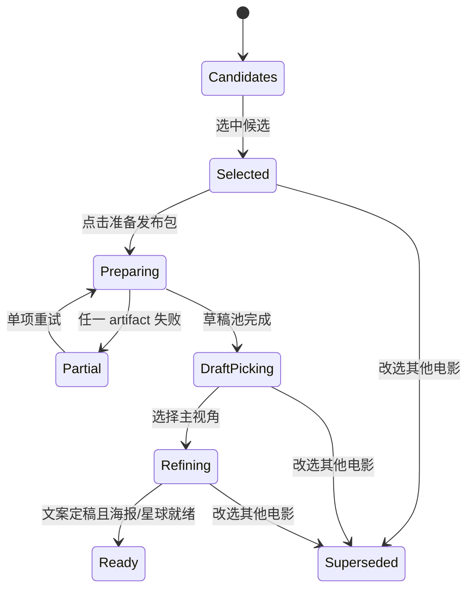
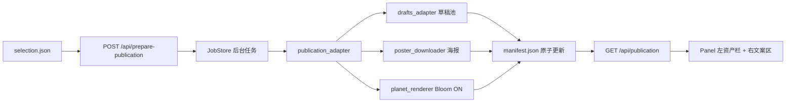

# Phase 13 · 发布包边界与视觉资产工作台

## 前置与范围

- Phase 12、12.6 已完成并合入 `main`；本 Phase 从最新 `main` 串行执行。
- 仅支持当前已实装平台 `xiaohongshu`；X/Reddit 仍为占位，不引入自动发布。
- 用户选择候选时只写选择；点击“准备发布包”后才并行生成草稿池、下载海报、导出星球图。
- 星球图只生成 Bloom ON 一份，复用 [scripts/lib/planet_renderer.py](scripts/lib/planet_renderer.py)，输出 3000×3000 RGBA PNG 与 `.render.json`。
- `daily_batch` 保留新闻、检索、judge、persona 和只读草稿池；可发布文案与图像进入独立 `publications` 工作区。
- 不批量搬迁或删除历史 `output`。旧 `selection.json.copies` 和旧 `_copy_*.md` 保持可读，迁移采用兼容投影而非破坏性移动。

## 目标目录与职责

```text
output/
├─ daily_batch/
│  └─ 2026-07-06/
│     ├─ ...流水线证据...
│     ├─ 05-ai-..._drafts_xiaohongshu.json
│     └─ selection.json
└─ publications/
   └─ 2026-07-06/
      └─ 670292-the-creator/
         ├─ manifest.json
         ├─ copy/
         │  ├─ xiaohongshu.md
         │  └─ xiaohongshu-humanized.md
         └─ assets/
            ├─ poster-original.jpg
            ├─ planet.png
            └─ planet.png.render.json
```

- `selection.json`：只回答“选中了什么”；新写入不再承载 `copies`、`selected_draft_id` 或图像状态。
- `manifest.json`：发布包 SSOT，保存 selection 快照、包状态、各 artifact 状态、相对路径、错误和时间戳。
- `bundle_id`：`{tmdb_id}-{slugify(title)}`；slug 只允许 `[a-z0-9-]`，无法生成时回退为 `{tmdb_id}`，保证 Windows 路径安全和确定性。
- 所有 manifest 路径使用相对发布包路径，不写机器相关绝对路径；写入采用临时文件 + `os.replace`，避免 Panel 读到半份 JSON。

## 状态模型与数据流





## 核心设计决策

### D1 · Publication Bundle 是发布工作区，不是 daily_batch 的别名

新增 [review_panel/publication_bundle.py](review_panel/publication_bundle.py)，集中负责 bundle ID、路径投影、manifest schema、状态归并和原子读写。调用方不得自行拼 `output/publications/...`，避免路径规则扩散到 serve、adapter 和前端。

manifest 至少包含：

```jsonc
{
  "schema_version": 1,
  "publication_id": "2026-07-06/670292-the-creator",
  "status": "preparing",
  "selection": {
    "date": "2026-07-06",
    "news_slug": "05-ai-poses-hiroshima-style-threat-to-humanity",
    "tmdb_id": 670292,
    "title": "The Creator",
    "selected_at": "..."
  },
  "artifacts": {
    "drafts": { "status": "ready", "path": "...", "error": null },
    "poster": { "status": "ready", "path": "assets/poster-original.jpg", "source_url": "...", "error": null },
    "planet": { "status": "running", "path": "assets/planet.png", "metadata_path": "assets/planet.png.render.json", "error": null },
    "copies": {
      "xiaohongshu": {
        "status": "pending",
        "selected_draft_id": null,
        "copy_path": "copy/xiaohongshu.md",
        "humanized_path": "copy/xiaohongshu-humanized.md"
      }
    }
  }
}
```

顶层状态由 artifact 状态纯函数归并：存在 `running` → `preparing`；有失败但其余可用 → `partial`；必需项全部 ready → `ready`；改选旧包 → `superseded`。

### D2 · 准备动作显式触发，三个任务并行且独立失败

新增 [review_panel/publication_adapter.py](review_panel/publication_adapter.py) 作为跨能力编排边界：读取 selection/candidate，初始化 manifest，然后并行执行 drafts、poster、planet。每项开始、完成、失败都原子更新 manifest；某项失败不取消其他项。adapter 支持 `--targets drafts,poster,planet`，供首次准备和单项重试复用。

[review_panel/serve.py](review_panel/serve.py) 只负责参数校验、通过现有 `JobStore` 提交 adapter、读取 manifest；不直接 import LLM 或 Three.js 相关重模块。

### D3 · 海报能力从 Discord 脚本中抽成通用基础设施

把 [scripts/publish_discord.py](scripts/publish_discord.py) 的 TMDB poster 下载逻辑下沉到新 [scripts/lib/poster_downloader.py](scripts/lib/poster_downloader.py)。下载器使用 `pathlib.Path`、超时、User-Agent、JPEG/PNG magic、非空检查和原子落盘；返回 source URL、文件大小和内容类型。Discord 脚本改为复用该模块，避免两套下载实现漂移。

### D4 · 当前稿与微调产物迁入 bundle，草稿池留在 daily_batch

更新 [review_panel/publish_adapter.py](review_panel/publish_adapter.py)、[review_panel/rewrite_adapter.py](review_panel/rewrite_adapter.py)、[review_panel/regenerate_adapter.py](review_panel/regenerate_adapter.py) 和 [review_panel/serve.py](review_panel/serve.py)：

- 草稿池仍为 `daily_batch/{date}/{slug}_drafts_xiaohongshu.json`。
- `select-draft` 将当前稿写到 bundle 的 `copy/xiaohongshu.md`，并把 `selected_draft_id` 写入 manifest。
- 编辑正文、重生成正文/标题只更新 bundle 当前稿；正文变化继续失效 humanized 分支。
- 去 AI 化稿写到 `copy/xiaohongshu-humanized.md`。
- `/api/copy` 从 manifest 定位产物，不再自行拼 daily_batch copy 路径。
- 兼容读取旧 `selection.json.copies` 和旧 `_copy_*.md`；新流程只写 manifest，不回写旧 copies 结构。

### D5 · 改选保留审计记录，不误删旧包

[review_panel/serve.py](review_panel/serve.py) 的 `handle_select` 调整为：

- 选择完全相同的候选时幂等返回，不清资产、不重置 manifest。
- 改选其他候选时，将旧 manifest 标记 `superseded`，不删除旧发布包。
- 新选择只写精简 `selection.json`；直到用户点击“准备发布包”才创建新 bundle。
- 不再执行现有 `_delete_stale_copies` 式破坏性清理。

### D6 · Panel 左侧视觉资产栏

[review_panel/index.html](review_panel/index.html) 保留现有 `candidates → pick → refine` 导航，在 pick/refine 工作台加入左侧固定资产栏：

- 2:3 海报卡：loading/ready/failed/缺 poster_path，提供下载与单项重试。
- 1:1 星球卡：棋盘格透明背景，只展示 Bloom ON，提供下载与重新渲染。
- 顶栏“生成草稿池”改为“准备发布包”，显示 `已完成项/总项`；点击后提交异步 job。
- 准备期间同时轮询 `/api/job` 和 `/api/publication`，让分项状态实时可见；接收 manifest 时 `console.log` publication id 和 artifact 状态。
- 图像通过受限本地端点读取：只接受 `poster|planet` 枚举，并从 manifest 注册路径解析；拒绝原始路径参数和越界路径，避免目录穿越。
- 资产失败不阻塞已完成草稿的选型/微调；只禁用依赖该资产的下载操作。
- 桌面使用左栏 + 右文案，窄屏时资产栏折叠到文案上方。

### D7 · ADR 与文档

新增 [docs/adr/0021-publication-bundle-lifecycle.md](docs/adr/0021-publication-bundle-lifecycle.md)，记录 D1–D6，特别说明：selection 与 manifest 的 SSOT 分工、非破坏性 superseded 语义、显式准备动作、草稿池与最终文案的目录边界、单 Bloom ON 决策。人工 GATE 通过后同步相关 SSOT/PRD；不提前宣称发布链路完成。

## Todo 13.1 · [domain+adr] publication bundle 模型、路径与 ADR-0021

**依赖：** 无。

**改动：**

- 新增 `review_panel/publication_bundle.py`：bundle ID、路径投影、manifest schema 校验、状态归并、原子读写、supersede。
- 新增 ADR-0021，固化 D1–D7。
- 所有函数签名带 type hints，路径只用 `Path`；状态归并保持纯函数。

**验收：**

- bundle ID 对英文、标点、空 slug 和 Windows 非法字符均确定且安全。
- manifest 路径全部为相对路径；缺字段、越界路径、未知 schema version 快速失败。
- 原子写入与 `ready/partial/preparing/superseded` 状态归并有单测。

## Todo 13.2 · [assets] 通用海报下载器 + 单 Bloom ON 星球资产

**依赖：** 13.1。

**改动：**

- 新增 `scripts/lib/poster_downloader.py`，从 Discord 脚本抽出通用 TMDB poster 下载能力并增加文件验证。
- `scripts/publish_discord.py` 改为复用通用下载器，保持现有 CLI 与产物命名不变。
- 新增 publication asset 适配逻辑：poster 输出 `poster-original.jpg`；planet 调 `render_planet(..., bloom=True)` 输出 `planet.png` 与 metadata，不生成 Bloom OFF。

**验收：**

- poster 成功、404/超时、空文件、错误 magic 均有 stub 单测；失败不留下半文件。
- Discord 既有行为无回归。
- planet adapter 只调用一次且 `bloom=True`，manifest 记录 PNG 与 metadata 相对路径。

## Todo 13.3 · [orchestration+api] prepare adapter、并行状态与单项重试

**依赖：** 13.1–13.2。

**改动：**

- 新增 `review_panel/publication_adapter.py`，并行编排 drafts/poster/planet，按项更新 manifest，支持 `--targets`。
- `review_panel/serve.py` 新增异步 `POST /api/prepare-publication`、异步 `POST /api/retry-publication-artifact`、同步 `GET /api/publication`。
- 新增受限 `GET /api/publication-asset`，只从 manifest 映射 poster/planet，校验根目录边界并返回正确 MIME。
- 沿用 `JobStore`；不另造第二套任务系统。

**验收：**

- prepare POST 立即返回 `202 + job_id`，三个任务可并行推进并实时更新 manifest。
- 单项失败得到 `partial`，其他 ready 产物保留；retry 只重跑指定项。
- 未选择、candidate/poster_path 缺失、Chronicle 环境缺失均返回可定位错误，不静默失败。
- asset API 无法读取 manifest 外文件，路径穿越测试被拒绝。

## Todo 13.4 · [copy migration] 当前稿迁入 bundle + selection 精简与兼容

**依赖：** 13.3。

**改动：**

- 将 select-draft、copy、rewrite、regenerate、edit-body 的路径解析统一切到 `publication_bundle.py`。
- 新写 `selection.json` 只保留 date/selected/selected_at；平台指针和 copy 状态写 manifest。
- 相同候选重复选择幂等；改选旧包只标 superseded，不删除。
- 加旧 `selection.json.copies` / 旧 daily_batch copy 的兼容读取层，不自动搬迁历史文件。

**验收：**

- `daily_batch` 草稿池 → 选主视角 → bundle 当前稿 → humanized 的链路完整。
- body 变化仍满足“humanized 必须失效”的不变量。
- 改选不误删旧包；重新选回旧电影可读取旧包并由用户决定是否重备。
- 旧 selection/copy fixture 可在新 Panel 中打开且不崩溃。

## Todo 13.5 · [frontend] 准备发布包动作 + 左侧视觉资产栏

**依赖：** 13.3–13.4。

**改动：**

- `review_panel/index.html` 顶栏动作、publication 状态、manifest 轮询与 artifact 重试。
- pick/refine 工作台改为左资产栏 + 右文案区；添加海报、透明星球、状态、下载和重试 UI。
- 保留现有草稿池、合并、微调、去 AI 化和移动宽度预览语义。
- 更新前端状态测试，锁定三态导航与资产栏在 selection/prepare/partial/ready/superseded 下的可见性。

**验收：**

- radio 选片不会发起图片或 LLM 请求；只有“准备发布包”触发。
- 海报/星球独立展示状态，失败可单项重试，ready 可预览和下载。
- 草稿已 ready 时即使图像失败也能进入选型和微调。
- 桌面左右布局清晰；窄屏不溢出、不遮挡现有操作。

## Todo 13.6 · [tests] 路径、manifest、adapter、API 与前端回归

**依赖：** 13.1–13.5。

**改动：**

- 新增 `tests/test_publication_bundle.py`、`tests/test_publication_adapter.py`、`tests/test_poster_downloader.py`。
- 扩展 `tests/test_review_panel_serve.py`、`tests/test_review_panel_frontend_state.py`、copy/rewrite/regenerate/drafts adapter 测试。
- 测试全部使用临时目录、stub HTTP、stub subprocess 和 inline JobStore；不真下载、不真调用 LLM、不真跑 Three.js。

**验收：**

- 相关定向测试全绿。
- `python -m pytest` 全量无 regression。
- 测试覆盖并行部分失败、重试、幂等重复选择、supersede、旧格式兼容和目录穿越拒绝。

## Todo 13.7 · [GATE] The Creator 真实发布包与 Panel 人工验收 [需人工验收]

**依赖：** 13.1–13.6 全部。

**执行：**

1. 使用 `2026-07-06 / The Creator / tmdb 670292`，选片后确认没有自动生成；点击“准备发布包”。
2. 验证草稿池、TMDB poster 和 Bloom ON planet 并行完成，目录与 manifest 一致。
3. 在 Panel 左栏检查 2:3 海报、透明背景星球、下载和单项重试；右侧走通选型、微调与去 AI 化。
4. 临时制造一个可恢复的资产失败，确认包为 partial、其他产物可用、单项重试恢复。
5. 改选另一候选，确认旧包标记 superseded 且文件保留；再切回确认不会错配资产。
6. 人工 Go 后同步 SSOT/PRD、更新 canonical plan 状态并按标准 TODO 流程写报告、提交和合并。

**人工验收：**

- radio 不自动生成，显式准备动作符合预期。
- `output/publications/2026-07-06/670292-the-creator/` 是可独立查看的完整发布工作区。
- Panel 左资产栏与右文案区信息层级清楚；图片比例、透明背景和状态反馈正确。
- 失败隔离、单项重试、superseded 与旧格式兼容均符合设计。
- 未获人工 Go 前不标 complete、不写最终报告、不合并。

## 风险与约束

- Chronicle 导出依赖 `MOVIE_COSMOS_GALAXY_ROOT`；缺失时只让 planet 失败并写 manifest，不拖垮草稿和海报。
- `manifest.json` 会被并行任务更新，必须经单模块锁 + 原子替换，禁止各任务裸读改写造成 lost update。
- 本地面板仍只绑定 `127.0.0.1`、无鉴权；asset API 不扩大到公网或任意文件读取。
- 海报和星球文件较大，前端用 URL 加载，不转 base64、不塞进 panel JSON。
- 不在本 Phase 自动发布到小红书或其他平台，也不清理 `_archive`、`Daily_Briefing`、`discord` 历史目录。
- `daily_batch` 是过程证据，`publications` 是发布工作区；任何后续平台集成都只能消费 manifest，不得回溯扫描散落文件猜状态。